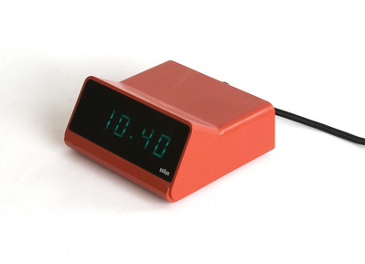
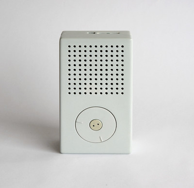
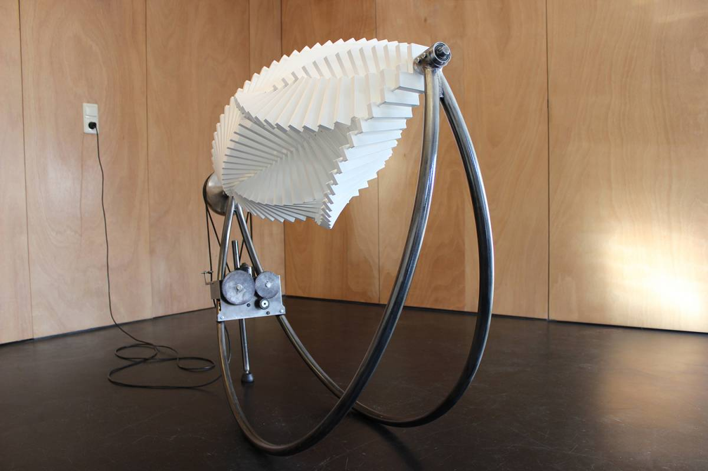

Reference
---

* [Melissa Coleman](https://melissacoleman.nl/)
* [Leah Beuchley](http://leahbuechley.com/) ([High-Low Tech](http://highlowtech.org/))
* [Maartje Dijsktra](http://www.maartjedijkstra.com/) ([Intimacy White](https://vimeo.com/13736739))
* [Behnaz Farahi](http://behnazfarahi.com/) ([Caress of the gaze](http://behnazfarahi.com/caress-of-the-gaze/))
* [Iris Van Herpen](https://www.irisvanherpen.com/)
* [Wei Chieh Shih](https://www.behance.net/shihweichieh) ([Laser Jacket](https://www.behance.net/gallery/5505381/laser-Jacket-for-Yoshii-Kazuya))
* [V2](http://v2.nl/)
* [Anouk Wipprecht](http://www.anoukwipprecht.nl/)
* [Sophy Wong](https://sophywong.com/)
* ["light of birth / 3d laser mist hologram" by nobumichi asai](https://vimeo.com/148280386)
* [Eran Hilleli](https://eranhilleli.com/)
* [Memphis Design Group](https://en.wikipedia.org/wiki/Memphis_Group)
* [Jennifer Townley](http://www.jennifertownley.com/bussola)

Braun (company)
---

Specifically the art direction of [Dieter Rams](https://en.wikipedia.org/wiki/Dieter_Rams)

[flickr](https://www.flickr.com/photos/34019036@N05/sets/72157612596210147/)

| | | |
|---|---|---|
|  |  | 

Jennifer Townley
---

| |
|---|
|  |

