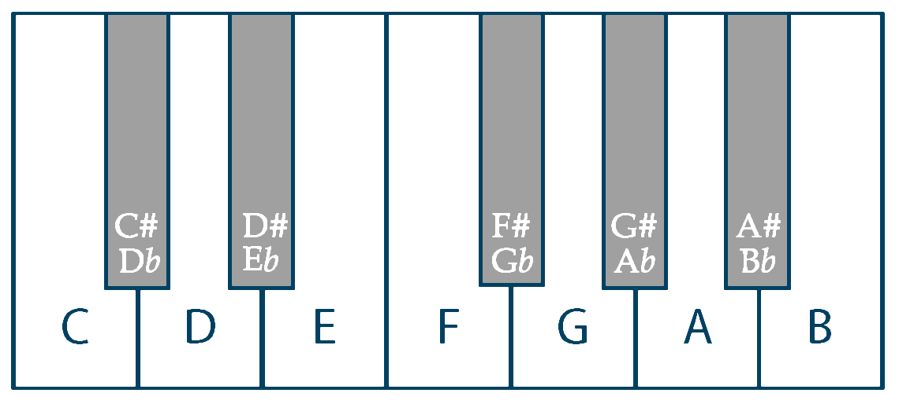

Music Notes
===

I'm doing some experimenting with music.
These notes are to document some of the thoughts
and insight I've gained as I learn.

The focus is on synths.

Timbre
---

### Oscillators

* A very rough classification of waveforms is as follows:
  - `sine` - string instruments
  - `triangle` - string instruments
  - `saw` - "brassy" instruments
  - `square` - "bassy" instruments
* For a multi-oscillator (2+ oscillators), a slight detune will
  provide a "fuller" body.  `detune` being the slight change in
  frequency from the 'fundamental' frequency.
* Detune in `cents`.  `1200` cents for a full octave change.  Common
  values are in the 0-20 range, where 20 is considered kind of extreme.
* Since `saw` and `square` waves have a discontinuity, this introduces
  a lot of higher frequencies which has a "buzzing" sound
* `triangle` waves have a similar effect but since the discontinuity is
  at the first order differential, lesser than the `saw` or `square`
* The "overdrive" effect, which chops off the high and lows of a waveform
  and replaces them with flat lines, has a similar "buzzing" sound for
  the same reason the `saw` and `square` waves have them (higher order
  frequencies from the discontinuity).

### ADSR envelopes

* `ADSR` envelope.  This is an envelope on the sound in some
  fashion.  For example, the envelope can be the amplitude
  of the waveform or it can be tied to the attenuation of
  a filter.
  - `A` - attack time of the envelope (in `ms` say)
  - `D` - decay time of the envelope (in `ms` say)
  - `S` - sustain *value* of the input waveform in a range of 0-1
  - `R` - release time of the envelope (in `ms` say)
* The `sustain` is different from the rest in that it's a value, not a time.
* The idea is that the note can be sustained as long as the musician
  wants, with the `release` decay happening only after the note is "let go".
* Note the `ADSR` envelope is often piecewise linear but need not
  be, with different functions used for different effect, such as
  exponential dropoff, etc.

### LFO

* `LFO` stands for "low frequency oscillator".  Technically just an oscillator
  but with the distinction that the oscillation is not mean to be used
  to drive a tone but used at a higher conceptual layer.
* `LFO` is an oscillator but usually in the range of 0 to 120 or so
* Since human hearing bottoms out at around 20Hz, the `LFO` is used
  to give a "higher order" effect, like a tremolo, or other "large scale"
  effect on the wave form.
* `LFO`s can be used to "spice" up a signal by adding volume changes,
  frequency changes, filter cutoff changes, detune, etc. to help
  provide variation to a sound and "fill it out".

### Spectrum

* Wood instruments as well as some metal instruments take time for
  the sound to build for whatever reason (because the wood/material takes
  time to reach resonance?  Takes time to absorb energy to then vibrate?)
  which means that a slower attack in the envelope.
* String instruments have a spectrum that is centered around sine wave fundamental
  frequencies, or integer multiples thereof, but tend to be lower frequency.
* Metal instruments have a narrower/sharper higher frequencies that are a bit
  further spaced apart.
* Shorter attack and short decay/release times lend themselves to percussion.

### Filters

* Common ones are `lowpass`, `highpass`, `bandpass`, `notch`, `comb`
* The buzzing from `saw` and `square` can be mitigated by providing
  a `lowpass` frequency filter to let low frequencies through (letting
  "low" frequencies "pass" through).
* Setting a `lowpass` filter below the fundamental frequency for the signal
  will cause a "washed out" or "muffled" sound.
* I've often heard frequency filter sweeps on songs to provide variation.
* Frequency envelopes often cause a big difference in the sound created
* The `Q` value (or `resonance`?) stands for the "quality" of the filter
  and is used to increase a small "notch" where pass value (for example,
  the frequency cutoff in a `lowpass` filter) is (in the frequency domain).
  It's unclear to me what sound effect this has.  Maybe a "highlight" of
  frequencies right at the cutoff value?

Melody
---

Data
---

| Key | data |
|-----|------|
| major | `[0,2,4,5,7,9,11]` |
| minor | `[0,2,3,5,7,8,10]` |

| Chord | data | example |
|-------|------|---------|
| major | `[+0,+4,+7]` | `[c,e,g]` |
| minor | `[0,+3,+7]` | `[c,d#,g]` |
| diminished | `[0,3,6]` | `[c,d#,f#]` |

Glossary
---

| Name | Description |
|------|-------------|
| `timbre` | The sound an instrument makes.  As far as I can tell, this is essentially synonymous with the Fourier coefficients of the resulting waveform of the instrument | |
| `chord` | A collection of notes played together. Usually at least 3. | `C E G` |
| `arpeggio` | A note progression where each note in a chord is played individually | `C E G` |
| `key` | A group of notes | key of `G`, which has all the `G A B C D E F#` pitches |
| `scale` | a set of musical notes ordered by frequency | `c b a g f e d` |
| `time signature` | Two numbers where the upper one represents the number of "beats" in a bar and the lower represents the inverse note length (power of 2). | `3/8`, 3 beats per bar with each note being an `eighth` note |
| `diatonic chords` | chords that fit in a key |

