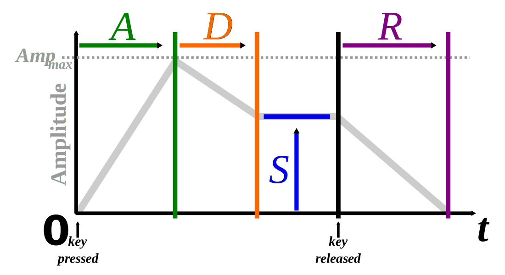
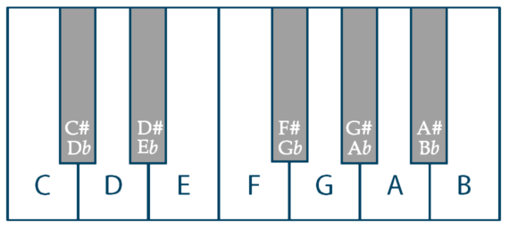

Music Notes
===

I'm doing some experimenting with music.
These notes are to document some of the thoughts
and insight I've gained as I learn.

The focus is on synths.


Timbre
---

### Oscillators

* A very rough classification of waveforms is as follows:
  - `sine` - string instruments
  - `triangle` - string instruments
  - `saw` - "brassy" instruments
  - `square` - "bassy" instruments
* For a multi-oscillator (2+ oscillators), a slight detune will
  provide a "fuller" body.  `detune` being the slight change in
  frequency from the 'fundamental' frequency.
* Detune in `cents`.  `1200` cents for a full octave change.  Common
  values are in the 0-20 range, where 20 is considered kind of extreme.
* Since `saw` and `square` waves have a discontinuity, this introduces
  a lot of higher frequencies which has a "buzzing" sound
* `triangle` waves have a similar effect but since the discontinuity is
  at the first order differential, lesser than the `saw` or `square`
* The "overdrive" effect, which chops off the high and lows of a waveform
  and replaces them with flat lines, has a similar "buzzing" sound for
  the same reason the `saw` and `square` waves have them (higher order
  frequencies from the discontinuity).

### ADSR envelopes



* `ADSR` envelope.  This is an envelope on the sound in some
  fashion.  For example, the envelope can be the amplitude
  of the waveform or it can be tied to the attenuation of
  a filter.
  - `A` - attack time of the envelope (in `ms` say)
  - `D` - decay time of the envelope (in `ms` say)
  - `S` - sustain *value* of the input waveform in a range of 0-1
  - `R` - release time of the envelope (in `ms` say)
* The `sustain` is different from the rest in that it's a value, not a time.
* The idea is that the note can be sustained as long as the musician
  wants, with the `release` decay happening only after the note is "let go".
* Note the `ADSR` envelope is often piecewise linear but need not
  be, with different functions used for different effect, such as
  exponential dropoff, etc.

### LFO

* `LFO` stands for "low frequency oscillator".  Technically just an oscillator
  but with the distinction that the oscillation is not mean to be used
  to drive a tone but used at a higher conceptual layer.
* `LFO` is an oscillator but usually in the range of 0 to 120 or so
* Since human hearing bottoms out at around 20Hz, the `LFO` is used
  to give a "higher order" effect, like a tremolo, or other "large scale"
  effect on the wave form.
* `LFO`s can be used to "spice" up a signal by adding volume changes,
  frequency changes, filter cutoff changes, detune, etc. to help
  provide variation to a sound and "fill it out".

### Spectrum

* Wood instruments as well as some metal instruments take time for
  the sound to build for whatever reason (because the wood/material takes
  time to reach resonance?  Takes time to absorb energy to then vibrate?)
  which means that a slower attack in the envelope.
* String instruments have a spectrum that is centered around sine wave fundamental
  frequencies, or integer multiples thereof, but tend to be lower frequency.
* Metal instruments have a narrower/sharper higher frequencies that are a bit
  further spaced apart.
* Shorter attack and short decay/release times lend themselves to percussion.

### Filters

* Common ones are `lowpass`, `highpass`, `bandpass`, `notch`, `comb`
* The buzzing from `saw` and `square` can be mitigated by providing
  a `lowpass` frequency filter to let low frequencies through (letting
  "low" frequencies "pass" through).
* Setting a `lowpass` filter below the fundamental frequency for the signal
  will cause a "washed out" or "muffled" sound.
* I've often heard frequency filter sweeps on songs to provide variation.
* Frequency envelopes often cause a big difference in the sound created
* The `Q` value (or `resonance`?) stands for the "quality" of the filter
  and is used to increase a small "notch" where pass value (for example,
  the frequency cutoff in a `lowpass` filter) is (in the frequency domain).
  It's unclear to me what sound effect this has.  Maybe a "highlight" of
  frequencies right at the cutoff value?

### Examples

#### "Stranger Things Synth" 0

A close approximation of the "Stranger Things" arpeggiator:

```
  var poly_synth = new Tone.PolySynth(2, Tone.MonoSynth);

  poly_synth.set({
    "envelope"  : { "attack"  : 0.005, "decay"  : 0.35 , "sustain"  : 0.0 , "release"  : 0.45 },
    "oscillator": { "type":"pwm", "modulationFrequency":0.85},
    "filter" : { "Q"  : 1 , "type" : "lowpass" , "frequency": 6000, "rolloff"  : -24 },
    "filterEnvelope" : {
      "attack" : 0.005 , "decay" : 0.86 , "sustain" : 0.0 , "release" : 0.56 ,
      "baseFrequency" : 200 , "octaves" : 8, "exponent" : 30
    }

  });

  poly_synth.voices[0].oscillator.modulationFrequency.value = 0.8;
  poly_synth.voices[0].frequency.value = "C3";

  poly_synth.voices[1].detune.value = 10;
  poly_synth.voices[1].oscillator.modulationFrequency.value = 0.8;
  poly_synth.voices[1].frequency.value = "C4";

  var synth_gain = new Tone.Gain();
  synth_gain.gain.value = 0.25;

  poly_synth.connect(synth_gain);
  synth_gain.toMaster();
```

The sweep is on the filter cutoff frequency.

```
var f = 30;
poly_synth.set({"filter": { "frequency": f}});
```

Without filter sweeping, here is an arpeggiator:

```
function stephen_things_arp(synth) {
  var now = 2;
  var scale = 1.33;
  var note = ["c2", "e2", "g2", "b2", "c3", "b2", "g2", "e2"];

  for (var ii=0; ii<20; ii++) {
    for (var jj=0; jj<note.length; jj++) {
      if (note[jj] == "") { continue; }
      synth.triggerAttackRelease([note[jj], note[jj]], 1/16, now + scale*(ii + jj/note.length), 1);
    }
  }

}

```

#### "Stranger Things Synth" 1

To get the more "bassy" synth, the following is maybe a good approximation?:


```
  var poly_synth = new Tone.PolySynth(3, Tone.MonoSynth);

  poly_synth.set({
    "envelope"  : { "attack"  : 0.5 , "decay"  : 0.5 , "sustain"  : 0.95, "release"  : 0.6 },
    "oscillator": { "type":"pwm", "modulationFrequency":0.5},
    "filter" : { "Q"  : 0, "type" : "lowpass" , "rolloff"  : -12, "frequency": 3000},
    "filterEnvelope" : {
      "attack" : 0.5 , "decay" : 0.72 , "sustain" : 0.0 , "release" : 0.0 ,
      "baseFrequency" : 200 , "octaves" : 0 , "exponent" : 30
    }
  });

  poly_synth.voices[0].oscillator.modulationFrequency.value = 0.5;

  poly_synth.voices[1].detune.value = -5;
  poly_synth.voices[1].oscillator.modulationFrequency.value = 0.25;

  poly_synth.voices[2].detune.value = 6;
  poly_synth.voices[2].oscillator.modulationFrequency.value = 0.75;

  var synth_gain = new Tone.Gain();
  synth_gain.gain.value = 0.125;

  var synth_reverb = new Tone.Freeverb();
  synth_reverb.roomSize.value = 0.15;
  synth_reverb.wet.value = 0.25;

  poly_synth.chain(synth_gain, synth_reverb);
  synth_reverb.toMaster();
```

```
poly_synth.triggerAttackRelease(["e3", "g3", "b3"], 10, "+0.05");
poly_synth.set({"filter":{"frequency":50}});
poly_synth.triggerAttackRelease(["e3", "g3", "b3"], 10, "+0.05");
```

#### "Stranger Things Synth" 2

This one is a bit more complicated since it has a noise synth attached
to it as well.
I don't know of an idiomatic way of triggering two synths tied together.


```
function custom_noise_synth() {
  var noise_synth = new Tone.NoiseSynth();
  var filt = new Tone.Filter({"Q":5, "frequency":950, "type":"lowpass", "rolloff":-24,});
  var filt_env = new Tone.FrequencyEnvelope( {
       "attack" : 0.025 , "decay" : 8.0 , "sustain" : 0.0 , "release" : 0.03 ,
      "baseFrequency" : 200 , "octaves" : 5.5, "exponent" : 0
  };

  noise_synth.envelope.attach = 0.005;
  noise_synth.envelope.decay= 8.0;
  noise_synth.envelope.sustain = 0.0;
  noise_synth.envelope.release= 0.08;

  filt_env.connect(filt.frequency);

  var reverb = new Tone.Freeverb();
  reverb.roomSize.value = 0.45;
  reverb.wet.value = 0.35;

  var gain = new Tone.Gain();
  gain.gain.value = 0.125;

  noise_synth.chain(reverb, filt, gain);
  gain.connect(Tone.Master);
  noise_synth.volume.value = -2;

  var x = {
    "synth":noise_synth,
    "filterEnvelope":filt_env,
    "triggerAttackRelease": (function(a,b) { return function(l,t,v) {
      a.triggerAttackRelease(l,t,v);
      b.triggerAttackRelease(l,t,v);
    } })(noise_synth, filt_env)
  };

  return x;
}

function stranger_synth_2() {
  var poly_synth = new Tone.PolySynth(4, Tone.MonoSynth);

  poly_synth.set({
    "envelope"  : { "attack"  : 0.05 , "decay"  : 8 , "sustain"  : 0.0, "release"  : 0.08 },
    "oscillator": { "type":"pwm", "modulationFrequency":0.5},
    "filter" : { "Q"  : 0, "type" : "lowpass" , "rolloff"  : -12, "frequency": 300},
    "filterEnvelope" :{
      "attack" : 0.005 , "decay" : 8.0 , "sustain" : 0.0 , "release" : 0.03 ,
      "baseFrequency" : 200 , "octaves" : 1 , "exponent" : 0
    }

  });

  poly_synth.voices[0].frequency.value = "C4";
  poly_synth.voices[0].oscillator.modulationFrequency.value = 0.8;

  poly_synth.voices[0].frequency.value = "C3";
  poly_synth.voices[1].detune.value = 1;
  poly_synth.voices[1].oscillator.modulationFrequency.value = 0.6;

  poly_synth.voices[2].set({"oscillator":{"type":"fmsine", "modulationType":"sine", "modulationIndex":3 }});


  var gain = new Tone.Gain();
  gain.gain.value = 0.125;

  var reverb = new Tone.Freeverb();
  reverb.roomSize.value = 0.15;
  reverb.wet.value = 0.25;

  var chorus = new Tone.Chorus(30, 0.1);

  poly_synth.chain(reverb, chorus, gain);
  gain.toMaster();

  var noise_synth = custom_noise_synth();

  var x = {
    "synth" : poly_synth,
    "noise_synth": noise_synth,
    "triggerAttackRelease": (function(a,b) { return function(n,l,t,v) {
      a.triggerAttackRelease(n,l,t,v);
      b.triggerAttackRelease(l,t,v);
    } })(poly_synth, noise_synth)
  };

  return x;
}
```

```
var s2 = stranger_synth_2();
s2.triggerAttackRelease("C4", 3, Tone.now());
```

#### Strange Sonic-Pi

```
use_bpm 180

melody = (ring :C2, :E2, :G2, :B2, :C3, :B2, :G2, :E2) #major

dt = 0.125/2
slidetime_a = Array.new(8) { |t| t = dt*(t+1) }
slidetime = (ring *(slidetime_a.concat slidetime_a.reverse()[1,6]))

live_loop :strange do
  idx = tick

  co = slidetime[idx]
  use_synth :dsaw
  #use_synth_defaults sustain: 0.5, release: 0.5
  #sn = play melody[idx], cutoff: 120
  sn = play melody[idx], cutoff: 120, sustain: 0.5, release: 0.5
  control sn, cutoff: 80, cutoff_slide: co
  sleep 0.5
end
```

Composition
---

Higher than basic melody, drums and instrument timbre on the "Musical Maslow" hierarchy
is composition.
This is the higher level song structure of how different melodies are chained together
to create a larger song.

I've seen a few different variations, but two basic song structures are:

```
intro (4) | verse (8) | pre-chorus (8) | chorus (8) | verse (8) | pre-chorus (8) | chorus (8) | bridge (8) | chorus (16)
```

and

```
intro (4) | verse (16) | pre-chorus (4) | chorus (8) | verse (8) | pre-chorus (4) | chorus (8) | bridge (8) | chorus (8) | outro (8)
```

With verses, pre-choruses and choruses all having slight variations between them.

Some thoughts and tips I've seen:

* The intro need only 'fade in' to the first verse and can be timed layering of instruments to lead into the song
* The outra can be the analogous 'fade out' mirror image of the intro (removing instruments, volume fading, etc.)
* Each of the verse, chorus and bridge occupy a significant place in the song and should be considered
  to have their own importance and weight (think of one as lesser to your detriment)
* The pre-chorus is meant to be a short connector between the verse and the chorus
  - the pre-chorus should be 'softer' than the chorus (either in volume, instrument number, etc.), to give the chorus more impact
  - the pre-chorus should stay away from starting on the root chord as it would take away the impact of the chorus
* The chorus should differentiate itself from the verse
  - one possibility is to choose a complementary rhythm for the chorus and verse (short notes in verse -> longer notes in chorus)
* Choruses should have more energy than verses
  - one way to achieve this is to add instruments in the chorus or take out instruments in the verse
  - singers can sing higher in chorus than in verse (could also be lead instrument or arp?)
  - choruses should have simple phrases repeated (perhaps the song name for the earworm factor) whereas the verse can be more wordy

One tactic that can be used to added variation to structure is to take 'motifs' and repeat with subtle alterations.

Here are some possibilities (where the first array are the notes and the second are the note durations):

| Base Sequence | Transformation | Notes |
|---|---|---|
| `[[a,b,c,d],[da,db,dc,dd]]` | `[[.,a,b,c,.],[du,da,db,dc,dv]]` | take a portion of the measure and shift it, cleaving off the notes at the front or end |
| `[[a,b,c,d],[da,db,dc,dd]]` | `[[a,b,c,d(+,-))],[da,db,dc,dd]]` | increase or decrease the notes at the tail of the measure |


### Modulation

Modulation is changing the key or mode during the song.
One simple effect is to go up half or a whole octave during the song.
For example, halfway through, going up an octave might give it a 'brighter' or 'more energy' feeling.
Going up somewhere during the song then going back down (a whole octave) might give the descent more power.

Apparently to go above (or below?) a whole step becomes overly dramatic.

---

Do a key change modulation, one can switch keys during the different parts of a song (verse, chorus, etc.).
From what I gather, the chorus is in a minor key whereas the verses are in a major key in The Beatles "While My Guitar
Gently Weeps".

One trick is to choose keys that are 'parallel' (share many of the same chords) and end one stanza with a
chord that can transition smoothly into a chord in the other key.

Another consideration is to try and switch to a parallel mode that shares the same root note to keep the 'tonal center'.

---

([src](https://youtu.be/Vxac3hHrxg8))


Melody
---




This is an ongoing understanding but from what I've seen, the idea is that
the melody can be broken down into two parts, the rhythm and the notes.
As a heuristic, the rhythm accounts for a [high percentage](https://www.youtube.com/watch?v=tyDVmnEP6BE&t=6m5s) of the 'quality'
of the melody (80%+)

An equally spaced rhythm leads to a melody that sounds boring.
Here are some basic rhythm patterns (suggested by [Dylan Laine](https://youtu.be/qlrLHhpp8-E)):


```
r0 = [ [1, 0.5, 0.5, 1, 1 ], [1, 0.5, 0.5, 1, 1 ], [1, 0.5, 0.5, 1, 1 ],  [4] ]
r1 = [ [1, 1, 0.5, 0.5, 0.5, 0.5], [1, 1, 0.5, 0.5, 0.5, 0.5], [1, 1, 0.5, 0.5, 0.5, 0.5], [1, 1, 0.5, 0.5, 0.5, 0.5] ]
r2 = [ [2, 2], [1, 1, 1, 1], [2,2], [1, 1, 1, 1] ]
r3 = [ [3, 1], [2, 2], [3, 1], [2, 2], [3, 1], [2, 2] ]
```

Dylan Laine suggests a tactic as follows (as far as I can interpret it):

* Choose your chord progression, one chord per bar
* Pick two notes from the chord per bar and create a phrase
* Choose a rhythm pattern for the phrase melody (maybe with a single multi-phrase repetition and a variation at the end)


[David Stewart](https://youtu.be/ktq_gOZU2VU) talks about a tactic to write a melody:

* Start and end on the tonic of the key
* Have a preference for small increments of notes instead of large leaps with a few leaps to add variation
* The extreme note should be played once at 2/3 to 3/4 of the way through the melody
* Phrases should be multiples of four

Though not explicitly stated, ["LifeStyleDidIt - How To Make Melodies - With Chords"](https://www.youtube.com/watch?v=SVKigPPX6Zs) looks to be using
a basic algorithm of:

* Start with a chord progression
* Choose 'anchor' notes from each of the chords
* Interpolate, potentially across bars, from one anchor note to another, potentially merging interpolations

From a cursory look, `LifeStyleDidIt` looks to be using many of the guidelines that `David Steward` uses in
terms of extremal note placement and note increments
The start and end note guideline is violated but one interpretation is that the start and stop of the melody
shares an extreme chord note.
For example, the beginning chord is `[c5,d#5,g5]` and ending chord is `[d#5,g5,a#5]` and the starting and
stopping melody notes are `c7` and `a#6` respectively.

---

For modern music, pop music in particular, the melody rhythm is meant to be used on top of lyrics that are sung.
Even for older music there's a bias towards music that is accompanied by a human voice singing with it.
This leads to a hypothesis that the melody rhythm should closely match the pacing of speech.

There's [some research](https://github.com/abetusk/papers/blob/release/Music/rythm-music_Patel_Daniel.pdf) to suggest
that language can influence structure of music.
If this were true, different languages might have different types of melody.

For example, one could settle on a 'one quarter note per word' model, splitting quarter notes into smaller notes depending
on how many syllables there were in a word, adding pauses for commas and new sentences, etc.
This assumes that all syllables are of equal length and one could imagine more complex models that take into account the different
syllable lengths or pairings.

This theory only defers understanding of melody rhythm by deferring to language structure, but, in my opinion,
language structure is much better understood and studied.
From what I remember this is more in line with a heavy tailed distribution that
can be explained by [simple generative models](https://github.com/abetusk/papers/blob/release/Probability/1089229510-mitzemacher.pdf).
The simple models might be good for giving a gross overview or large scale structure but might not be good
for picking out small scale structure.

One thought on a 'practical' guide to choosing rhythm melody in a more generative way is to take a corpus, split each sentence
into it's syllables and choose rhythm based on that with the above 'one quarter note per word, quarter note split by syllable'
method described above.

No doubt melody rhythm is much more complex than this simplistic view but, from my perspective, it's enlightening as it
gives some motivation for why certain rhythms might sound better than others.


Simple Algorithms
---


#### inversion

`[a,b,c] -> [b,c,a+12]`

#### 'peddling'

Staying on the root note in a scale/mode and then
'jumping' to other chords within the same scale
before returning to the root note.
While on the root note, the note is played in
a sequence of short notes (4 quarter notes per bar, say).

#### simple chord progression (for major scale only?)

* 4 measures
* start a measure with the root major chord
* end with a major chord that isn't the root
* interpolate with other chords in between

Example:

```
I -> iii -> ii -> V
I -> iii -> ii -> IV
I -> vi -> V -> V
```

#### misc.

|   name   | description   |
|----------|---------------|
| ostinato | repeat melody |
| augmentation | repeat and increase length by 2x  |
| diminution | repeat and decrease length by 1/2x |
| note subtraction | repeat and remove a note each time |
| note addition | repeat and add note each time |
| note metamorphosis | repeat and alter a note each time |
| static harmony | change on chord to another interpolating between chords that are minimal distance away from each other |
| phasing | playing two versions of the same melody where one is truncated relative to the other |
| rhythmic displacement | changing a note loudness on each repetition |

#### diatonic chords

```
function list_chords(note_key) {
  var k = 0;
  var chord = { "major" : [0,4,7], "minor" : [0,3,7], "diminished" : [0,3,6] };
  var note_map = ["c", "c#", "d", "d#", "e", "f", "f#", "g", "g#", "a", "a#", "b" ];
  var key_map = {};

  for (k=0; k<note_key.length; k++) { key_map[note_key[k]] = 1; }
  for (var note_root = 0; note_root<12; note_root++) {
    for (var chord_name in chord) {
      for (k=0; k<chord[chord_name].length; k++) {
        var x = (note_root + chord[chord_name][k]) % 12;
        if (key_map[x] != 1) { break; }
      }
      if (k==chord[chord_name].length) {
        console.log( note_map[note_root], chord_name );
      }
    }
  }

}

var key = {
  "major" : [0,2,4,5,7,9,11],
  "minor" : [0,2,3,5,7,8,10]
}

console.log("\nmajor key:");
list_chords(key.major);

console.log("\n---");
console.log("minorkey:");
list_chords(key.minor);

```

Drums
---

* `H` High hat (open hat)
* `h` Closed hi hat (closed hat)
* `c` Clap
* `s` Snare
* `b` Bass (kick)

*Four on the floor*: `b...b...b...b...`

Human heart beat ~60-100 bpm

Misc
---

[src](https://www.youtube.com/watch?v=UcmrgTNE9Cs)

| Section Name | Bar length |
|-------------|------------|
| intro | 4 |
| verse | 16 |
| (pre) | 4 |
| chorus | 8 |
| verse | 8 |
| (pre) | 4 |
| chorus | 8 |
| bridge | 8 |
| chorus | 8 |

| voice | intro | verse | chorus | verse | chorus | bridge | chorus |
|-------|-------|-------|--------|-------|--------|--------|--------|
| singer|   -   | start | high   | verse0 | chorus0 | -    | chorus0 |
| keyboard | hook | hook | chords | verse0 | chorus0 | chords | chorus0 |
| guitar | - | long | short | mid | chorus0 | follow | - | chorus0 |
| drums | - | kick | +snare | +hihat | chorus0 | ride | - | chorus0 |

Data
---


|  c  | c#/db |  d  | d#/eb |  e  |  f  | f#/gb |  g  | g#/ab |  a  | a#/bb |  b   |
|-----|-------|-----|-------|-----|-----|-------|-----|-------|-----|-------|------|
| `0` |   `1` | `2` |   `3` | `4` | `5` |   `6` | `7` |   `8` | `9` |  `10` | `11` |

| Key | data |
|-----|------|
| major | `[0,2,4,5,7,9,11]` |
| minor | `[0,2,3,5,7,8,10]` |
| harmonic minor | `[0,2,3,5,7,8,11]` |
| melodic minor | `[0,2,3,5,7,9,11]` |
| minor pentatonic | `[0,3,5,7,10]` |
| major pentatonic | `[0,2,4,7,9]` |
| egyptian | `[0,2,5,7,10]` |
| blues minor | `[0,3,5,8,10]` |
| blues major | `[0,2,5,7,9]` |

|    tonic     |   super-tonic |   mediant    |  sub-dominant |    dominant  | submediant   |
|--------------|---------------|--------------|---------------|--------------|--------------|
| `scale[0%n]` | `scale[1%n]`  | `scale[2%n]` | `scale[3%n]`  | `scale[4%n]` | `scale[5%n]` |

| Chord | data | example |
|-------|------|---------|
| major | `[+0,+4,+7]` | `[c,e,g]` |
| minor | `[+0,+3,+7]` | `[c,d#,g]` |
| augmented | `[+0,+4,+8]` | `[c,e,g#]` |
| diminished / diminished triad | `[+0,+3,+6]` | `[c,d#,f#]` |
| (full) diminished / diminished 7th (`dim7`) | `[+0,+3,+6,+9]` | `[c,d#,f#,a]` |
| (half) diminished / minor 7 flat 5 (`m7b5`) | `[+0,+3,+6,+10]` | `[c,d#,f#,a#]` |
| major 7th | `[+0,+4,+7,+11]` | `[c,e,g,b]` |


| Mode | data | example | step sequence | "mood" |
|------|------|---------|---------------|--------|
| ionian | `[0,2,4,5,7,9,11]` | `[c,d,e,f,g,a,b]` |       `[2,2,1,2,2,2,1]` | happy/bland |
| dorian | `[0,2,3,5,7,9,10]` | `[c,d,d#,f,g,a,a#]` |     `[2,1,2,2,2,1,2]` | mellow/smooth |
| phrygian | `[0,1,3,5,7,8,10]` | `[c,c#,d#,f,g,g#,a#]` | `[1,2,2,2,1,2,2]` | dark/tense |
| lydian | `[0,2,4,6,7,9,11]` | `[c,d,e,f#,g,a,b]` |      `[2,2,2,1,2,2,1]` | sci-fi/spacy |
| mixolydian | `[0,2,4,5,7,9,10]` | `[c,d,e,f,g,a,a#]` |  `[2,2,1,2,2,1,2]` | bright/upbeat |
| aeolian | `[0,2,3,5,7,8,10]` | `[c,d,d#,f,g,g#,a#]` |   `[2,1,2,2,1,2,2]` | dark/sad |
| locrian | `[0,1,3,5,6,8,10]` | `[c,c#,d#,f,f#,g#,a#]` | `[1,2,2,1,2,2,2]` | ? |

| Mode | 1 | 2 | 3 | 4 | 5 | 6 | 7 |
|---|---|---|---|---|---|---|---|
| ionian | `I` `[0,4,7]` | `ii` `[2,5,9]` | `iii` `[4,7,11]` | `IV` `[5,9,12]` | `V` `[7,11,14]` | `vi` `[9,12,16]` | `viid` `[11,14,17]` |
| dorian | `i` `[0,3,7]` | `ii` `[2,5,9]` | `III` `[3,7,10]` | `IV` `[5,9,12]` | `v` `[7,10,14]` | `vid` `[9,12,15]` | `VII` `[10,14,17]` |
| phyrgian | `i` `[0,3,7]` | `II` `[1,5,8]` | `III` `[3,7,10]` | `iv` `[5,8,12]` | `vd` `[7,10,13]` | `VI` `[8,12,15]` | `vii` `[10,13,17]` |
| lydian | `I` `[0,4,7]` | `II` `[2,6,9]` | `iii` `[4,7,11]` | `ivd` `[6,9,12]` | `V` `[7,11,14]` | `vi` `[9,12,16]` | `vii` `[11,14,18]` |
| mixolydian | `I` `[0,4,7]` | `ii` `[2,5,9]` | `iiid` `[4,7,10]` | `IV` `[5,9,12]` | `v` `[7,10,14]` | `vi` `[9,12,16]` | `VII` `[10,14,17]` |
| aeolian | `i` `[0,3,7]` | `iid` `[2,5,8]` | `III` `[3,7,10]` | `iv` `[5,8,12]` | `v` `[7,10,14]` | `VI` `[8,12,15]` | `VII` `[10,14,17]` |
| locrian | `id` `[0,3,6]` | `II` `[1,5,8]` | `iii` `[3,6,10]` | `iv` `[5,8,12]` | `V` `[6,10,13]` | `VI` `[8,12,15]` | `vii` `[10,13,17]` |


| 2-chord progression | code | description |
|---------------------|------|-------------|
| `[+0,+4,+7] [+2,+6,+9]` | M2M | Protagonism |
| `[+0,+4,+7] [+6,+10,+13]` | M6M | Outer space |
| `[+0,+4,+7] [+8,+12,+15]` | M8M | Fantastical |
| `[+0,+4,+7] [+4,+7,+11]` | M4m | Sadness, loss |
| `[+0,+4,+7] [+5,+8,+12]` | M5m | Romantic |
| `[+0,+3,+7] [+5,+9,+12]` | m5M | Wonder |
| `[+0,+3,+7] [+2,+6,+9]` | m2M | Mystery |
| `[+0,+3,+7] [+11,+15,+18]` | m11M | Dramatic |
| `[+0,+3,+7] [+6,+9,+13]` | m6m | Danger |
| `[+0,+3,+7] [+8,+11,+15]` | m8m | Evil |

Misc Code
---

To find the chords for a mode:

```
var mode_notes = {
    "aeolian":[0,+2,+3,+5,+7,+8,+10],
    "locrian": [0,+1,+3,+5,+6,+8,+10],
    "ionian":  [0,+2,+4,+5,+7,+9,+11],
    "dorian":  [0,+2,+3,+5,+7,+9,+10],
    "phyrgian": [0,+1,+3,+5,+7,+8,+10],
    "lydian":  [0,+2,+4,+6,+7,+9,+11] ,
    "mixolydian":  [0,+2,+4,+5,+7,+9,+10]
  };

var mode_names = [ "aeolian", "locrian", "ionian", "dorian", "phyrgian", "lydian", "mixolydian" ];
var mode_chord = {};

var chord_name = {
  "maj" : ["I", "II", "III", "IV", "V", "VI", "VII"],
  "min" : ["i", "ii", "iii", "iv", "v", "vi", "vii"],
  "dim" : ["id", "iid", "iiid", "ivd", "vd", "vid", "viid"]
};

for (var ii=0; ii<mode_names.length; ii++) {
  var mode_name = mode_names[ii];
  var notes = mode_notes[mode_name];

  mode_chord[mode_name] = [];

  var occupancy = [];
  for (var _i=0; _i<24; _i++) { occupancy.push(0); }
  for (var _i=0; _i<notes.length; _i++) {
    occupancy[notes[_i]] = 1;
    occupancy[notes[_i]+12] = 1;
  }

  chord_check_name = ["maj", "min", "dim"];
  chord_check = [ [0,4,7], [0,3,7], [0,3,6] ];

  for (var nidx=0; nidx < notes.length; nidx++) {
    var chord_info = { "type":"", "chord":[], "name":""};
    var base_note = notes[nidx];

    for (var ch_idx=0; ch_idx < chord_check.length; ch_idx++) {
      var found = true;
      for (var _n=0; _n<chord_check[ch_idx].length; _n++) {
        if (occupancy[base_note + chord_check[ch_idx][_n]] == 0) {
          found = false;
          break;
        }
      }
      if (found) {
        chord_info.type = chord_check_name[ch_idx];
        chord_info.name = chord_name[ chord_check_name[ch_idx] ][nidx];
        chord_info.chord = [
          base_note + chord_check[ch_idx][0],
          base_note + chord_check[ch_idx][1],
          base_note + chord_check[ch_idx][2] ];
        break;
      }
    }
    mode_chord[mode_name].push(chord_info);
  }
}

console.log(JSON.stringify(mode_chord));

```

Glossary
---


| Name | Description |
|------|-------------|
| `accidental` | Symbols that raise or lower the pitch of a note by a half-step (example: sharp, flat, natural) |
| `arpeggio` | A note progression where each note in a chord is played individually (example: `C E G`) |
| `chord` | A collection of notes played together. Commonly 2, 3 or 4 notes played together. (example: `C E G`) |
| `common time` | 4/4 meter |
| `cut time` | 2/2 meter |
| `diatonic chords` | Chords that fit in a key |
| `double flat` | A symbol that lowers a note by a whole step (written as two connected flat symbols to the left of the note) |
| `double sharp` | A symbol that raises a note by a whole step (written as an `X` to the left of a note) |
| `fermata` | A symbol indicating the note can be held as long as desired but no more than the written note length |
| `flat` | A symbol indicating a note should be lowered a half step (`\flat`)
| `gallop` | An eight followed by two sixteenth notes (`[1/8,1/16,1/16]`) |
| `half-step` | A $\frac{1}{12}$ music interval ($2^{\frac{1}{12}}$) |
| `key` | A group of notes | key of `G`, which has all the `G A B C D E F#` pitches |
| `natural` | A symbol written to the left of a note that cancels a sharp or flat symbol |
| `ostinato` | A short musical pattern that repeats in a passage |
| `timbre` | The sound an instrument makes.  As far as I can tell, this is essentially synonymous with the Fourier coefficients of the resulting waveform of the instrument [yt](https://www.youtube.com/watch?v=VRAXK4QKJ1Q) |
| `tie` | A curved line connecting two notes to indicate they should be played as one (that is, without a break) |
| `reverse gallop` | Two sixteenth notes followed by an eight note (`[1/16,1/16,1/8]`) |
| `scale` | A set of musical notes ordered by frequency (example: `c b a g f e d`) |
| `step (whole)`| Two half-steps ($2^{\frac{2}{12}}$) |
| `time signature` | Two numbers where the upper one represents the number of "beats" in a bar and the lower represents the inverse note length (power of 2). | `3/8`, 3 beats per bar with each note being an `eighth` note |


References
---

* [Studiologic Sledge Tutorial 39 Stranger Things](https://www.youtube.com/watch?v=HGufVBDfPvs)
* [Musical Chord Progression Arpeggiator](https://codepen.io/jakealbaugh/full/qNrZyw)
* [Turing-Tunes](https://github.com/maximecb/Turing-Tunes)
* [Melodique](https://github.com/maximecb/Melodique)
* [Tone.js](https://tonejs.github.io/)
* [Paul Adenot: Elements of Dance Music JSConf.Asia 2015](https://youtu.be/Ww0jTafmd_w)
* [teoria](https://github.com/saebekassebil/teoria)
* [Web Audio Weekly](http://www.webaudioweekly.com/)
* [Tonal](https://github.com/danigb/tonal)
* [Open Music Theory](http://openmusictheory.com)
* [Growing Music (L-Systems)](https://www-users.cs.york.ac.uk/~susan/bib/ss/nonstd/eurogp05/index.html)
* [How to Synthwave | FL Studio Tutorial](https://youtu.be/ahPindVHPK4)
* [Measures of Consonances in a Goodness-of-fit Model for Equal-tempered Scales by Aline Honingh](https://github.com/abetusk/papers/blob/release/Music/measures-consonances_honingh.pdf)

Melody References
---

* [computoser](http://computoser.com/), [github](https://github.com/Glamdring/computoser), [paper](https://arxiv.org/pdf/1412.3079.pdf)
* [SO: "How to algorithmically find a chord progression for an infinite arbitrary melody?"](https://music.stackexchange.com/questions/11923/how-to-algorithmically-find-a-chord-progression-for-an-infinite-arbitrary-melody)
* [SO: "How can I generate nice-sounding random chord progressions?"](https://music.stackexchange.com/questions/3788/how-can-i-generate-nice-sounding-random-chord-progressions?rq=1)
* [SO: "Guide-lines for creating a simple chord-progression?"](https://music.stackexchange.com/questions/14812/guide-lines-for-creating-a-simple-chord-progression?rq=1)
* [musictheory.net](https://www.musictheory.net/lessons)
* [musictheory.net: Common Chord Progressions](https://www.musictheory.net/lessons/57)
* [Dylan Laine - How To Write A Melody](https://youtu.be/qlrLHhpp8-E)
* [David Steward - How to Write a Melody](https://youtu.be/ktq_gOZU2VU)
* ["An empirical comparison of rhythm in language and music" by Aniruddh D. Patel and Joseph R. Daniele](https://github.com/abetusk/papers/blob/release/Music/rythm-music_Patel_Daniel.pdf)

Music Theory References
---

* [Lightnote: How Music Works](https://www.lightnote.co/)
* [Creating a Synthwave Score](https://modeaudio.com/magazine/the-joy-of-arps-creating-a-synthwave-score)
* [An Introduction to Species Counterpoint](http://homepage.eircom.net/~gerfmcc/SpeciesOne.html)

Composition Reference
---

* [YT: Signals Music Studio - Intro to Modulations and Key Changes](https://youtu.be/Vxac3hHrxg8)


