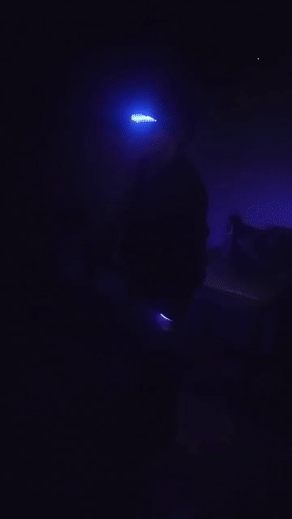

Inner Light Jacket
===



(glasses not included)

1. [Intro](#Intro)
2. [Materials](#Materials)
3. [Design Overview](#design-overview)
4. [LED Rope Assembly](#led-rope-assembly)
    1. [Test Rope](#test-rope)
    2. [Cut to Length](#cut-to-length)
    3. [Sew Velcro to LED Rope](#sew-velcro-to-led-rope)
    4. [Sew Velcro to Jacket](#sew-velcro-to-jacket)
    5. [Wire LED Rope](#wire-led-rope)
5. [Electronics](#Electronics)
    1. [Power Cable](#power-cable)
    2. [Power Regulators](#power-regulators)
    3. [Raspberry Pi Soldering](#raspberry-pi-soldering)
6. [Software Installation](#software-installation)
7. [Electronics Housing](#electronics-housing)
8. [Complete Installation](#complete-installation)
9. [Wear It](#wear-it)
10. [Lessons Learned, Failures and Future Improvements](#lessons-learned-failures-and-future-improvements)
11. [References](#References)

Intro
---

The 'Inner Light' project is a light up wearable jacket.
LED 'rope' is strung along the inner lining of a faux leather jacket and provides a diffuse
lighting show that can be controlled by the wearer.

Many years ago, I saw [ch00ftech's](http://ch00ftech.com/2012/01/16/light-up-leather-jacket/) post about a
'light up' leather jacket that had LED lights sewn into the inner lining of a leather jacket.
The effect was very cool and I wanted to see if me and a friend, [star_carcass](https://www.instagram.com/star_carcass/),
could make our own but with a few upgrades, such as beat detection and custom patterns.

The 'Inner Light' project is the result of a collaboration with [star_carcass's](https://www.instagram.com/star_carcass/)
and myself.
I did most of the programming and electronics assembly while [star_carcass](https://www.instagram.com/star_carcass/)
did most of the design, sewing, wiring, final assembly along with the housing assembly for the battery and buck converters.

The jacket has a approximately 3 meters of LED "rope" that is controlled by a Raspberry Pi W Zero.
The Raspberry Pi acts as a WiFi hotspot and serves up a custom web interface for control of the LED strips.
The LED "rope" was chosen because of the diffusion.
The whole jacket runs off of a single 11.1V 5.5Ah LiPo battery.
We've run the jacket over three hours without issue and we expect the charge to last approximately around 5 hours or so
between charges.

Materials
---

| Item | Pic | Approx Cost | Source |
|------|-----|-------------|--------|
| LED RBG Rope (SK6812/SK6218, 5V) | | $20/m x 4m = $80 | [Amazon](https://www.amazon.com/gp/product/B07DN3QP4R) [Ebay](ebay.com/itm/5V-SK6812-LED-Neon-Flex-Tube-Pixel-Strip-Light-3535-RGB-Addressable-360-Round/273955416625) |
| Raspberry Pi W Zero | | $20 | [Amazon](amazon.com/Vilros-Raspberry-Starter-Power-Premium/dp/B0748MBFTS/) [Ebay](ebay.com/itm/Raspberry-Pi-Zero-W-Wireless-Wi-Fi-Version-w-2x40-Gold-Header-Ships-Same-Day/222858178477) |
| Micro SD Card (16Gb) | | $6 | [Amazon](https://www.amazon.com/Sandisk-Ultra-Micro-UHS-I-Adapter/dp/B073K14CVB) [Ebay](ebay.com/itm/SanDisk-16GB-32GB-64GB-128GB-Ultra-Micro-SD-Card-Class-10-98MB-s-Memory-Card-Lot/143318377880) |
| JST-XH Headers (2-pin and 3-pin, right angle) | | $9 | [Amazon](amazon.com/GeeBat-460pcs-Connector-Housing-Adapter/dp/B01MCZE2HM) [Ebay](ebay.com/itm/JST-XH-Connector-Terminal-Header-Assortment-Kit-Male-Female-RIGHT-ANGLE-90-Deg/292219710596) |
| AWG28-18 Crimping Tool | | $23 | [Amazon](amazon.com/IWISS-Professional-Compression-Ratcheting-Wire-electrode/dp/B00OMM4YUY) [Ebay](ebay.com/itm/SN-28B-Pin-Crimp-Plier-Tool-2-54mm-3-96mm-18-28AWG-Crimper-Tool-Dupont-JST-Molex/401949283529) |
| AWG24 Stranded Wire (various colors) | | $15 | [Amazon](amazon.com/StrivedayTMFlexible-Silicone-Electric-electronic-electrics/dp/B01LH1G2IE) [Ebay](ebay.com/itm/24-AWG-Gauge-Stranded-Hook-Up-Wire-Kit-25-ft-Each-0-0201-Dia-UL1007-300-Volts/371133252837) |
| JST SM m/f connectors (2-pin) (5 pair) | | $6 | [Amazon](https://www.amazon.com/gp/product/B07GGNFPQQ) [Ebay](ebay.com/itm/10-Pairs-Jst-Sm-2-Pins-Plug-Male-And-Female-Wire-Connector/323655645814) |
| JST SM m/f connectors (3-pin) (6 pair) | | $7 | [Amazon](amazon.com/ALITOVE-Female-Connector-WS2812B-SK6812-RGBW/dp/B071H5XCN5) [Ebay](ebay.com/itm/2pin-3pin-4pin-5pin-Male-And-Female-22AWG-LED-Strip-Wire-JST-SM-Plug-Connector/401741125239?) |
| Buck Converters (5v, 10A) x3 | | $10 x 3 = $30 | [Amazon](amazon.com/BINZET-Converter-Regulator-Regulated-Transformer/dp/B00J3MHTYG) [Ebay](ebay.com/itm/DC12V-24V-to-5V-10A-50W-Step-Down-Buck-Voltage-Converter-Module-Waterproof-IP68/312733329138) |
| Buck Converter (5v, 3A) (BEC) | | $3 | [Amazon](amazon.com/Ship-Hobbywing-Switch-mode-UBEC-Lowest/dp/B008ZNWOYY) [Ebay](ebay.com/itm/RC-UBEC-5V-6V-3A-Max-5A-Switch-Mode-Lowest-RF-Noise-BEC-Kit-for-RC-Models-Tool/352620354400) |
| Battery (11.1v, 5.5Ah) | | $40 | [Amazon](amazon.com/FLOUREON-5500mAh-Quadcopter-Airplane-Helicopter/dp/B072313FYS) [Ebay](ebay.com/itm/11-1V-5000mAh-3S-55C-Lipo-Battery-Deans-Plug-for-RC-Helicopter-Airplane-Monster/223292866369) |
| Fuse Holder (18Ga) | | $8 | [Amazon](amazon.com/KOLACEN-Automotive-Holder-Regular-Standard/dp/B07C5JGFRH) |
| Fuse (blade, 10A) | |  $20 | [Amazon](amazon.com/EPAuto-AE-009-1-Pieces-Assorted-Standard/dp/B01DYQ5T3O) [Ebay](ebay.com/itm/220-Pcs-Car-Blade-Fuse-Assortment-Assorted-Kit-Blade-Set-Auto-Truck-Automotive/303300580187) |
| SPST Rocker Switch (prewired) | | $10 | [Amazon](amazon.com/COOLOOdirect-Solder-Rocker-Switch-Toggle/dp/B071Y7SMVQ) |
| XT60 Connectors (2 pair) | | $8 | [Amazon](https://www.amazon.com/Female-Connector-Housing-Silicon-Battery/dp/B073QJWVVK) |
| Jacket | | $50 | [Amazon](https://www.amazon.com/gp/product/B01GKGWBCM) [Ebay](ebay.com/itm/Olivia-Miller-Womens-Faux-Leather-Moto-Biker-Jacket-with-Pockets/283175170552) |
| Velcro (non-sticky backed, 0.25 inch width, black) | | $13 | [Amazon](https://www.amazon.com/dp/B07PZS5D1W) |
| Curved Upholstery Hand Needles | | $5 | [Amazon](amazon.com/Dritz-9020-Curved-Upholstery-Needle/dp/B0009V0V5E) [Ebay](ebay.com/itm/7pcs-Curved-Carpet-Leather-Sewing-Needles-Upholstery-Canvas-Hand-Repair-New-Hot/254354399362) |
| Thimble | | $6 | [Amazon](amazon.com/Thimble-Protector-Adjustable-Quilting-Accessories/dp/B076ZFQ7KN) |
| Heavy Thread | | $10 | [Amazon](amazon.com/dp/B07QW8GZF2/ref=twister_B07QX5KR31) [Ebay](ebay.com/itm/69-92-138-Bonded-Nylon-Sewing-Thread-For-Outdoor-Leather-Upholstery-Canvas/254295021529) |
| Heat Shrink Tubing | | $8 | [Amazon](amazon.com/Ginsco-580-pcs-Assorted-Sleeving/dp/B01MFA3OFA) [Ebay](ebay.com/itm/280pcs-Cable-Heat-Shrink-Tubing-Sleeve-Wire-Wrap-Tube-2-1-Assortment-Kit-Box-Set/401747169106?) |
| Solder | | $15 | [Amazon](amazon.com/Rosin-Core-Solder-60-4oz/dp/B0006O933K) [Ebay](ebay.com/itm/60-40-Tin-Lead-Rosin-Core-Solder-Wire-Soldering-Sn60-Pb40-Flux-039-1-0mm-50g/372474772922) |
| Flux | | $15 | [Amazon](amazon.com/MG-Chemicals-Liquid-Leaded-Solder/dp/B005DNR01Q) [Ebay](ebay.com/itm/Delcast-Rosin-Soldering-Flux-Paste-Solder-Welding-Grease-50G/131373589900) |
| Sewing Machine | | $100 | [Amazon](amazon.com/Brother-XM2701-Lightweight-Buttonholer-Instructional/dp/B00JBKVN8S) [Ebay](ebay.com/itm/Brother-XM2701-Lightweight-Full-Featured-Sewing-Machine-with-27-Stitches-NEW/383233984209) |
| Soldering Iron | | $100 | [Amazon](amazon.com/Hakko-FX888D-23BY-Digital-Soldering-Station/dp/B00ANZRT4M/) [Ebay](ebay.com/itm/Hakko-Digital-FX888D-CHP170-bundle-includes-Soldering-Station-CHP170-cutter/183571277471?) |
| Rotary Encoder | | $5 | [Amazon](amazon.com/Cylewet-Encoder-Digital-Potentiometer-Arduino/dp/B07DM2YMT4) [Ebay](ebay.com/itm/US-Stock-3x-Rotary-Encoder-Switch-EC11-Audio-Digital-Potentiometer-Handle-20mm/382748544423) |
| Tap and Die Set | |  $35 | [Amazon](amazon.com/TEKTON-7559-Tap-Metric-39-Piece/dp/B00AHV3DWY/) |
| Bolts, Nuts (2M to 5M) | | $25 | [Amazon](amazon.com/DYWISHKEY-Stainless-Washers-Assortment-Wrenches/dp/B07QLRKYR7) |

### Optional

| Item | Pic | Approx Cost | Source |
|------|-----|-------------|--------|
| Laser Cutter (40W, CO2) | | $500 | [Ebay](ebay.com/itm/40W-CO2-Laser-Engraving-Machine-12-x-8-Engraver-Cutter-w-USB-Port/191857677830) |
| Plywood Stock (1/8") | | $20 | [Amazon](amazon.com/3MM-Baltic-Birch-Plywood-Engraving/dp/B07CHX1GTD) |
| Plywood Stock (1/4") | | $20 | [Amazon](amazon.com/6MM-Baltic-Birch-Plywood-Engraving/dp/B07HBC8NQ9) |
| Spray Paint (black) | | $5 | [Amazon](amazon.com/Krylon-K02754007-Fusion-Spray-Paint/dp/B07LFWTQJX) |

Design Overview
---

The Raspberry Pi Zero W controls all of the LED strips.
All the LED strips (or "neon rope") are wired in series to create a long single strand.
There are approximately 3M of LED strip or about 180 LEDs in total.

The LED "ropes" have velcro sewed onto their silicone housing and the complementary velcro
strip is sewn into the jacket.
Where the LED "ropes" join from the lapel to the collar, they are sewn together to create a
better aesthetic for when the "ropes" transition into each other.

There are six contiguous strips in all, two for the cuff, two for the lapel, one for the back lower
waist and one for the collar.
The mapping for how the LEDs show up is done in software on the Raspberry Pi.

There are three 5V 10A buck converters to power all of the LED strips.
The LED "rope" lights are 60 LEDs per meter.
The LED "rope" lights operate at 5V and each LED in the strip can potentially pull 60mA of current.
In theory this means that each strip only consumes 3.6A in total, or about 18W, but in practice
the voltage drop across a meter of LED strip is so significant that multiple power sources need
to be deployed to make sure there is no color degradation from power loss.

To overcome the power losses, the three 5V 10A buck converters are used, with a single buck converter
power anywhere from one to three contiguous strips in the jacket.

The Raspberry Pi is put into a housing and connected to it's encoders for direct user input.
Software is installed on the Raspberry Pi to make it into a WiFi access point that a cell phone
can connect to.
The Raspberry Pi, in addition, runs a web service that can be connected to that sends signals
to the software controlling the LED strips.

There is a microphone attached to the Raspberry Pi that can be used in the 'sound reactive' mode.

The battery powers the three buck converts in addition to the smaller buck converter, or BEC, that
powers the Raspberry Pi.
The battery is itself put in a housing along with the buck converters and protected with a blade
fuse to provide short protection.
A toggle switch is also installed to allow for easy power on and off.

Note that while the fuse is technically not required, it is highly recommended as the battery
can push upwards of 100A that can cause fire, explosions, harm and death.
Please understand that the amount of power that is being pushed through is large and that
caution should be used when creating and using this jacket.
Before installing the fuse as an over current protection fault, one of the authors would periodically
explode wires due to stray shorts when assembling similar projects.

The software that runs on the Raspberry Pi consists of a few different components that can be briefly
summarized as follows:

* A web server to listen to web requests and update a config file depending on user options
* A beat server to listen to the microphone and generate 'beat' events
* An encoder server to monitor the encoder states
* An LED driver that loads a memory mapped file and pushes updates to the LED strip
* A manager program that loads the config file on updates, takes input from the encoder monitor and beat
  server and updates the memory mapped file of LED state

In addition there are other various monitoring scripts to restart processes that have failed.
The motivation for the profusion of programs is that each program should do one thing in isolation
without the strict dependency on any other programs.
This made development and testing easier as well as making sure each process is relatively isolated
from each other, providing better protection from one stray process affecting other parts of the
functionality.

All code is free/libre source and can be downloaded from [Github](https://github.com/abetusk/dev/tree/release/projects/inner-light).

LED Rope Assembly
---

### Test Rope

Before cut and assembly, each LED "rope" should be tested.
We found that many times the LED "rope" were faulty.
After each LED "rope" has been tested, proceed to measuring and cutting.

### Cut to Length

There are six LED "rope" segments in total:

* Two cuffs
* Two lapels
* One collar
* One Waist

The waist is a full 1m LED rope.
If the waist on your jacket is smaller than 1 meter, the LED "rope" can be cut to length.
The lapels are cut to size with a 45 degree angle cut into the silicone at the ends.
The collar is also cut to size with a 45 degree angle cut.

The cuffs are cut to size with a slight taper at the ends to help with wrapping around the wrists.

Four total segments are needed as the collar and two cuffs can't be taken from the excess of the
lapels.
Even though the total length of the LED "rope" is about three meters, four meters of source LED
"rope" are needed.

Each jacket size will be different so measuring out which segments need how much length should
be done with care to make sure the segments can be fit and sewn onto the jacket.

To cut the silicone, first remove the end strain relief on both ends.
Once the strain relief has been removed, pull the LED strip out.
Cut the silicone tube to the desired length.

Once the silicone tube has been cut, cut the LED strip, making sure to leave two extra
LEDs in length, one extra LED at each end.
When possible, try to cut the LED strip to leave an already connected connection at one
end.

### Solder Connectors to LED Rope Ends

For the LED rope that was cut, there will be an end of the LED strip that will be without a
connector.
These ends need to have a connector soldered onto them to allow for power input, where
appropriate, and for data communication from the previous LED strip or to the next LED strip.

Each LED strip end has three solder connections, one for power, one for ground and for for
data.
For each connector, solder the appropriate gendered 3 pin JST SM connector to the end.

The LED strips are oriented in that the data direction goes in on direction and, in general,
the LED strips cannot be flipped around arbitrarily.
A rule of having a female 3 pin JST-SM connector for the input side and a male JST-SM connector
for the output side was adopted.

For the power, a 2 pin JST-SM male connector was used.
Which end of the LED strip the power connector is soldered to doesn't matter but
a convention of soldering the power connector to the data input line was used in this
project.

Tape can be used to hold the LED strip end and the JST-SM wires in place to help in soldering
the connectors onto the strip.
The JST-SM cable ends should have a small amount of copper wire exposed taking care to not expose
too much copper and this could cause shorts other issues if too long.

Heat shrink tubing should be slid onto the JST-SM connector cables or the LED strip before soldering
as it is difficult to slide the heat shrink tubing after the components are soldered together.
The heat shrink tubing should be slid to cover the solder joint.
A heat gun can then be used to shrink the heat shrink tubing in place.

After soldering, it's generally a good idea to test the LED strips to make sure the connectors
for data and power were soldered properly.


### Sew Velcro to LED Rope

Each of the segments has a strip of non-adhesive velcro sewn into the side.
Though not necessary, it's probably  preferable to have the 'stiff' side of the velcro sewn
onto the LED segments and the 'soft' side of the velcro sewn into the jacket.

To sew the non-adhesive velcro into the LED silicone, use the curved upholstery needle with
the heavy duty thread.
To push the needle through the silicone and the velcro requires a large deal of force that
will quickly destroy human fingers.
To help push the upholstery needle through, use the thimble to get leverage on the needle
to push it through.

A spacing of about 0.5 inches should be used, with an 'X' pattern to ensure equal distribution
of force.
When choosing which side the velcro should go on, remember that the lit portion of the LED "rope"
should be facing 'away' from the interior of the jacket.
For the collar, this means the LED "rope" should be pointing upwards, the lapels 'outwards',
the waist 'down' and the cuffs 'out'.
The side of the LED "rope" to sew velcro on should be chosen appropriately.

For any cut segment, an extension connector needs to be soldered on and attached.
Directionality is important so care has to be taken to ensure the proper connector
orientation.

For each connector soldered on, heat shrink tubing should be applied to the solder points
to help keep the solder joint in place and to minimize live wire exposure.

To help with strain, a single LED 'pixel' at either end of the waist, lapel, collar and cuff segments
are folded back and sewn into the silicone.
A common failure is for the connector to fray off so the doubling over of the LED strip itself that
can be sewn back into the silicone housing helps prevent this fraying and provides extra support.

The extra LED that is folded over will still output light and might have undesirable light 'bleeding'.
One option is to cover it with tape or paint but the LED can just as easily be deactivated in software,
which is the route we took to make sure the extra LEDs weren't activated during normal run.

To sew the extra LED that is folded over for structural support, a small slit should be cut
on the end of the LED "rope" to allow the extra LED strip to be inserted in and sewn on.

The collar and lapel segments join each other where the 45 degree angle had been cut into the silicone.
To make sure the joining region stays aligned, sew the collar to both of the lapel segments.

### Sew Velcro to Jacket

The complementary pair of the velcro should be sewn into the jacket edge.
To minimize the sew line being noticeable from the outside, sewing on the seam should be preferred.

### Wire LED Rope

Once each of the segments have been sewn with velcro, sewn to each other and the jacket sewn
with velcro, the LED strips can be wired together.

The three 5V 10A buck converters will be used to power the LED strips by trying to evenly distribute
the power among all of the segments.
One buck converter will be used to power one lapel and collar, another buck converter will be used
to power the other lapel and both cuffs and the last buck converter will be used to power the waist
segment.

The LED strip connectors have three wires, one for power, another for 'data' and another for ground.
Each of the data lines for the LED strips need to be hooked up in series and
all LED strips need to have their ground lines hooked to each other.

The power line needs to be disconnected when a contiguous string of LEDs is powered from one
buck converter but connects to another segment that is powered by another buck converter.
This means that for the left lapel and collar that are powered by one buck converter, say,
they need to share a power line but for the collar that connects to the right lapel, say,
this power line needs to be cut as the right lapel is receiving power from another buck converter.

JST SM connectors are used for power as they are oriented, which prevents reversing polarity,
and locking, which prevents disconnections.
For LED segments that powered from the same buck converter, they can receive their power
from the 3 wire connector.

For the LED segment that are receiving power from the buck converters, they connect to
the buck converter with a JST SM connector.
As a reminder, and LED "rope" segment that receives it's power from a buck converter
should have it's power line cut on it's incoming 3 wire connector.
In other words, any LED "rope" segment that receives power from a buck converter directly
should only be receiving data and ground lines from the previous strip, if connected.

Once all the LED "rope" segments are connected, it's a good idea to test them, either
all at the same time or each continuous set of segments individually.

Electronics
---

The electronics portion consist of a Raspberry Pi Zero W connected to two encoders.
The Raspberry Pi Zero W is powered through a smaller buck converter, also known as a BEC.
All buck converters, the three powering the LED "ropes" and the BEC powering the Raspberry
Pi Zero W, are powered from an 11.1V 5.5A LiPo battery.

The 11.1V 5.5A LiPo battery is connected to a cable distribution through a fuse and power
button.

The Raspberry Pi Zero W connects a data line to communicate with the LED rope.

### Power Cable

The LiPo battery stores a lot of energy.
To reduce the possibility of a short circuit causing extreme damage, a fuse is
placed in line of the power coming from the battery

A fuse holder is created as an extension cable, with XT60 connectors on either
end so it can be placed in between the buck converters and the battery.

A wire splitter is created with an XT60 connector on one end to connect to the
fuse cable and is split out to the three buck converts to power the LED ropes
and another buck converter to power the Raspberry Pi Zero W.

A toggle power switch is soldered in line to be able to switch power on and off easily.

### Power Regulators

Three buck converters change the input voltage of 11.1V to the output voltage of 5V needed
by the LED rope.
In theory, all LED ropes could be powered by one buck converter but because of the voltage
drop across one rope, LEDs at the tail end tend to fade or get polluted in color.

The power to each of the LED ropes is "replenished" by providing a buck converter for a
group of segments.

The three buck converters each have a screw terminal where the appropriate end of the
wire splitter connected to the battery and fuse can be screwed in.
The wire splitter should have a connector to connect directly into the BEC that
powers the Raspberry Pi Zero W.

All buck converters and the BEC are put into a compact housing.

### Raspberry Pi Soldering

The raspberry pi needs a 2 pin power connector and two 4 pin connectors to the encoders.
The 2 pin connector is a female JST-XH 90 degree angle connector soldered directly onto
the Raspberry Pi Zero W.

Two 4 pin female JST-XH 90 angle degree connectors are also soldered onto the Raspberry Pi
Zero W.
Each of these will connect to the encoders for user input.
Four wires each are needed for the encoder as two lines are for the rotation information,
one line is for the button press and the last is for ground.

The position on the Raspberry Pi Zero W is chosen so that the appropriate cable from the
encoder lands on a ground pin in the 20x2 header row on the Raspberry Pi Zero W.

The encoders are soldered onto PCB protoboard with two 4 pin female JST-XH connectors.
Connection wires need to be created to connect the encoder to the Raspberry Pi Zero W.

Software Installation
---

The `Inner-Light` project uses custom software to drive the LED rope, monitor the encoders,
process microphone input and listen for events from the web client application.

As a brief overview, the following software components are used:

* `inner-light-drive` - a 'driver' that pushes values from a memory mapped file to the LED strip
* `inner-light-generator` - state management and animation control of the memory mapped file for LED strip display
* `beatsrv` - processes raw input from the microphone and does beat detection
* `encoder-monitor` - listens for encoder changes and reports the encoder state
* `inner-light-web` - the web server to serve the client application and listen for updates
* `inner-light-monitor` - a management process to monitor all other processes, starting them or stopping them as appropriate

In addition to the above software, the Raspberry Pi Zero W needs to be configured to be an access point so that
it can be connected to when no other network is present.

The installation is handled by a script in the repository which can be run once the repository has been cloned.

On a fresh install of Raspbian.
To install Raspbian on an SD card that will be used by the Raspberry Pi Zero W, follow [the tutorial by Raspberry Pi Foundation](https://www.raspberrypi.org/documentation/installation/installing-images/).

Once Raspbian is installed, put it into your Raspberry Pi Zero W.

Boot the Raspberry Pi Zero W with the new SD card with Raspbian installed, preferably with a keyboard and monitor attached.
Go through any installation process needed to get the Raspberry Pi Zero W running and have it connect to a local network.
Once connected, executing the following command to clone the repository:

```
git clone https://github.com/abetusk/dev
```

The `dev` repository houses many other projects of which `inner-light` is one.
To access the appropriate `inner-light` portion, go into the appropriate directory and
run the `install.sh` script:

```
cd dev/projects/inner-light
./install.sh
```

With any luck, the appropriate software should be installed and it should be ready to run on next boot.

Electronics Housing
---

A housing was laser cut out of wood and spray painted black.

Though not necessary, having a housing helps manage all of the electronics and provides strain relief to the wires going into and out
of the Raspberry Pi.
The files are provided in the [hardware](https://github.com/abetusk/dev/tree/release/projects/inner-light/hardware) directory of the `inner-light`
repo.

Once the housing is cut out of wood, it's spray painted black.
Once the paint has dried, the housing is assembled out of M3 screws.

A custom cast for the buck converters, batteries, fuse and power toggle switch was constructed out of aluminum channel.
This was done for compactness.


Complete Installation
---

The Raspberry Pi housing was affixed to the jacket.
In our iteration, we put it on the outside, fixing the housing to the jacket with additional M3 screws.

The microphone sensor was attached to the lapel via a clip.

The battery, fuse and buck converter casing was put in the inner pocket of the jacket with wiring connected to the appropriate places for the Raspberry Pi
and the LED ropes.


Wear It
---


Lessons Learned, Failures and Future Improvements
---

* The housing can get big and clunky and it's better to try and make custom housing as compact as possible for ease of wearability
* Strain relief is an absolute must as there are strains from normal wear that most electronics components are not well suited to
* Fuses are nearly a requirement to prevent short circuits from damage, destruction or personal harm
* Heat shrinking the connectors would often cause shorts, causing failure for a strip that was tested and working just a short time
  before. Preventing these shorts is still an ongoing exercise in experimentation but being careful as to how the heat shrink curls
  and perhaps adding some extra buffer in terms of hot glue or other insulation might help mitigate this issue
* Real time access to control the jacket is extremely useful and some type of ability to play with modes or other control is a boon
  to experimentation and play
* The access point to the Raspberry Pi is finicky and isn't robust, sometimes not coming up at all, sometimes requiring internet to
  be turned off on the phone or dropping connections randomly. This is an ongoing experiment to how to robustly control the running
  Raspberry Pi
* Beat detection is still finicky and often doesn't work, with sound getting saturated and causing the strips to light up continuously.
  I remain convinced this is possible but I have been unable to get this to work in all but the most simple of test environments
* Tap to beat detection is a good compromise as this allows the user to 'set the beat' without relying on the finicky microphone
* The encoders would unreliably work and would sometimes destroy the Raspberry Pi Zero pins. I suspect this is because of pins being
  in an unreliable state when booting but I wasn't able to diagnose the problem to my satisfaction. In the future I plan on using
  a microcontroller, like an Arduino (Nano), to act as a go-between to the input electronics. Using some communication protocol like
  I2C, SPI or even USB-to-RS232 would be a more reliable way to get input to the Raspberry Pi then rely on the Raspberry Pi to interface
  with the input electronics directly.
* The LED ropes are large and clunky. Were I to do this project again, I would choose lighter LED ropes or find some other diffusor
  that was lighter and more plyable
* Experimentation with custom diffusors was a failure. The LED ropes were chosen because of their diffusion and quality of light

References
---

* [ch00ftech: light up leather jacket](http://ch00ftech.com/2012/01/16/light-up-leather-jacket/)
* [GitHub: Inner Light](https://github.com/abetusk/dev/tree/release/projects/inner-light)


