The Crow
===

This is an art project to design a laser cut relief drawing.
All source and art files in this directory and it's sub-directories
are provided under a CC0 license.

The original art is from Richard Heighway's illustration of
"The fox and the crow" taken "The fables of Aesop" available
in two versions from archive.org ([version 1](https://archive.org/details/fablesofsop00aeso))
([version 2](https://archive.org/details/fablesofsopsel00kely)).
The original book has fallen out of copyright.

The source material was modified to focuse on the crow and the tree.


Methodology
---

### Image Cleanup

The source material was taken from [page 21](https://archive.org/stream/fablesofsopsel00kely#page/20/mode/2up).
Converting to PDF and extracting the image creating low quality images so the
image was saved directly from archive.org to a JPG (right click on the image and "save image as").

Once the image was saved, GIMP was used to restrict to the area of interest (only the image in the
black bordered box).
The image was passed through a threshold to get rid of the off-white background.
The lower portion that included the fox and the city scape as well
as the "piece of cheese" that's being released from the crow's beak were erased.

### Layer Creation

Four layers were decided on.
Each layer consists of a 'mask' and a 'relief'.
The mask layer is the outer contour that will be cut on the laser cutter whereas
the relief is the etching for that layer.
Each mask at a lower level includes the portion above it to provide structural support.

As the relief portions that are hidden from the contours from layers above it,
that portion need not be etched.

A combination of the 'lasso' cut and pasting then removing were used to create each layser.
The portions of the layer that 'connect't to the layer below it were shaped to
make the transition as undertandable as possible.
For example, the branch from layer 0, the top most layer, to the branch in layer 1, the
layer directly underneath, was shaped in an approximation of an ellipse to provide
a pleasing transition.

### Conversion to GCode

Once the mask and relief layers were created, each of the relief layers was
converted to GCode using [LaserWeb4](https://github.com/LaserWeb/LaserWeb4)
after downloading the latest [stand alone binary](https://github.com/LaserWeb/LaserWeb4-Binaries/)
[application for Linux](http://laserweb-release.s3-website-us-east-1.amazonaws.com/).

Each conversion used a "Cut Rate" of 4000.
The "Burn White" option was de-selected.
Each of the four layers was converted and saved to a separate GCode file.

Other tools could be used to convert the mask to an outline cut, for example
Inkscape, but I decided on a command line tool option.
The command line tool `pngtopnm` and `potrace` were used to create a PostScript contour file,
which was then fed to `clipcli` to order the polygons properly and `gp2ngc` to convert
to GCode.

The program for conversion is as follows:

```
#!/bin/bash

ppi=300
mm_to_inch=25.40

g_scale="1.0"
px_to_mm=`echo "( 1.0 / $ppi ) * $mm_to_inch" | bc -l`

pfx_fns="layers/layer0 layers/layer1 layers/layer2"

premul=`echo 1000000 | bc -l`
invmul=`echo "1.0/$premul" | bc -l`

finmul=`echo "$invmul * $px_to_mm * $g_scale" | bc -l`

S_cut="S1.0"
S_engrave="S0.25"
S_move="S0.0"

F_cut="F800"
F_move="F3000"

xshift=30
yshift=30

if [[ "$VERBOSE" -eq 1 ]] ; then
  echo "##"
  echo "## ppi $ppi"
  echo "## mm_to_inch $mm_to_inch"
  echo "## premul $premul"
  echo "## invmul $invmul"
  echo "## finmul $finmul"
  echo "##"
  echo "## S(cut,engrave,move) ($S_cut, $S_engrave, $S_move)"
  echo "## F(cut,move) ($F_cut, $F_move)"
  echo "##"
  echo "## outline: $outline_fns"
  echo "##"
fi

mkdir -p aux
mkdir -p ngc

for pfx_fn in $pfx_fns ; do
  b=`basename $pfx_fn .png`
  fn="${pfx_fn}-mask_solid.png"

  echo "$b $fn ..."

  cat $fn | pngtopnm | potrace > aux/$b.eps
  pstoedit -f gnuplot aux/$b.eps aux/$b.gp
  clipcli -s aux/$b.gp -F -x $premul -T > aux/$b-ord.gp
  echo -e "G21\nG90\nG1 $F_cut S0\nG0 $F_move S0\n" > ngc/$b-outline.ngc
  gp2ngc -i aux/$b-ord.gp --sfx-rapid "$F_rapid $S_move" --sfx-slow "$F_cut $S_cut" | \
    ngc_scale -s "$finmul" >> ngc/$b-outline.ngc
    #ngc_scale -s "$invmul" > ngc/$b.ngc
done

for pfx_fn in $pfx_fns ; do
  b=`basename $pfx_fn .png`
  ngc_fn="${pfx_fn}-relief.gcode"

  cat $ngc_fn > ngc/$b.ngc
  cat ngc/$b-outline.ngc >> ngc/$b.ngc
  cat ngc/$b-outline.ngc >> ngc/$b.ngc
done

cat layers/layer3-relief.gcode > ngc/layer3.ngc
cat layers/box.ngc >> ngc/layer3.ngc
cat layers/box.ngc >> ngc/layer3.ngc
```

Some relevant points:

* `g_scale` can be set to rescale the image
* `PPI` (pixels per inch) is assumed to be 300
* `clipcli` required integer coordinates and this is the reason for the pre and post multiplication
* The GCode is assumed to be in metric (mm scale)
* All resulting GCode files are offset by 30mm in both the x and y axies
* `box.ngc` was created by hand by copying the outer most box of one of the GCode files
* Cutting speed is 800 (mm / minute)
* The engraving speed and power are inhereted from whatever LaserWeb4 used (in this case full power, 4000 (mm/minute) speed)

### Cutting and Assembly


A complete run was done to create each of the four layers, as can be seen below:

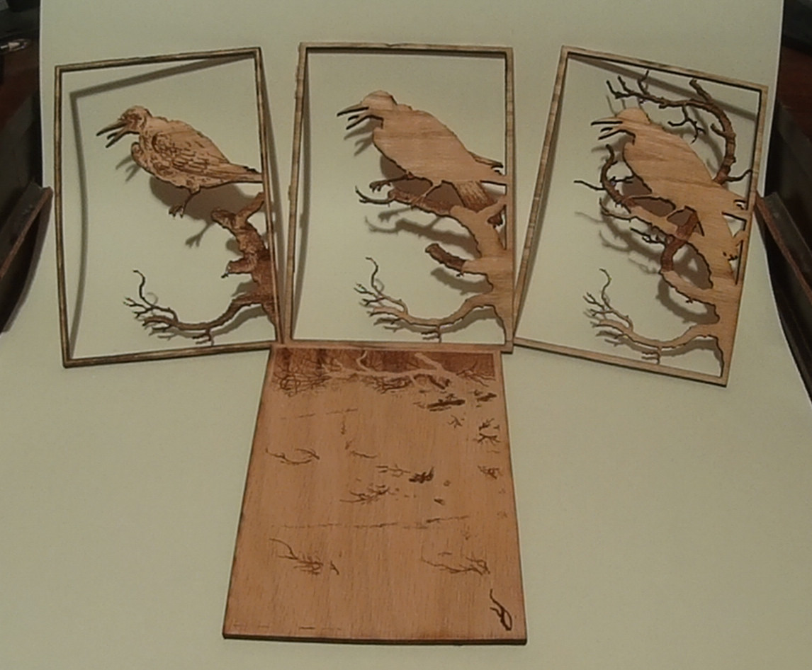

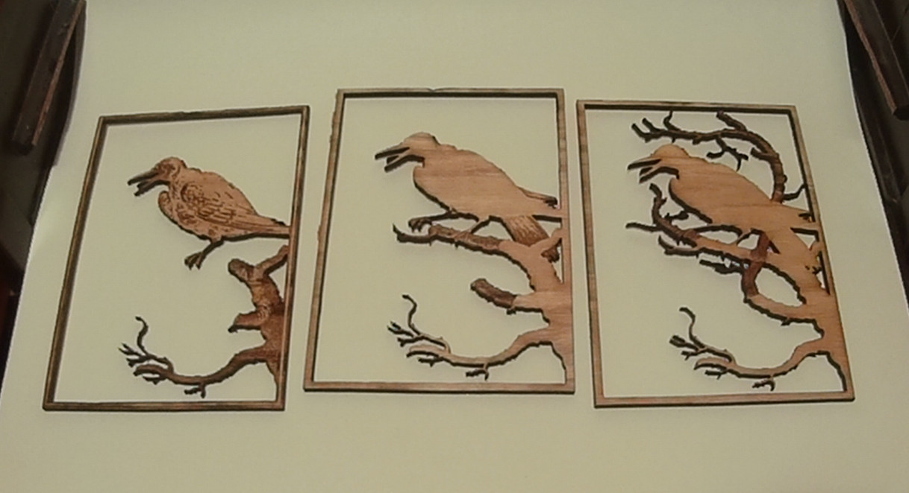

Maple wood was used as that's been reported as having the best results in terms of
engraving.
Transfer tape was put over the wood to minimize burn marks on the unetched and uncut
portions of the wood.

The registration of each layer can be done easily as the negative space that was left
unetched in the lower layers should line up with the cuts from layers above it.

Each layer was glued to the layer above it, starting with the top layer and working down.
First wood glue was used applied to the unetched parts of layer and the glued to the layer above it.

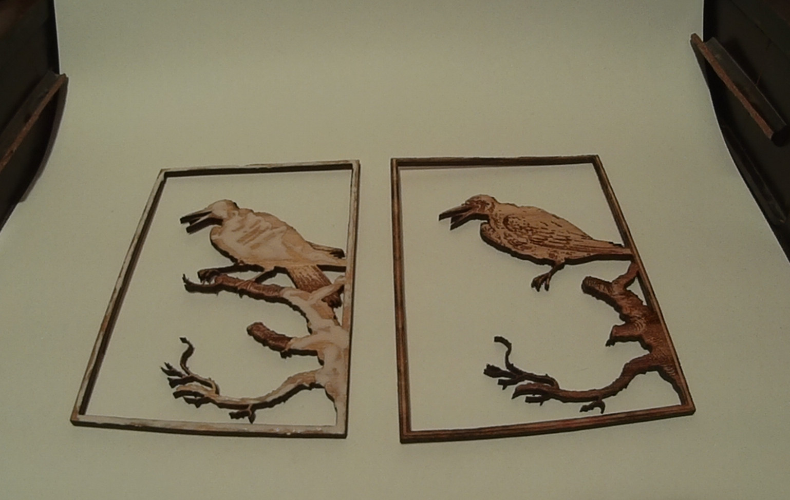

The layer was then aligned and small grips were attached to make sure there was pressure where the glue
was applied.

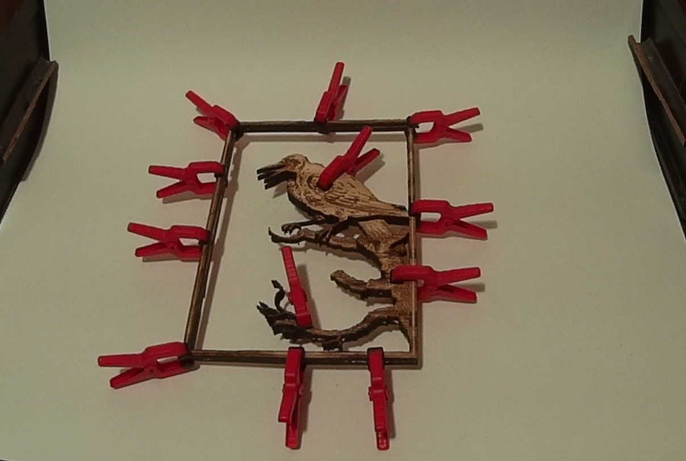

This was let sit for 15-30mins and the step was repeated for the layer below it.


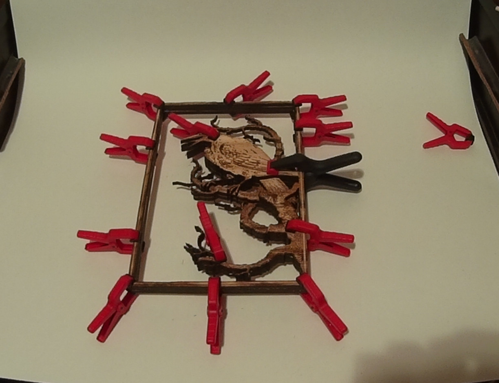

Once the top three layers have been glued, the glue was applied to the bottom and aligned on the back plate.

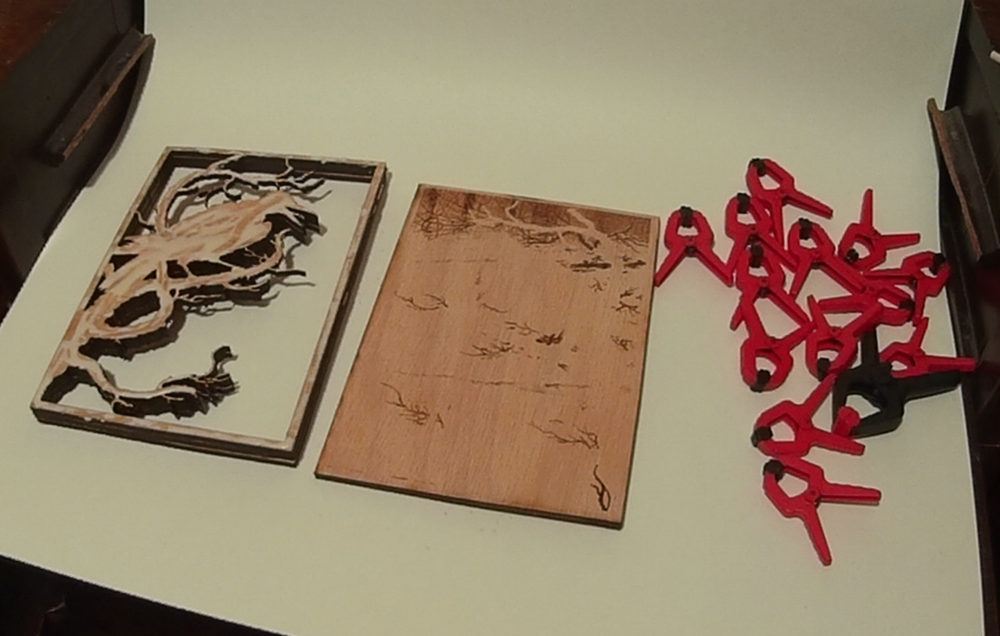

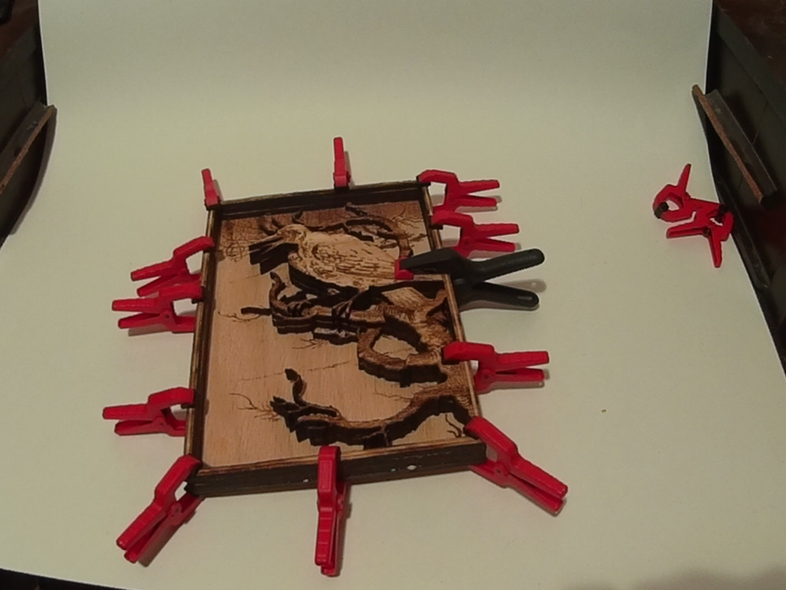

A small rectangular piece was cut and hinges were screwed into it.
The hinge holes that aren't screwed can be used to put wire or string through so the piece can be hung.


The backing was then glued to the back of the piece.

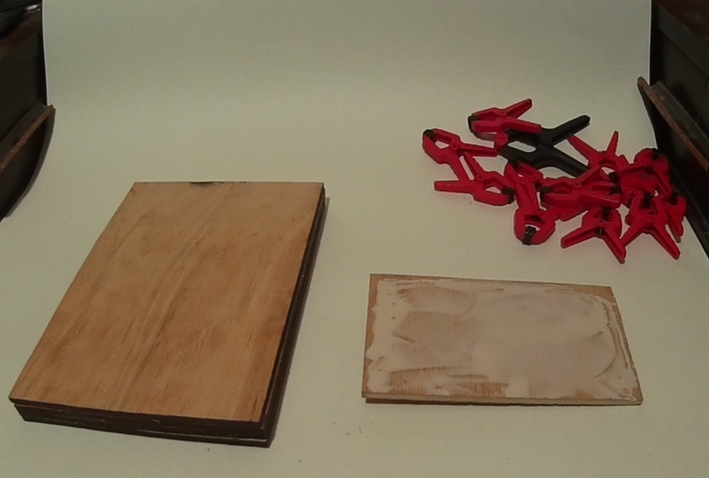

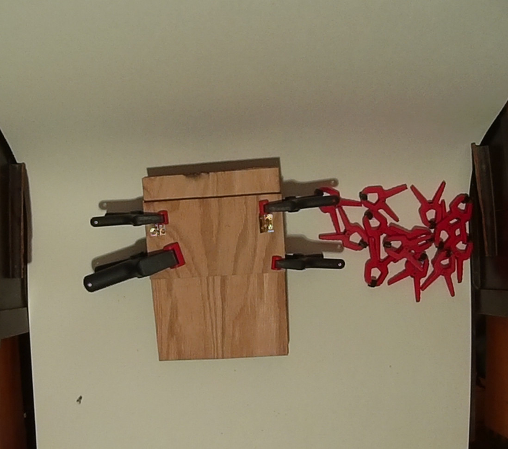

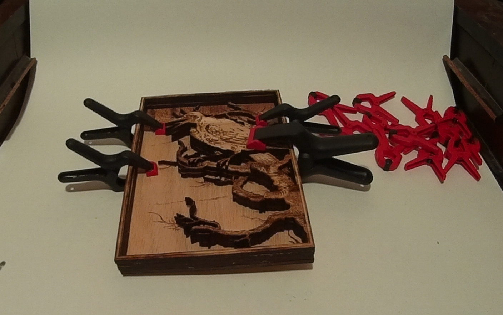

One could finish the wood to provide better protection.

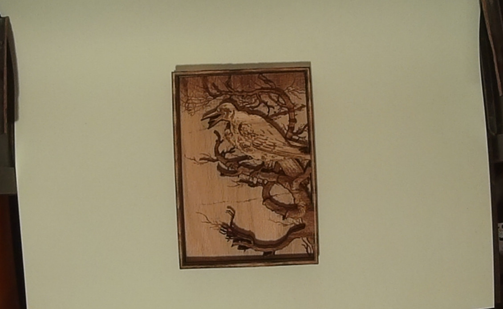


References
---

* ["The Fables of Aesop" by Kely and Sons, binders; Jacobs, Joseph, 1854-1916, ed; Heighway, Richard, ill](https://archive.org/details/fablesofsopsel00kely)
* [LaserWeb4](https://github.com/LaserWeb/LaserWeb4)
* [clipcli](https://github.com/abetusk/clipcli)
* [gp2ngc](https://github.com/abetusk/abes_cnc_utilities/blob/release/conversion/gp2ngc.py)
* [pstoedit](http://www.pstoedit.net/)
* [potrace](http://potrace.sourceforge.net/)
* [pngtopnm](http://netpbm.sourceforge.net/doc/pngtopnm.html)
* [ngc_scale](https://github.com/abetusk/abes_cnc_utilities/blob/release/ngc_scale.pl)
* [grecode](https://github.com/bkubicek/grecode)
