Laser Spiked Jacket
===

 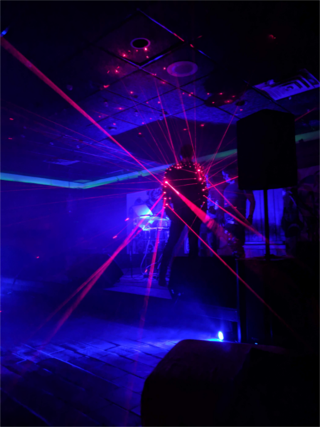
 
 [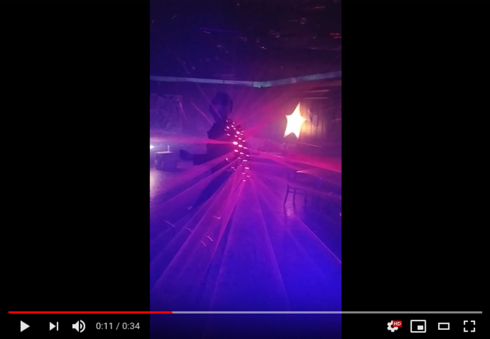](https://youtu.be/JvzV8-crT5Y)

Intro
---

After seeing [Wei Chieh Shi's laser jacket design](https://shihweichieh.com/laser-jacket-for-yoshii-kazuya), I wanted to create my own.
These instructions show how to modify a jacket to add laser diodes
and control them electronically to produce different laser light patterns.
The laser diodes give the jacket an appearance of being "spiky", like having
metal spikes but with red laser light.
The effect is especially striking in environments with fog or smoke as the
laser light path shows a trail from where it originates.

The concept and execution is relatively simple but care has to be taken to
make sure that the electronics, wiring and other aspects of the jacket don't
fail when in use.
Much of the subtlety and complexity of the project is providing proper wire
routing and making sure that strain relief for the electronics
and connections is provided so that it's resilient under normal wear.

Assuming the basic parts are available (soldering iron, multimeter, wire strippers,
laser cutter, etc.) I would estimate that this project is about $300 in raw materials and about 20 hours worth
of labor.
What follows is the way I created the jacket you see here and the design, sourcing
and implementation is open for improvement.

Depending on the battery used, the jacket can operate for about an hour or two continuously.
Spare batteries can be carried around and used to replace the depleted batteries if need be.

Materials
---

| | | |
|---|---|---|
| 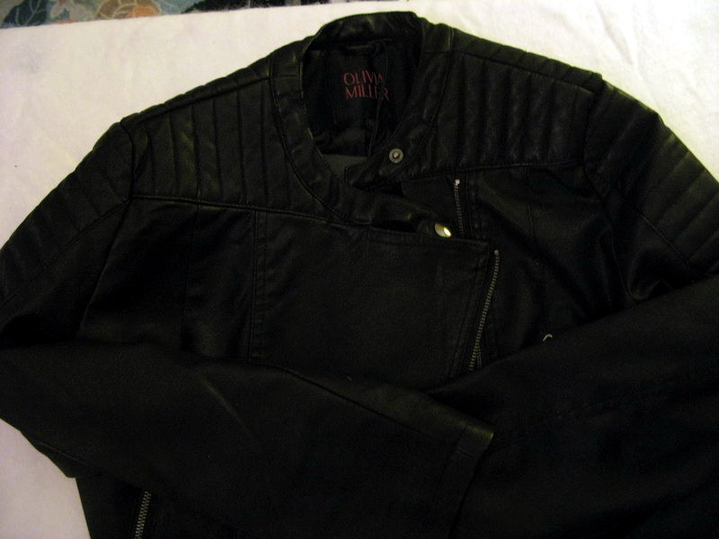 | 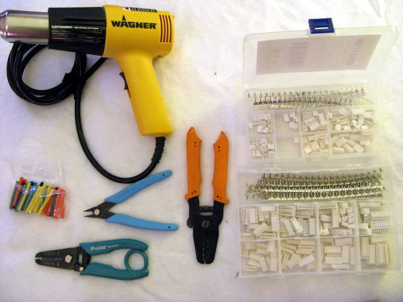 | 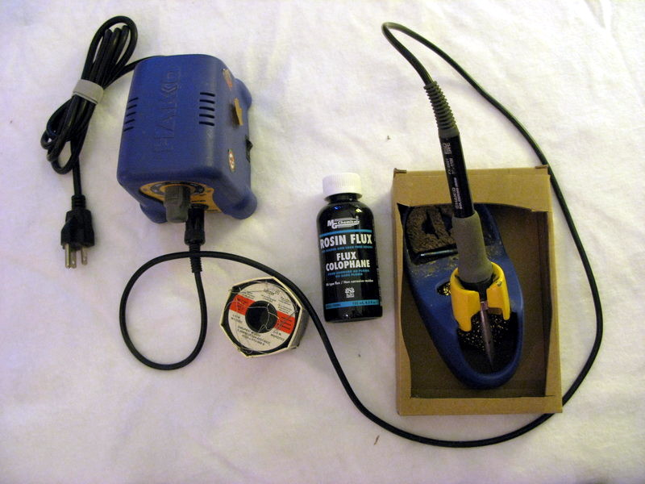 |
| 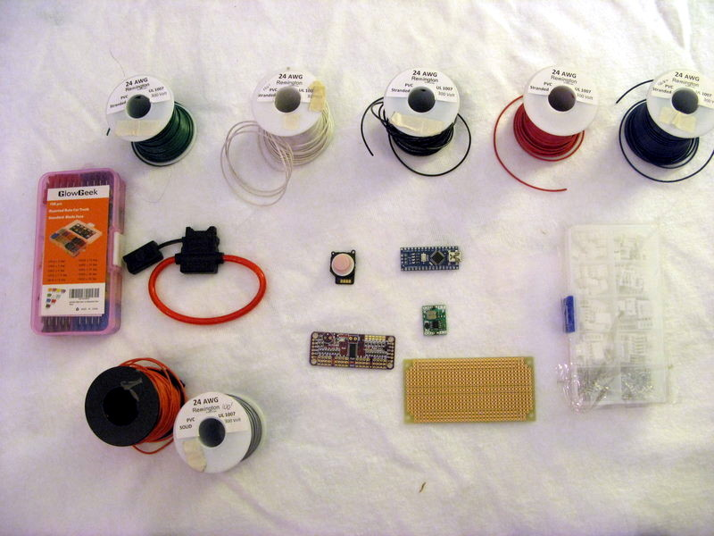 | | |

* Jacket ([Amazon](https://www.amazon.com/gp/product/B01GKGWBCM/))

* Soldering Iron ([Amazon](https://www.amazon.com/Hakko-FX888D-23BY-Digital-Soldering-Station/dp/B00ANZRT4M/))
* Multimeter ([Amazon](https://www.amazon.com/AstroAI-Digital-Multimeter-Voltage-Tester/dp/B01ISAMUA6/))
* Solder ([Amazon](https://www.amazon.com/Kester-24-6337-0010-Rosin-Solder-SPOOL/dp/B00068IJWC/))
* Wire Cutter ([Amazon](https://www.amazon.com/CHP-170-Stand-Off-Maximum-Cutting-Capacity/dp/B00FZPDG1K/))
* Wire Strippers ([Amazon](https://www.amazon.com/WGGE-Professional-crimping-Multi-Tool-Multi-Function/dp/B073YG65N2/))
* Flux ([Amazon](https://www.amazon.com/MG-Chemicals-Corrosive-Conductive-residue/dp/B005DNR01Q/))
* Helping Hands (optional) ([Amazon](https://www.amazon.com/SE-MZ101B-Helping-Hand-Magnifier/dp/B000RB38X8/))
* Soldering Braid (optional) ([Amazon](https://www.amazon.com/Vastar-Solder-Packs-Desoldering-Length/dp/B073TRWY19/))
* Nitrile Gloves (optional) ([Amazon](https://www.amazon.com/gp/product/B009D15X1S/))

* Arduino Nano ([Amazon](https://www.amazon.com/ELEGOO-Arduino-ATmega328P-Without-Compatible/dp/B0713XK923/), [EBay](https://www.ebay.com/itm/5Pcs-USB-CH340G-Nano-V3-0-16M-5V-ATmega328P-Micro-Controller-Board-For-Arduino/222545056262))
* Joystick Module ([Amazon](https://www.amazon.com/WGCD-Joystick-Breakout-Controller-Arduino/dp/B01N59MK0U/), [EBay](https://www.ebay.com/itm/2X-JoyStick-Breakout-Module-Shield-PS2-Joystick-Game-Controller-For-Arduino/382748157784))
* Microphone ([Amazon](https://www.amazon.com/HiLetgo-Electret-Microphone-Amplifier-Adjustable/dp/B07DRGF8C2/))
* 128x Laser Diode Module ([Amazon](https://www.amazon.com/DTOL-Laser-Diode-Module-650nm/dp/B00R73MC1S/), [EBay](https://www.ebay.com/itm/100pcs-Red-Dot-Laser-Diode-Module-5-Volt-5mW-650nm-Heads-New/173409416207))
* 2x PCA9685 16 channel PWM drivers ([EBay](https://www.ebay.com/itm/PCA9685-16-Channel-12-bit-PWM-Servo-Driver-I2C-Interface-for-Arduino-Raspberry/201916673816))
* 5V Buck Converter ([Amazon](https://www.amazon.com/gp/product/B077TC3812/))
* 5V 3A BEC ([Amazon](https://www.amazon.com/Ship-Hobbywing-Switch-mode-UBEC-Lowest/dp/B008ZNWOYY/), [EBay](https://www.ebay.com/itm/3A-RC-Ubec-5V-6V-BEC-Full-5A-Shielding-Antijamming-Switching-Regulator-New-US/362502124866))
* 7.4V 850mAh LiPo battery ([Amazon](https://www.amazon.com/SoloGood-850mAh-Battery-Connector-Racing/dp/B07L9VFMMJ/))
* XT30 Connectors ([Amazon](https://www.amazon.com/Finware-Upgrade-Female-Connectors-Battery/dp/B074S7NH3H/))
* 20 gauge in line fuse holder ([Amazon](https://www.amazon.com/2-pack-Gauge-Fuse-Holders-FUSES/dp/B01MQP96S3/))
* Rocker switch ([Amazon](https://www.amazon.com/XiangLv-Solder-Rocker-Switch-Toggle/dp/B07B9RPLZD/))
* 2s LiPo charger ([Amazon](https://www.amazon.com/RC-Battery-Balancer-Charger-7-4-11-1V/dp/B06XR87987/))
* 2x Gikfun Proto-Boards ([Amazon](https://www.amazon.com/gp/product/B071WC2BCF))
* 1x protoboard ([Amazon](https://www.amazon.com/gp/product/B00LLO4Q7W/))
* 1x small protoboard ([Amazon](https://www.amazon.com/Gikfun-Solder-able-Breadboard-Arduino-Electronic/dp/B0778G64QZ/))

* 50x 2pin male/female JST 2.5mm connectors ([Amazon](https://www.amazon.com/Pieces-2-54mm-JST-XHR-Connector-Female/dp/B0731NHS9R/), [EBay](https://www.ebay.com/itm/100-pcs-of-PH-2-0mm-2-Pin-Right-Angle-JST-Socket-Male-Connector/152686455882))
* 5x 6pin male/female JST connectors ([Amazon](https://www.amazon.com/Pieces-2-54mm-JST-XHR-Connector-Female/dp/B077LYP4T9/))
* 150x JST 1.25mm male/female pair ([Amazon](https://www.amazon.com/gp/product/B013JRWCBU/), [EBay](https://www.ebay.com/itm/50-Sets-Mini-Micro-JST-1-5mm-ZH-2-Pin-Connector-Plug-With-Wires-Cables-150mm/332287106091))
* 6 colors of 24 AWG wire, stranded 300V (10ft) ([Amazon](https://www.amazon.com/Stranded-Nano-Flexible-Insulated-Electrical/dp/B07DCV7BDD/))
* 2 colors of 24 AWG wire, stranded 300V (200ft) ([Amazon](https://www.amazon.com/Remington-Industries-24UL1007STRBLA-Stranded-Diameter/dp/B00NB3SYB0/), [Amazon](https://www.amazon.com/Remington-Industries-24UL1007STRWHI-Stranded-Diameter/dp/B00NB3T6LM/))
* 2 colors of 24 AWG wire, solid core (10ft) ([Amazon](https://www.amazon.com/Electrical-tinned-copper-electric-CBAZY/dp/B07HRLQVGM/))
* Engineer PA-21 Universal Crimping Pliers ([Amazon](https://www.amazon.com/Engineer-PA-21-Universal-Crimping-Pliers/dp/B002L6HJ8W/))
* 1/4" braided cable sleeve ([Amazon](https://www.amazon.com/100ft-Expandable-Braided-Sleeving-braided/dp/B074GM1PK1/))
* Heat Shrink Tubing ([Amazon](https://www.amazon.com/Ginsco-580-pcs-Assorted-Sleeving/dp/B01MFA3OFA/))
* Heat Gun ([Amazon](https://www.amazon.com/Genesis-GHG1500A-Temperature-Nozzle-Attachments/dp/B00EU2T8GG/))

* 12x 30mm M3 bolt & 20x 6mm M3 bolt ([Amazon](https://www.amazon.com/iExcell-Stainless-Internal-Drives-Socket/dp/B076GZQXHB))
* 100x M3 nut ([Amazon](https://www.amazon.com/Shapenty-100PCS-Stainless-Female-Fastener/dp/B071NLDW56))
* 400x 25mm M2 black hex cap bolt ([Amazon](https://www.amazon.com/XunLiu-100PCS-Socket-Screws-Knurled/dp/B07CHG7845))
* 1000x M2 nut ([Amazon](https://www.amazon.com/Wkooa-Stainless-Right-Threads-Micro/dp/B07L3TSKKT))
* Tubing ([Amazon](https://www.amazon.com/Penn-Plax-Aquariums-Flexible-Standard/dp/B0002563MW/))

* 24"x36"x1/16" Black Acrylic Sheet ([Amazon](https://www.amazon.com/gp/product/B07D9RQC8Z/))
* 3x 12"x12"x1/8" Wood Sheet ([Amazon](https://www.amazon.com/Premium-Baltic-Birch-Plywood-Woodpeckers/dp/B078JZG5J2/))
* Laser Cutter ([Amazon](https://www.amazon.com/VEVOR-Engraving-Machine-Exhaust-Stepping/dp/B06Y2PB3RX/))

* Velcro tie ([Amazon](https://www.amazon.com/Attmu-Reusable-Fastening-Microfiber-6-Inch/dp/B00O9VKVFK/))
* Snaps (optional) ([Amazon](https://www.amazon.com/LIHAO-Pliers-Plastic-Buttons-Crafting/dp/B0734WN4RW/))
* Scissors ([Amazon](https://www.amazon.com/Scotch-1448-Precision-Scissor-8-Inches/dp/B001BKHHGS/))
* Cable ties ([Amazon](https://www.amazon.com/TR-Industrial-TR88302-Multi-Purpose-Cable/dp/B01018DC96/))
* Cable clamp ([Amazon](https://www.amazon.com/LICTOP-R-Type-Fasteners-Tubing-Management/dp/B07P3ZKG45/))

A quick note: Amazon generally offers quicker shipping than the EBay alternative but often at 2-10 times the cost.
I've found there's often minimal difference in quality between the items I order on Amazon and EBay.

I prefer to crimp my own connectors but if you don't mind paying a bit extra, you can buy pre-crimped connectors.
I also have a preference for angled female connectors though having a good mix of straight and angled provides more
options.

Design Overview
---

The basic design is to attach 128 laser diodes to the arms, shoulders and upper back of a
'moto' jacket and provide power and control to the laser diodes with electronics.
The electronics are put into a housing and all wires, electronics and their housing are
hidden in the interface between the outer jacket shell and the inner lining.

A joystick and microphone is used for input, with power being provided by a LiPo rechargeable batter.

The basic components are:

* Laser diode housing and attachment
* Electronics
* Electronics Housing
* Wiring and connection

The basic workflow is roughly as follows:

* Assemble the laser diodes with their connectors and housing
* Attach the laser diodes to the jacket
* Solder the electronics and assemble them in their housing
* Create the cabling and connect the laser diodes to the electronics
* Wear it

Laser Diode Assembly
---

The laser diodes are attached to the outside of the jacket by a laser cut 'housing'.
Each laser diode housing is a stack of laser cut acrylic, fit together with M2 screws.
The base of the housing is put under the outer jacket shell to provide support for
the laser diode and relief for the laser diode wires.

### Attach Laser Diode Cabling

| | |
|---|---|
| 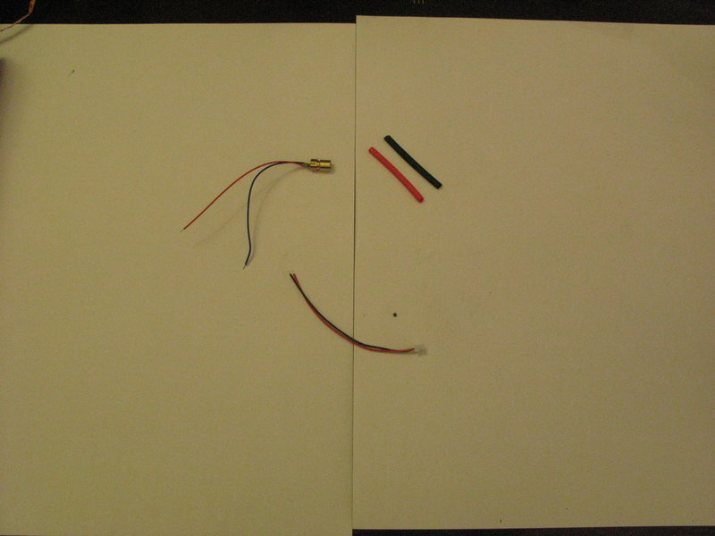 | 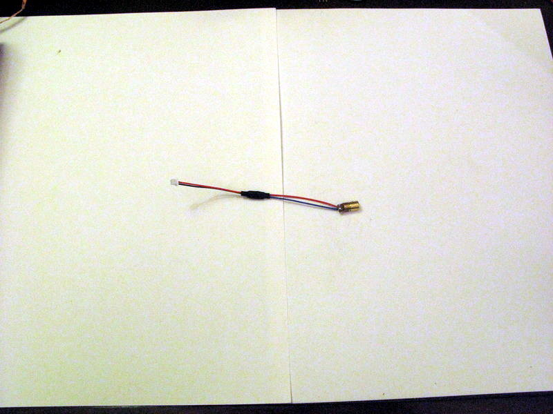 |
| 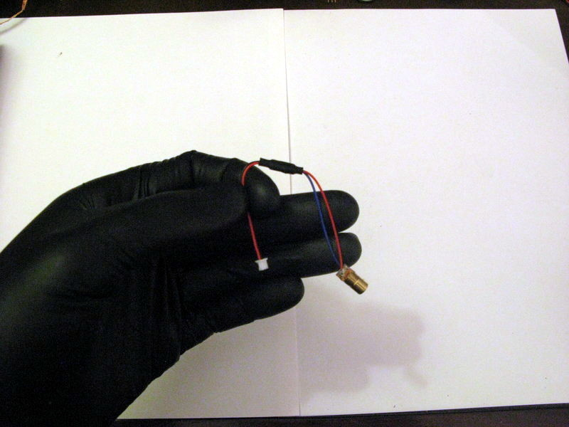 | 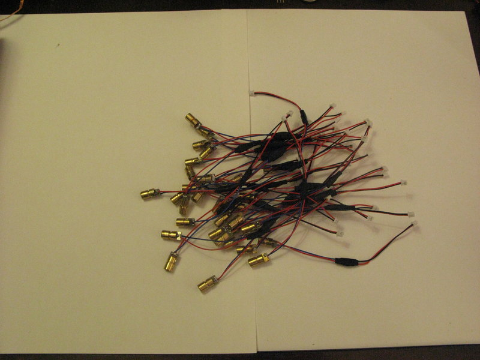 |
|  | 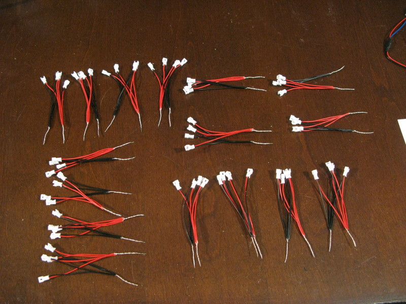 |

After testing each laser diode to make sure they work, solder a male  JST 1.25mm 2pin header
to each of the ends of the laser diode.
I've found best results by cutting the edge of the wires off, stripping them and then wrapping and
soldering them.

As much as possible, I try to make a 'lineman splice' when connecting wires to make sure
there's a good connection.
Make sure to put the heat shrink tubing on before soldering.

Before soldering, apply a healthy drop of flux to make sure the solder will flow well.
Once the wires are soldered together, put the heat shrink tube on and heat with the heat
gun to give a good fit.

If there's any exposed wires, cover with electrical tape.
If for some reason the heat shrink tube is loose, you can always put another, larger,
heat shrink tube around both and shrink to fit.

Be gentle when handling the laser diodes as the wires connected to the laser come off easily.

Do this for each of the 128 laser diodes.
As much as possible, test the laser diodes after attaching the cabling.
This might mean making a 'test cable' to test each of the laser diodes.

### Laser Cut Housing

Use your laser cutter to cut the laser diode housing.
I used 1/16" black acrylic.
My laser cutter has an effective work area of 8"x12" which allows a sheet of
black acrylic to cut out approximately 20 laser diode housings per run.

Though probably obvious to people who use laser cutters more than I do, make
sure to take off the paper protection for the acrylic sheets.
The acrylic cut is clean and often doesn't produce a flame, so any paper protection
isn't necessary.
Leaving the paper on also tends to cause the work to catch fire.

I've found that my laser cutter only has about 30 minutes of operation before
the water cooling becomes too hot for the laser cutter to keep functioning properly.
This is highly dependent on the type of laser cutter and cooling system that's installed
but it's something to keep an eye on.

After the housing has been cut, I've found that it's necessary to remove smaller interior
pieces with a small pick.
I like to prepare the acrylic pieces by putting them into groups depending on whether
it's and outer, inner or backing piece, for ease of assembly later.

### Assemble Laser Diode Housing

| | |
|---|---|
| 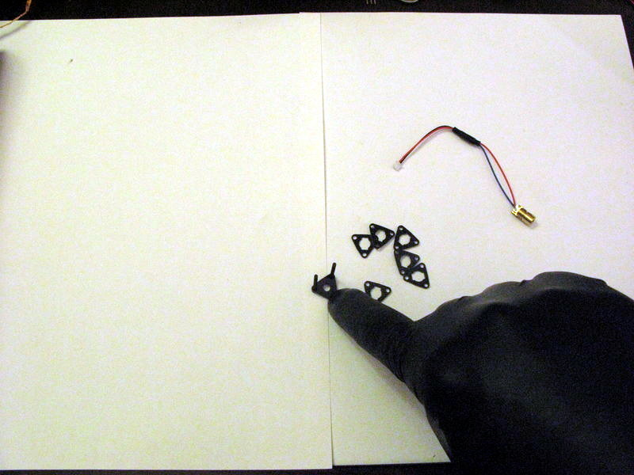 | 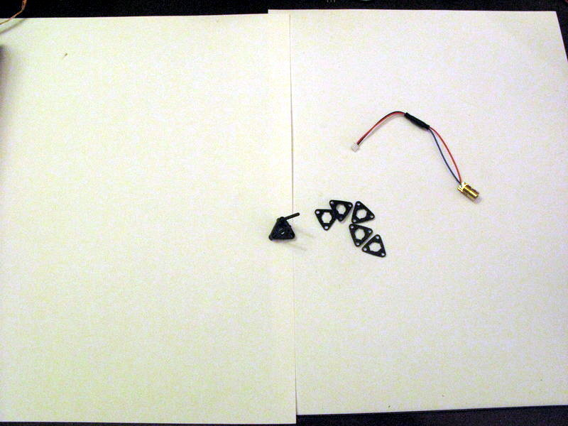 |
| 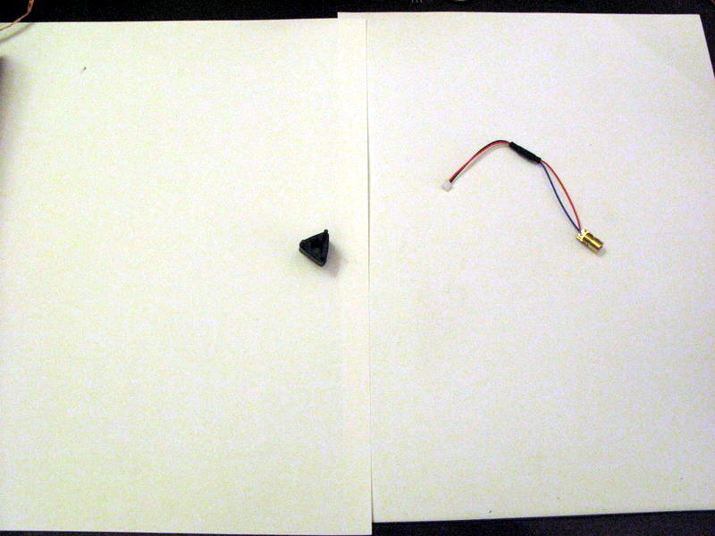 | 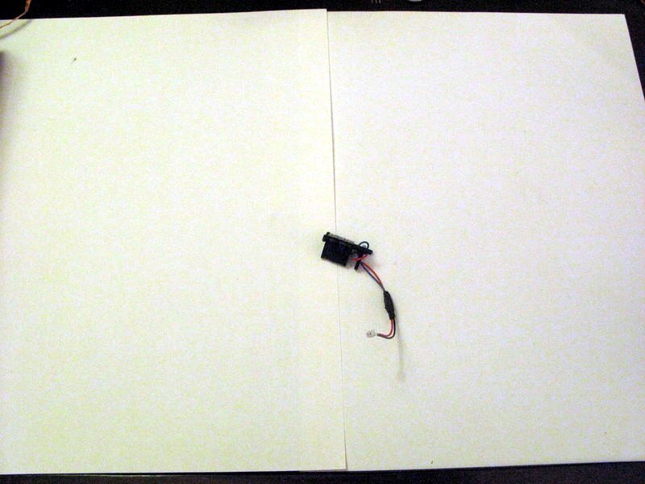 |
| 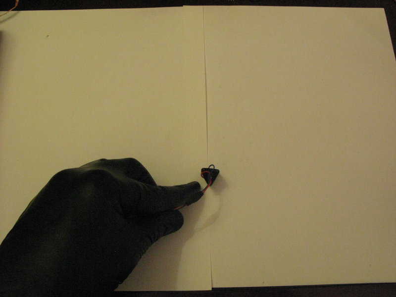 | 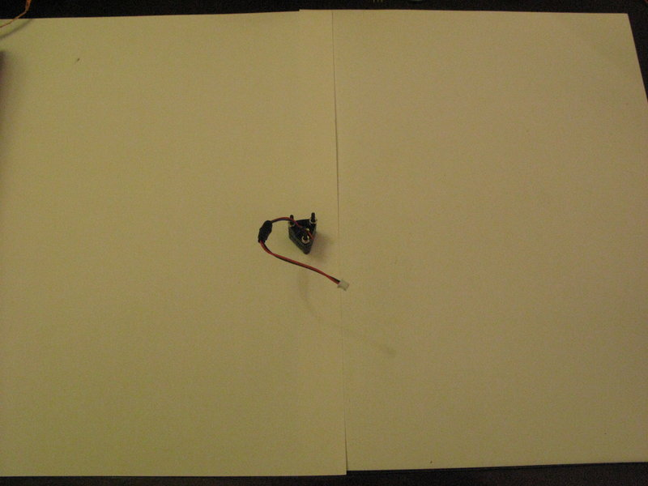 |
| 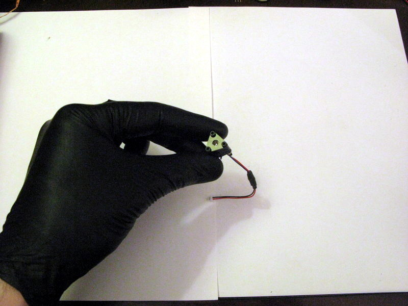 | 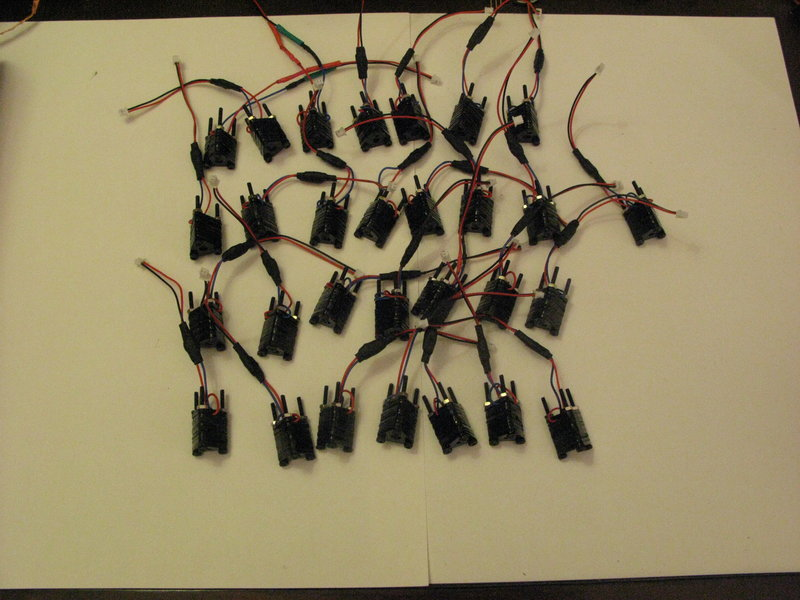 |

After the laser diodes have been cabled and the laser diode housings have all been cut,
it's time to assemble the laser diode in it's housing.
This won't be the complete housing as there's a final backing piece that won't be put
on until the laser diode is attached to the jacket but most of the laser diode assembly
is done in this step.

Prepare the 128 cabled laser diodes along with the pile of acrylic housing pieces and
the M2 25mm screws and nuts.
One by one, put each of the laser diodes into the assembled laser housing.

I've found the best way to proceed is to put two M2 screws through the top housing
plate then progressively add the six middle plates.
I try and put the two M2 screws in a position that is perpendicular to the rectangular
slot in the middle stacked plates.
When stacking the middle plates, make sure that the rectangular slots line up.

I loop each laser diode through a bottom plate.
This loop is done to provide strain relief for the wire so that moderate force
won't disconnect the soldered wires from the laser diode.
Once the laser diode is looped through the bottom plate, I then position the
laser diode onto the stack.

Once the laser diode is seated in the laser diode housing stack, I then insert
the third M2 screw and put a nut on each of the three M2 screws.
The idea is to screw the bottom plate on tight enough to keep the laser diode
cables in place and relieve any forces that would yank on the wires coming out.

Using acrylic for the housing and strain relief is less than ideal as the acrylic
is very brittle and cracks easily.
I've found that the bottom plate often cracks when screwing the nuts in place.
As long as the acrylic bottom plate provides strain relief, even if it's cracked,
the housing is still doing it's job.
While the brittle acrylic and potential cracking is not ideal, I've found that
it works well enough.

Any future iteration of this project should provide a better solution to housing
the laser diodes.

### Attach Laser Diodes to Jacket

| | |
|---|---|
| 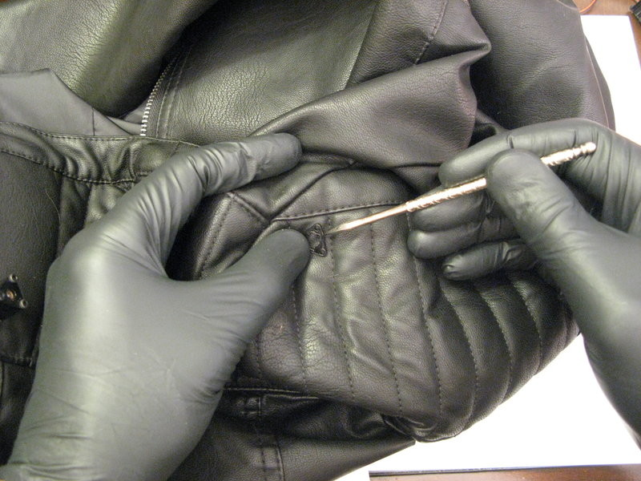 | 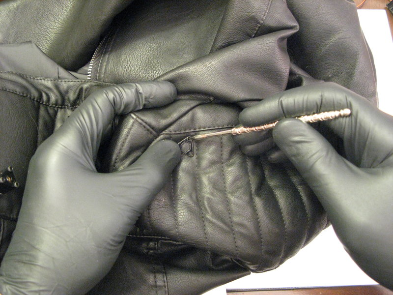 |
| 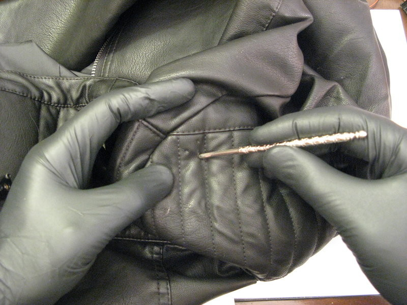 | 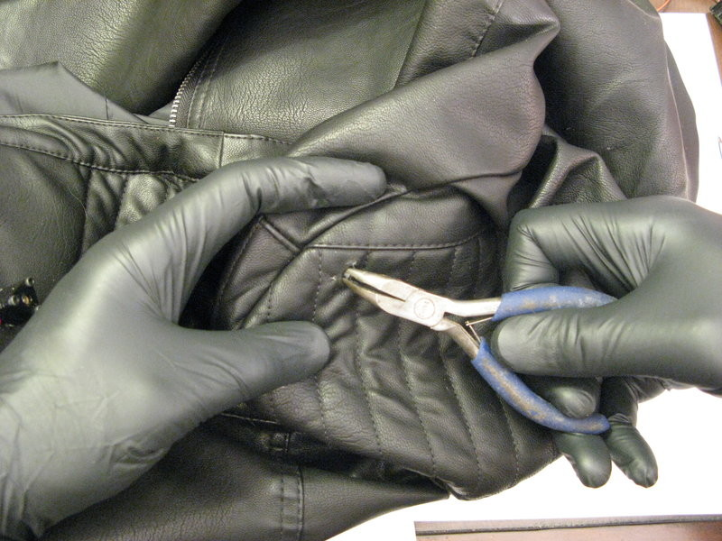 |
| 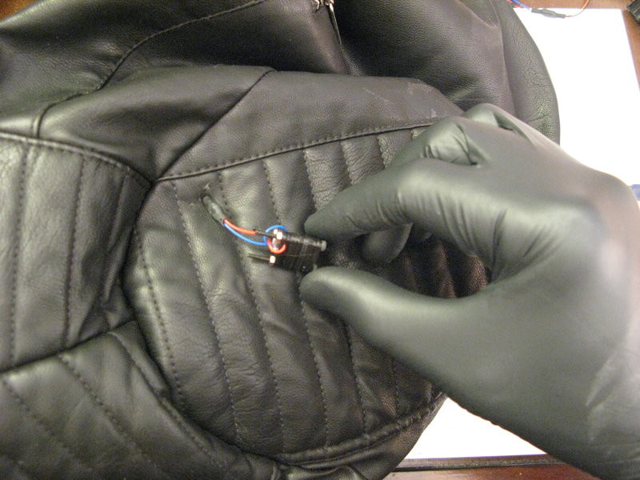 | 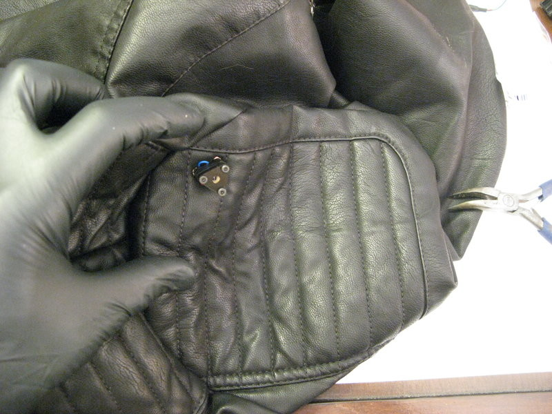 |
| 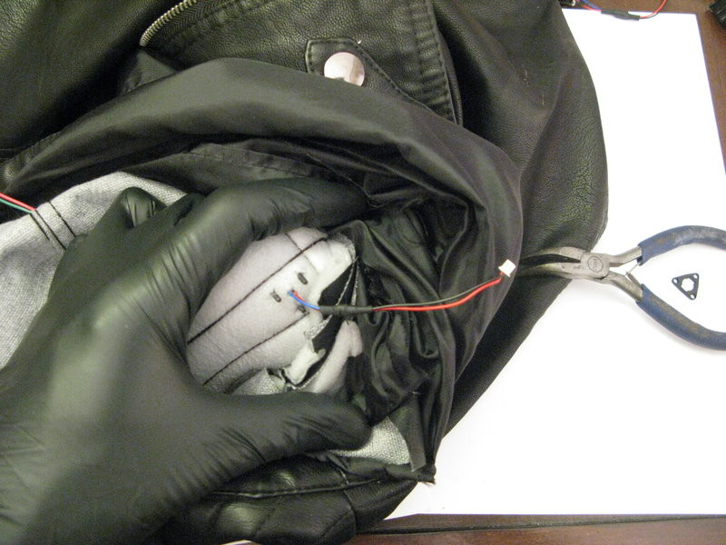 | 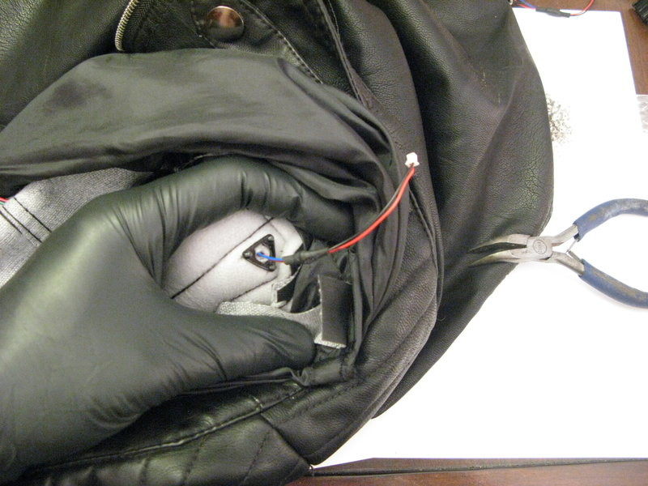 |
| 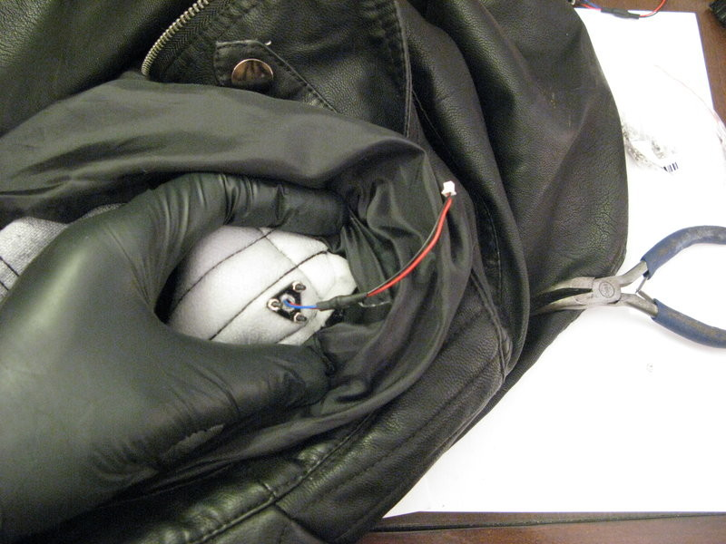 | 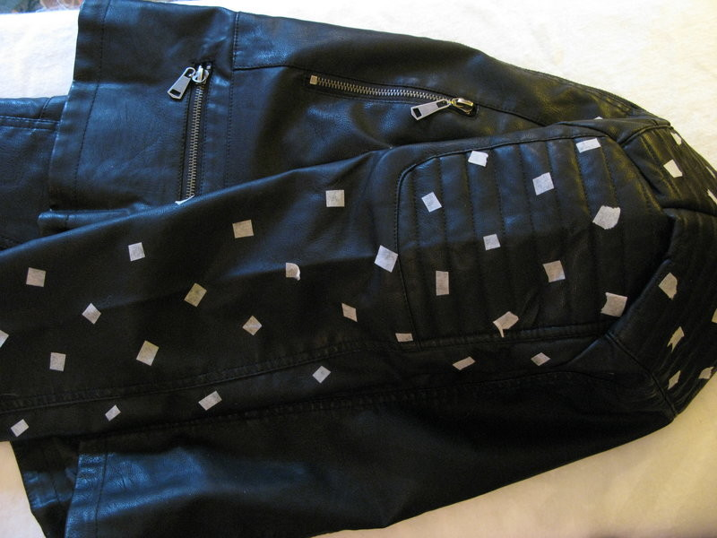 |
| 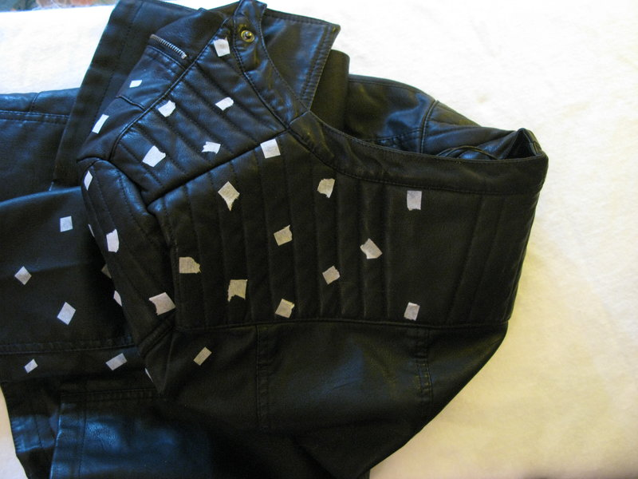 | 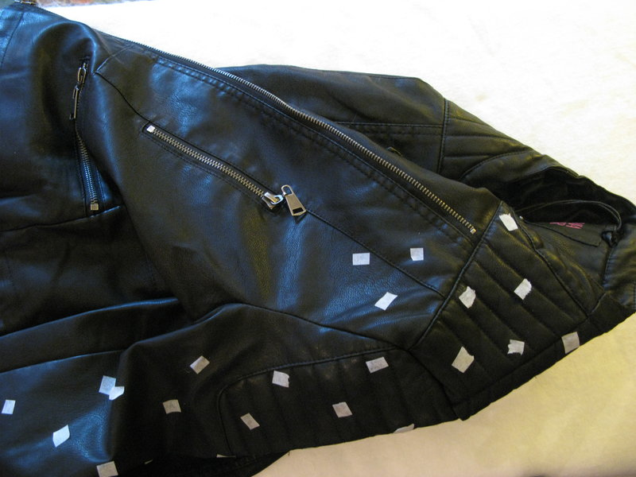 |

Once the 128 laser diodes have been put in their housing, it's time to attach
them to the jacket.
First, open up the jacket lining to get access to the inner jacket shell.
It's best to keep as much of the lining intact as possible as the lining
provides shielding from the cabling to your skin when wearing the jacket
and also provides a convenient place to put the electronics out of sight.

I've found that taking the stitches out of the middle back is best.
The opening can be closed off later with snaps or velcro.

A pattern is first marked on the outside of the jacket to decide where to place each of the
laser diodes.
I initially did this with tape.
After the first few rows had been placed, I found the tape was mostly not necessary
as it's easy to judge where the to place the laser diodes by eye.

Use a middle plate of the laser housing as a guide to
poke four holes per laser diode in the jacket.
The outer three holes are for the M2 screws to hold the housing in place
and the center hole is for the laser diode wiring to go through.
I use an antique walnut cracker but any sharp pointed object will do to create
the holes in the jacket.

The center hole for the cable needs to be bigger than the rest as the JST 1.25mm
male header is bigger than the M2 screws.
I've found that enlarging the hole with a pair of needle nose pliers works well.

Once the laser diode housing's cable and three M2 screws have been fed through
the holes, the inside of the jacket shell needs to be accessed to attach
a middle housing plate to the M2 screws that are now poking through.
For the fist few rows of the laser diodes, the jacket arm might need to be
turned inside out but as the laser diodes are attached further up the arm,
it's possible to get access to them without completely turning the arm inside out.

When turning the arm inside out, take care to try not to damage the laser
diodes.
The laser diodes in their housings should be moderately resilient (after all, that's one of the reasons they
were designed) but it's best to still be as careful as possible.

When the underside has been accessed, place a center laser housing plate on
the bottom, feeding the M2 screws through the three holes and the laser diode
cable through the center.
Screw the plate on with three M2 screws.

Once all the laser diodes have been attached, if possible, test each laser
diode to make sure they still function.

Testing earlier in the process helps weed out potential problems down the line.
Engineering and electronics are hard to do in general and when there's the added
element of electronics attached to clothing that's bending, bumping, moving and
flexing, it makes it all that much more probable that failure occurs.

Considering the quantity of elements involved in the project, failure can
be expected, so make sure to have a few extra laser diodes on hand so that
when failures are detected, the laser diodes can be replaced.

Understand that component failure is part of the process and don't get
demotivated when things break or don't initially work.
Failure is to be expected, planned and compensated for by testing
and making sure there are replacement parts handy.

Once all the laser diodes are attached and we have some reasonable expectation
that they function, it's time to move on to creating the electronics
that will drive the laser diodes.

Electronics Assembly
---

The electronics are a pair of PCA9685 PWM controllers which are themselves controlled by
an Arduino Nano.
A microphone is hooked up to the Nano to allow for ambient sound input, music for example,
and a joystick with a button is provided for some control.

The joystick button is used to control which 'mode' the jacket display is in.
Currently, there are three modes:

* Twinkle - loops the laser diodes in a 'twinkle' pattern
* Graphic Equalizer - use the microphone input to get graphic equalizer data to control the laser diode project pattern
* Joystick Controlled - use the joystick to control the laser diodes directly

Each output line of the PWM driver is fed into four laser diodes.

The laser diodes are powered by a 5V 3A "battery elimination circuit" (BEC).
The Arduino Nano and all of the logic on the peripherals are powered by a 5V buck converter.
The BEC and buck converter are powered by a LiPo 2s battery.
The battery has an attachment of a 3A fuse and power toggle.

As stated above, the fuse is a safety precaution to make sure that any accidental
short circuit doesn't result in a catastrophic and potentially hazardous failure.
The power toggle is provided for ease of use.

### Power Cable

| | |
|---|---|
| 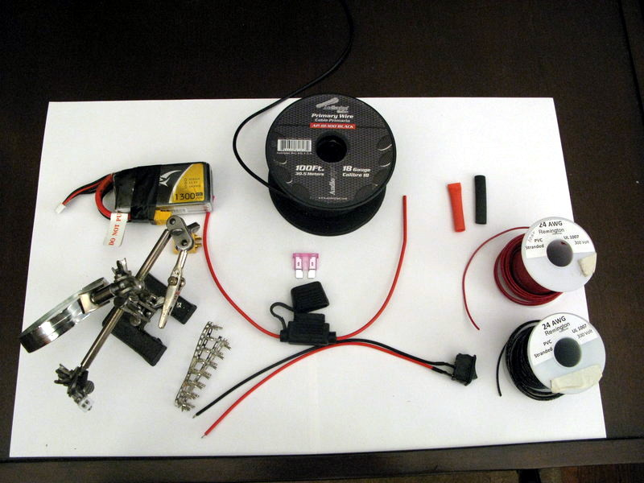 | 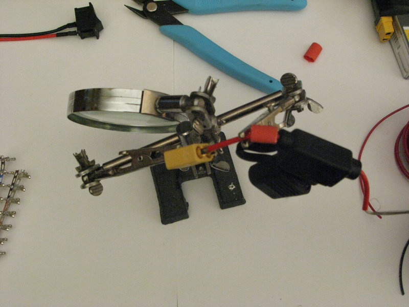 |
| 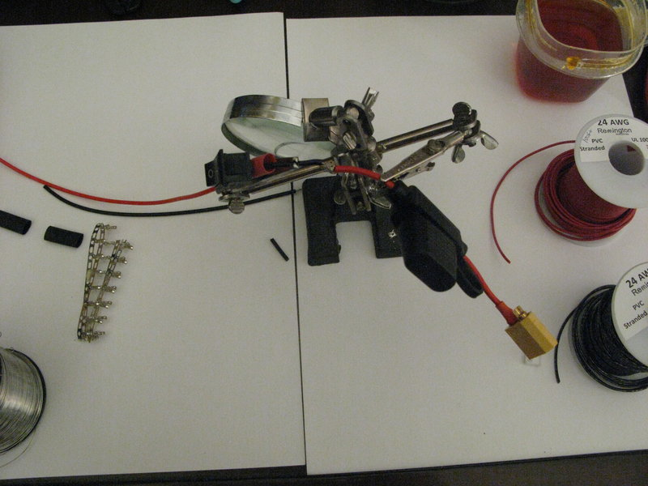 | 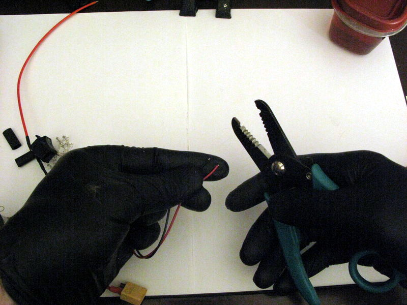 |
| 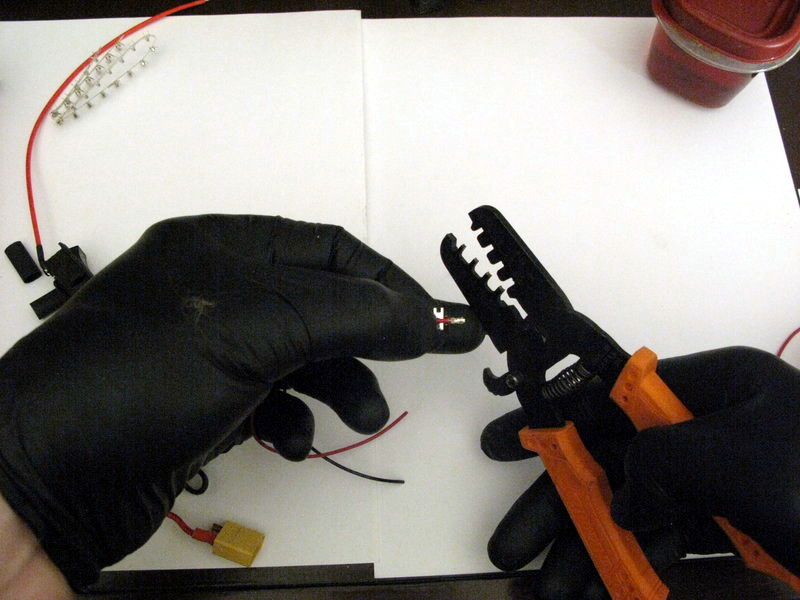 | 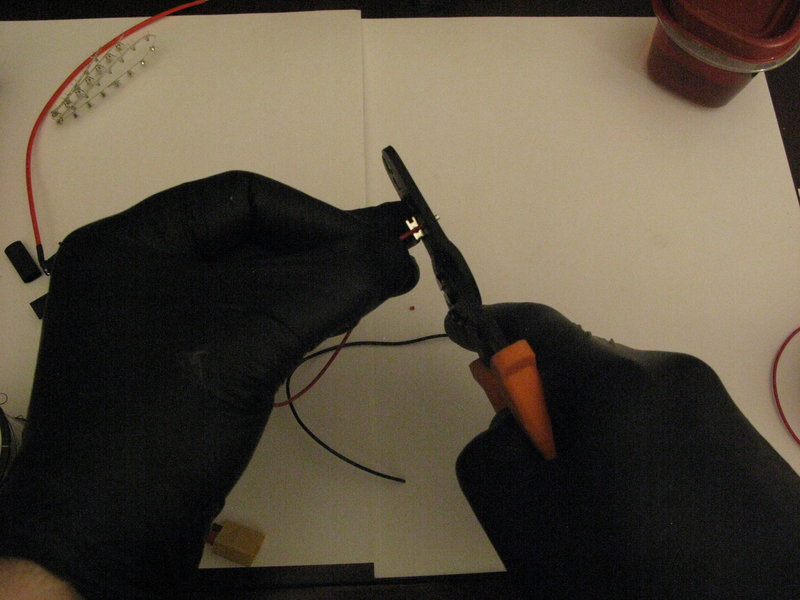 |
| 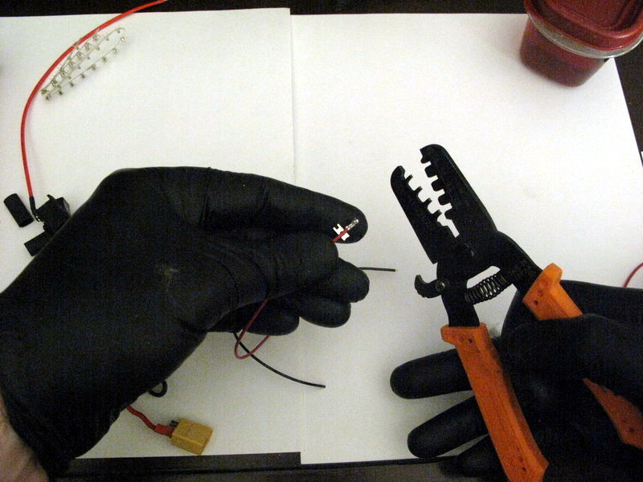 | 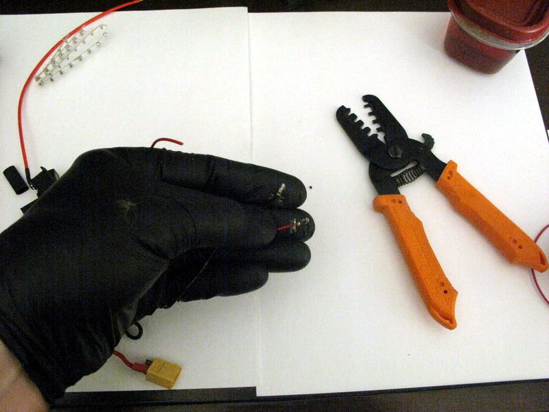 |
| 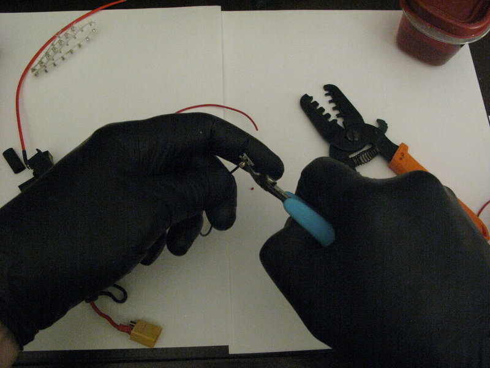 | 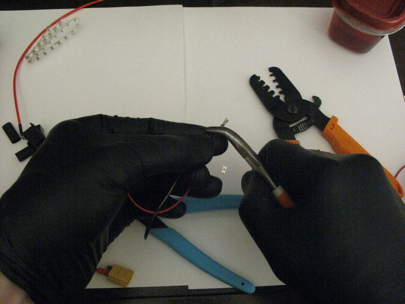 |
| 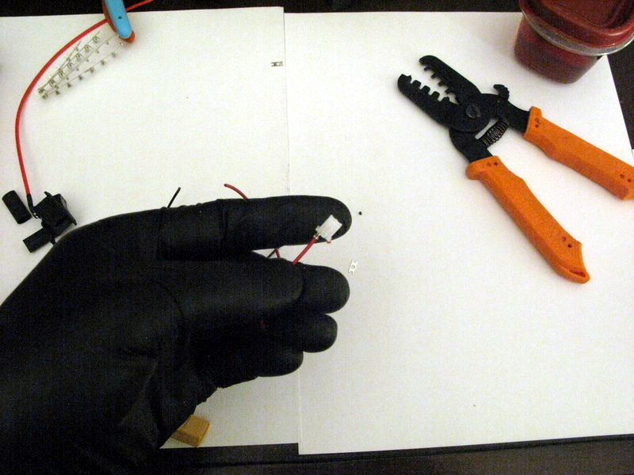 | 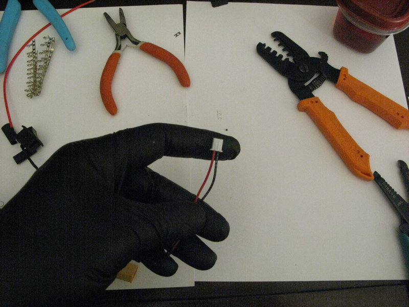 |
| 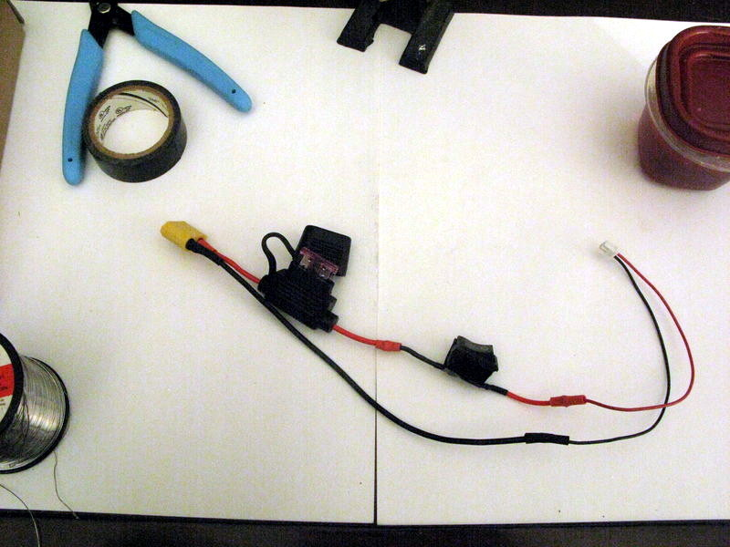 | 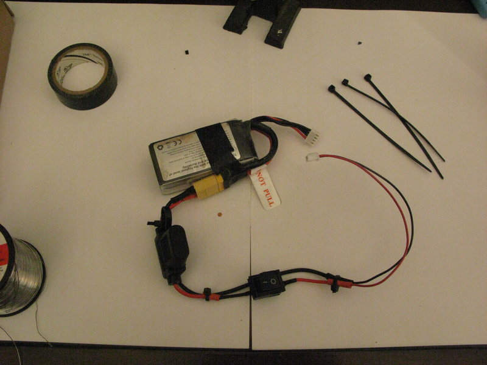 |

For safety and convenience reasons, a cable for the 2s LiPo battery is created and connected.
It's sometimes easy to accidentally create a short when soldering or prototyping.
Should a short happen without a fuse in line with the LiPo battery, the battery often has
the potentially to push upwards of 25A through the connection.

When prototyping, I've accidentally created a short and had one of the wires heat up and explode,
causing the wire shielding to catch fire.
With the fuse in place, I've had no fires or explosions, so I would highly recommend putting
this safety feature in.

I've found the 20 AWG fuse holder to be a good wire size.
Larger gauges become unwieldy to attach to other cables.

Solder one end of the 20 AWG fuse holder into the positive lead of a female XT30 connector.
In line with the fuse holder, on the end that isn't connected to the battery,
solder a power toggle switch wire.
For both, make sure to feed the heat shrink on before soldering.

For all attached wiring, I think the [Lineman splice](https://en.wikipedia.org/wiki/Western_Union_splice)
is a good technique to strive towards.
When the wires are wrapped together well, add drop of flux and solder them together.
Once soldered, give the wires a decent yank to make sure they're attached well.

Once the wires are attached firmly, feed the heat shrink tubing onto them
and use the heat gun to shrink the tubing over the soldered joint.
If you don't have any heat shrink tubing or forgot to put it on, wrap
the exposed solder joint in electrical tape to make sure it's isolated.

I put electrical tape around the bottom of the toggle switch to make sure
any exposed leads are covered.

Attach another lead to the negative end of the XT30 connector, making sure
to match the length of the fuse, toggle and end connector.

Create a 2 wire end connector with a JST 2.5mm male end.
I've found a 24 AWG stranded wire to be a good option for
this.

As before, I believe attaching the JST 2.5mm male 2 wire connector
to the battery wiring with a [Lineman splice](https://en.wikipedia.org/wiki/Western_Union_splice)
is best.
Once the wires have been spliced together, add a drop of flux
and solder them together, making sure to put the heat tube on before soldering.
Give the connection a yank to make sure the joint is good, re-soldering
if necessary.

Once the connector is soldered on, move the heat tubing over the exposed
joint and use the heat gun to shrink the heat tubing in place.

I've found the cabling to be a bit loose, so I put a few cable ties
to keep it as clean and self contained as possible.

Make sure to put a 3A fuse into the fuse holder.

Attach the battery to the power cable.

### Power Regulators

| | |
|---|---|
| 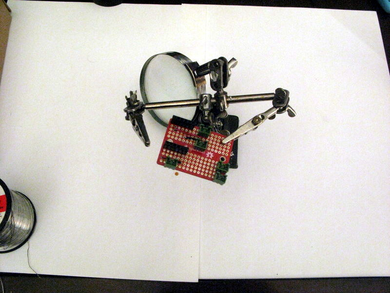 | 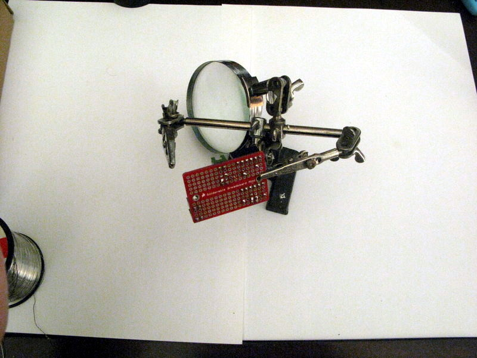 |
| 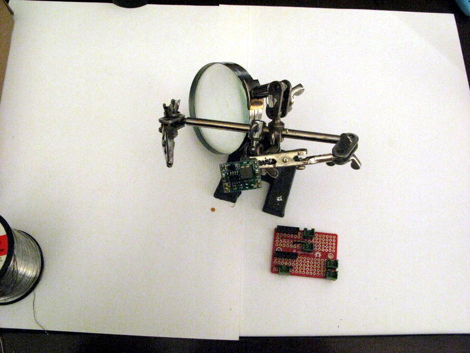 | 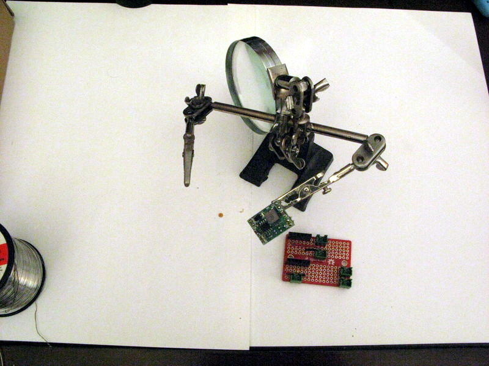 |
| 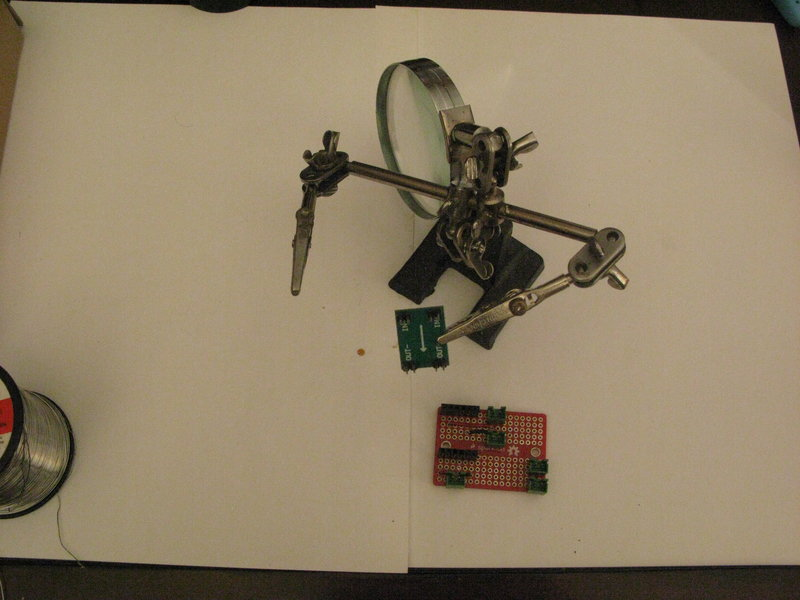 |  |
|  |  |
|  | |

We'll now build the breakout board for the power regulators.
The laser diodes should draw around 1mA each, making the whole
system draw around ~200mA as an upper bound.

Since the power draw is significant and highly variable for the laser diodes
compared to the power draw of the rest of the electronics, separate
regulators have been used to make sure the laser diode power and
the electronics power are as isolated as possible.
Without this isolation, the Arduino might star to act weird
and other input devices might function incorrectly due to to the noisiness of
the circuit.

The breakout board diverts power from the batter to a 5V buck
converter and to the 5V 3A BEC.
The 5V buck converter powers the Arduino Nano and other logic
circuits.
The 5V 3A BEC powers the laser diodes.

Sometimes regulators fail so it's nice to have them be swappable
as much as possible.

For the 5V buck converter, solder four 2-pin headers at the appropriate
positions.
For the BEC, cut off the ends and re-attach two 2-pin JST 2.5mm male headers,
making sure the positive lead is on the left side of the header if looking at
the header with the notch side visible.

Solder two 6x1 row female headers onto the protoboard.
Make the vertical spacing of the headers a matching distance to the height of the buck converter.
The headers will provide the seating for the buck converter.

Solder five 2-pin female headers to the protoboard, one at the top for the battery
power in, three on the right for the battery power out to the BEC and one last one on the left
for the output of the 5V regulator.

Two of the three 2-pin female headers on the right are for the input and output of the BEC.
The last 2-pin female header is for the output of the BEC that goes to power the laser diodes.

Use connecting wires to make sure all power is routed to the appropriate places.

### Arduino and Input Breakout

| | |
|---|---|
|  |  |
|  |  |

An Arduino Nano provides the main processing power that takes input from the microphone
and joystick and communicates with the PWM drivers.

The basic layout of the circuit is to breakout the appropriate pins to route to
the I2C lines for the PWM controllers, input lines to read the joystick and button,
an input line for the microphone and power routing to the various portions of the
breakout that need it.

The only extra component is the 10k resistor to make sure the button line on the
joystick floats high.

When soldering, make sure to use flux as it helps solder flow and prevent cold
joints.
As a general rule, testing continuity is a good idea.
As a basic precaution, make sure that power and ground are isolated by confirming
there is no continuity between them.

After soldering is completed, clean up the bottom by removing any excess wiring.

Once the breakout is ready, put two 1x15 header rows into the female headers.
Put the Arduino Nano through the short end of the 1x15 headers, apply flux and solder the
headers to the Arduino Nano.
Seating the male header in the female header makes sure it's aligned properly.

Once the headers for the Arduino Nano are soldered on and placed in the breakout
board, we can program it.

### Programming the Arduino Nano

Connect the Arduino Nano to the computer with a USB cable and start the Arduino IDE.
If not already installed, install the [Adafruit PWM library](https://github.com/adafruit/Adafruit-PWM-Servo-Driver-Library)
and the [Fourier transform, ffft,](https://github.com/adafruit/piccolo) library.
If the libraries aren't available through the IDE, download a zip of each of the libraries
and place them in the Arduino library directory.
See the [Arduino reference on libraries](https://www.arduino.cc/en/hacking/libraries) for more information.

The Adafruit PWM servo driver is used to communicate to the PCA9685 PWM drivers.
The `ffft` library is used in Adafruit's [Piccolo music visualizer](https://learn.adafruit.com/piccolo/overview)
project to provide a graphic equalizer.
The Piccolo project has a lot of pre-set values to make sure the graphic equalizer is visually
interesting so it's a good starting point to analyze microphone data and do visualization.

The `laser-spike` program has a `DEBUG` flag that can be created to see serial output for debugging purposes.
Later, when the breakout board for the laser diodes is created, we'll test to make sure things look
good.
If for some reason things aren't working down the road, uncommenting the `DEBUG` keyword can help
track down where the error is occurring.

### PWM breakout

The PCA9685 PWM controllers are not directly soldered on to the protoboard,
instead they are seated on headers.
The laser diodes aren't directly driven by the PWM controller and are powered
by 2n2222 transistors whose gate is connected to the PWM controller output.

Each PCA9685 PWM controller sits in it's own proto-board.
Each line out of the PCA9685 PWM controller feeds into the gate of a 2n2222
transistor.
The transistor then provides power to the laser diode.
There are 16 lines out of each PCA9685 PWM controller so 16 2n2222 transistors
are needed.

The line coming out of the 2n2222 transistor is used to power the laser diode through a female JST 2.5mm connector.
The board's laser diode power is fed by the 5V 3A BEC output.
The PWM controller's logic circuitry is powered by the 5V buck converter but
is provided by the 6-pin connector that's used for it's I2C connection.

There are two PWM controllers, each with their own proto-board.
One PWM controller will be housed with the Arduino Nano breakout and the power
regulator breakout.
The other PWM controller will be on it's own housing and eventually placed on the other
side of the jacket.

Each PWM controller is located on either side of the jacket to provide better
access to the laser diodes they will drive.

Each of the PWM controller is in charge of controlling 64 laser diodes.
Since each output line of the PCA9685 PWM controller only has 16 lines, each output line
provides power to a group of 4 laser diodes (16 * 4 = 64).
The two PCA9685 PWM controllers control 64 laser diodes each which drives the total 128 laser diodes.

As a note, even with the large proto-board the PWM controller is housed in,
space is still a concern for the wiring.
I've found that using the top and bottom of the proto-board helps keep wire management
under control.
The way I've wired the control lines from the PWM controller output to the transistors
means that the solder points of the wires will fall in the middle of other lines
above it.
To make sure that soldering doesn't damage the wires, I've found staggering the
soldering, first doing only one side of the top and bottom wires, then progressing
further down, is a better method than soldering a complete top or bottom at once.

### PCA9685 Module Soldering and Addressing

| | |
|---|---|
|  |  |
|  |  |
|  |  |
|  |  |
|  |  |
|  |  |
|  |  |
|  |  |

Since there are two PCA9685 PWM controllers which are in communication with the Arduino Nano,
they need to have separate addresses since they share the communication lines (also known as a 'bus').
On only one of the PCA9685 PWM controller, connect the low bit on the 'address' breakout pad.
For the single PCA9685 PWM controller, this will change it's address to `0X41` (from the default `0x40`)
so the Arduino Nano can address it independently.

Solder headers onto each of the two PCA9685 PWM controllers.
Since we're only interested in the PWM output, only solder a single row of 1x4 headers for
each of the four PWM output groupings on each of the PWM controllers.
This will be the way the PCA9685 PWM controllers are seated on the breakout board.
I find that using the same trick of seating the headers in the female headers where they'll eventually reside
helps keep them straight when soldering.

I use a JST 2.5mm, oriented and locking 6 pin female connector on either side of the PCA9685 module.
In order to keep cable ordering the same, one female header is soldered to the top on the other to the bottom of the PCA9685
module.

### PCA9685 Module Cabling

Once the headers have been attached, create two 6 wire cables, one about 20cm in length and the other about
75cm.
I used an oriented, locking JST 2.5mm 6 pin connector.
Make sure the wire ordering from the breakout of the Arduino Nano cable onto the PCA9685 module lines up correctly.
If for some reason the orientation was reversed or jumbled, re-order the cable wiring to accomodate.

I like to use a cable shroud for long cables to keep them from tangling.
I also try and use different colored cables to differentiate what their function is and
to make it easier to determine if there was a cable ordering mismatch.

Testing
---

Before going further we need to pause and make sure things are working properly.
Before now, we could only really get a sense for whether things had worked by doing
continuity or testing individual components.
This will be a full 'integration test' that will test nearly the whole system before a full
installation.

The test is imperfect but helps track down some common errors early on.
The final test is, of course, whether it works after full assembly.
The tests here are designed to make sure we're confident that the system is behaving well enough
to proceed to the next step.

### Testing Prep

Pick a spare laser diode out of the pile that's handy.
Take a CR2032 battery and use it to make sure the laser diode is functional by pressing
the exposed leads of the laser diode to the top and bottom of the battery.
The red wire should be on the 'top' of the CR2032 (the positive lead) and the black or blue
wire should be on the bottom (negative) end of the battery.
The laser diode should dimly light up.

Make a temporary test cable that consists of a JST 2.5 2pin male header with two disconnected wires coming out
on the end.
Strip the ends of these two wires and take a spare laser diode.

The exposed leads of the stripped ends of the header cabling will be used to test the laser diode on each
of the connections out of the PCA9685 breakout boards.

### Laser Diode Connector Testing

Make sure the Arduino Nano and other electronics are powered.
After the power is turned on, an LED on the Arduino Nano should show as well as various LEDs on the BEC and
the PCA9685 modules to indicate they are working.

Connect the JST 2.5 2pin header and wires created above to an output header on the PWM driver breakout board.
Connect the laser diode to the exposed wires and confirm that it's being powered.

The default mode of the Arduino Nano should be the 'twinkle', so the laser diode should run through a cycle of
ramping up power then going dim.
Wiggle the laser diode connection gently to make sure there are no loose connections that would cause a power
outage.

Go through each connection to make sure they all work.

Intermittent failures here will most likely crop up into outright failures down the road.
Putting electronics into clothing and jostling them around provide ample opportunity for
intermittent failures in a stable testing and development environment to become permanent failures
in a real world environment.

Fixing issues at this stage, even if intermittent or hard to reproduce, will save heartache down
the line when disassembly and debugging will be even more difficult.

See the `Common Errors` section on help tracking down problems should any occur.

Cabling and Connections
---

Though it might seem dry or inconsequential, cabling turns out to be a major factor
in the functionality an aesthetics of this project.
Making sure the wiring is routed properly, has proper strain relief and is compact is the difference between
a wearable piece and a bulky jacket that is prone to failure.

All wires that aren't soldered directly to proto-boards are stranded.
With the exception of some of the battery wiring, all wire is 25 AWG.
Where possible wires are put into a wire shroud to make sure they don't get tangled.

Except for the direct connections to the lasers,
all headers are JST 2.5mm, locking and oriented.
As previously stated, the locking is necessary to prevent disconnection from strain
or movement.
The orientation provides a safety check to make sure shorts or improper connections don't occur.

### Power, I2C, Joystick and Microphone Connections

| | |
|---|---|
|  |  |
|  |  |

Power from the regulators needs to get to the Arduino and PWM controllers.
The Arduino Nano also needs to communicate to the PWM drivers.
The joystick and microphone need extension cables.

The laser diode power cabling is a group of four 2-pin JST 2.5mm male connectors.
At least one length should be 75cm with the rest being in the range of 20cm.
The Arduino Nano power cable is a short 20cm cable of 2-pin JST 2.5mm male connectors.
The right PWM controller also needs a short 20cm 2-pin JST 2.5mm male connector cable.

The joystick connector is a length of about 50cm of a five wire JST 2.5mm pair
of male headers.

The microphone connector is a length of about 50cm of a 3pin JST 2.5mm pair of male headers.

The PWM controllers need two cables of 6 wires, one of length about 20cm and the other of length
about 75cm.
They each have ends that are 6 pin male JST 2.5mm headers.

All headers are oriented and locking.

All cables should be made out of 25 AWG stranded wire.
Solid core wire is too stiff and not only restricts movement but has the potential
to fray and break.
The stranded wire is much more moveable and is better suited to providing power and
communication between elements that don't reside on the same proto-board.

### Wiring and Routing for the Laser Diodes

| | |
|---|---|
|  |

The laser diodes are grouped into four that are powered and controlled from a single PWM driver line.
The cables for this are a JST 2.5mm male header on one end that break out into 4 JST 1.25mm female headers.
As much as possible, I try to use a [Lineman splice](https://en.wikipedia.org/wiki/Western_Union_splice)
and cover each connection with heat shrink tubing.
Electrical tape can be used if heat shrink tubing is not available or wasn't put on before soldering.

Each length of wire should be measured to be the approximate length of the grouping of four laser diodes
to the electronics housing.
This means the wires for the laser diodes at the end of the arm should be longer than the shoulders or back.

Each of the wires is put in a cable sleeve to prevent tangling.
I've found 1/4" braided sleeving works well.

To help route the sleeved wires through the arm and middle interface between the outer shell jacket and inner lining,
I attached cable clamps, closed off with a cable-tie, that attach to some floating excess fabric on the inside of the arm of the jacket.

Care has to be taken to make sure the wiring is fed out of the arm properly.
If the wiring loops around the lining, this will pinch the opening where an arm would go through
making the jacket hard to put on and use.

I tried labelling the wires so that I could trace back which group belonged to which wire but
I didn't have much success.

I would suggest testing the laser diodes with a CR2032 battery to make sure the laser diodes still work after
installation and hookup.

Once all the laser diodes are connected to their respective wires, it's time to start the final assembly.

### Electronics Housing Overview

The PWM driver, along with other electronic components, such as the power converters
and Arduino Nano, are seated in a laser cut electronic housing, consisting of
two laser cut wood panels that have plastic tubing in the middle for spacing.
The electronic housing is joined with various M3 screws.
The M3 screws provide double duty, acting as spacers for the two housing panels
and also provide support for the proto-board.

The other PWM driver will be located closer to the other arm and has it's own housing.

Before closing the electronics housing make sure all wires are attached.
This means the microphone, joystick, power cable, I2C cable and all the laser diode
connections for the left arm are attached.

It's a good idea to do a test run of the all the electronics connected to the laser diode
to make sure things are working properly before the electronics housing is closed off and
installed in the jacket.

### Strain Relief

Once the electronic housing enclosures are bolted together, the wires should be wrapped around
the strain relief gadgets on the top of the housing.
This is necessary because stresses from normal movement will wear the connectors on the protoboard
and could cause loose connections, breaks in power and other failures.

The clamp should be screwed down so that it can withstand a decent yank from the wires.

Eventually, blue loctite should be put on all the bolts that need to be kept in place.
This shouldn't be done until there's enough confidence that the jacket is ready to wear as
the nuts are hard to get off after the loctite is applied.

### Final Placement and Installation

Place the electronics enclosures in the middle between the jacket outer shell and the inner
jacket lining.
Use velcro ties to make sure the electronics enclosures are securely in place.

Feed the microphone out to a place that can be exposed to sound, puncturing a hole if need be.
The joystick can be fed through the arm or be kept on the inside of the jacket, depending on
preference.

Use either velcro or snaps to close the lining that was cut open.

Once all the components are in place, try wearing the jacket to make sure things are working
properly.
The connections should be resilient to moderate use but a little care should be taken to make
sure no excessive wear or strain is put on the components.

If there are any failures, either in the whole system or individual laser diodes, work through
each until everything is working as expected.
See the section ["Common Errors"](#common_errors) to work through some problems I tend to encounter.

Wear It
---

Once all the issues are worked out, wear it!

Final Design Notes
---

There are some major points of interest that I believe are worth mentioning.
Here is a list, in no particular order:

* The laser diodes are 5mw and don't pose a significant risk to people eyesight.
  Though people shouldn't stare directly into the laser diode, it's akin to staring
  straight into a flashlight...bad if done without looking away but no real danger
  of being blinded by accident.
* Strain relief is a must for all components involved. Without it, wires coming out
  of the laser diodes would be pulled off and connections on the protoboard would weaken.
* Making sure the proto-board is backed onto a more stable substrate, like the laser
  cut wood housing, prevents flexing from the proto-board, which helps mitigate breaks,
  weak joints and other failures from occurring.
* The LiPo battery has a fuse in line with it preventing more than 3A to be produced.
  A friend suggested I do this after setting many of my projects on fire. Since I've
  been using the fuse in line with the LiPo, I'm happy to report that I haven't had one
  wire explode or any of my jackets catch on fire.
* Without putting the main driving electronics on a separate regulator from the
  main power draw I've had the noise cause major
  problems, especially when there's communication or audio sensing involved.
  In this project and others, I make sure to power the electronics components (the Nano,
  PWM controllers, etc.) from a 5V regulated buck converter and the main power
  components, in this case the laser diodes, from another regulator, in this
  case the 5V 3A BEC.
* In general, I like oriented and locking headers, especially for power connections.
  The orientation prevents accidentally inverting the ground and power.
  The locking mechanism prevents connections from coming loose.
  Since the electronics are to be worn, the locking mechanism prevents
  the headers from coming out if the assembly is jostled.
  If it's necessary to make connections in the field, the orientation
  helps prevent mis-wiring.

For anyone attempting this project, understand what you're getting into.
I have enough of a risk affinity to not mind the dangers but for others who might
be more risk averse, **understand that the LiPo batteries involved in this project could cause severe bodily damage**.

**The LiPo battery has enough power to catch fire, explode and otherwise cause potentially sever bodily damage**.

I personally believe the technology is safe enough to use (I am happy to wear the
jackets I make) but shorts can cause fires, water exposures can cause shorts or other
potentially hazardous situations and battery puncture or rupture could cause severe bodily damage.

Before I started using fuses as a safety measure, I've had
wires explode and jackets catch fire because of shorts in my wiring (only in development,
never while actually wearing them out to events).

**Do your research to make sure you understand the risks involved and what level of risk you are comfortable with.**

Troubleshooting and Common Errors
---

#### Things catch fire

A potential cause could be a short causing wires to heat up and catch their insulation
or surrounding flammable material on fire.

Make sure to install a fuse on the battery so that the fuse will blow on a short condition instead of
wires or other electronics.

Test continuity to track down the short.
Make sure all the solder joints and area are clean of wire trimmings.

#### Things don't power on

This could be caused by a short or break in the power lines.
Another possible source is a bad regulator or low battery.

To track down where the error is, consider the following steps:

* Test the batter is producing the voltage you expect (in this case the 2-3s battery output voltage should be in the 7.4V to 11.1V range).
  If not, charge the battery or use another that is fully charged.
* Test to make sure the fuse hasn't blown. If it has this could indicate a short in the power line so test for continuity to track down
  if there is a short in the power line. If not, replace the fuse and try again.
* Make sure the breakout board for power has the proper voltages at points you expect. This means testing witht he multi-meter that the
  voltage on the board before the regulator is what's expected to come out of the battery. Test the output of each of the regulators
  to make sure the voltage is the expected 5V. Often regulators die or are bad so they might need to be replaced. Also make sure the
  regulators orientation is correct (there should be an 'input' side that connects to the battery side and an 'output' side that connects
  to the rest of the electronics).
* Test for continuity for the ground and power rails. That means every point on the other breakout boards that is power and ground should
  have continuity to the appropriate points on the source power output breakout board. If not, this could mean a bad connection on the
  breakout board in question or a wire that connects the power output.

Most of the soldering is essentially power management and making sure the proper power and ground rails get to where they need to
go.
This means that the most common error is a short or break in the power lines (at least that's what I've found in my experience).

If power outages are still causing confusion, try disconnecting everything and then progressively connecting components until the failure
occurs.
For example, disconnect the power breakout board from the other electronics and make sure the regulators in isolation are being powered
correctly.
Once that's confirmed as working, add only the Arduino Nano breakout, then a single PCA9685 PWM module breakout, etc.

It's good practice to also make sure the battery is fully charged.

#### Things power on intermittently

This is one of the more frustrating problems and is hard to track down and debug because the problem is often hard to
reproduce.
The most likely cause, in my experience, is a bad solder connection.
A deformation of the proto-board or too much strain on the connectors causes the solder joint to weaken or crack.
In certain orientations, there is physical contact creating the illusion of a proper functioning circuit, but if
stresses are applied, the joint falls out of contact and components stop working or power as a whole is broken.

If this can be reproduced 'on the bench' then this can give a clue as to where the bad joint is.
In general, it's good practice to go over the solder connections to make sure they look good.
This means making sure there is plenty of solder on the joints and that through holes are filled with solder.

I've also found light wiggling to help track down weak connections.
In the end, the electronics need to be housed and strain relief needs to be provided or these types of failures
will almost surely occur but even with minimal stress on the circuit, sometimes loose connections cause intermittent
failures and should be tracked down as soon as possible to prevent headaches later on.

Also, make sure the battery is fully charged to rule out an empty battery as a possibility.

#### The Arduino keeps resetting

In my experience, this is most likely to intermittent power and so the above strategy of looking for
loose or bad connections should be used.
In rarer occasions, electrical noise sometimes causes the Arduino and other problems in the peripheral electronics.
Making sure the power is isolated by their own regulators is a good start but in the worst case, ferrite
beads can be attached at choice locations to try and mitigate the noise.

If the failure can be reproduced consistently, this can give a good indication of what the underlying cause
is.

Also, make sure the battery is fully charged to rule out an empty battery as a possibility.

#### The microphone/joystick isn't working

The symptoms are that the joystick won't do antying (for example, not being able to change 'modes') and/or the graphic equalizer mode
doesn't display anything.
For the joystick, connect the Arduino to your computer and turn on debugging. There should be output of what the joystick state
is and make sure it's reading from the joystick.

If it looks like the Arduino still isn't seeing the joystick, make sure the cable and connections have continuity.
Sometimes joysticks fail or are bad to begin with so in the worst case, use an Arduino in isolation to try and read
from the analog pin that's connected to one of the joystick's axies to determine if it's the connection or the joystick
that's failing.

For the microphone, do similar as above.
Check the cabling for continuity and make sure to test continuity to test that the input pin is being fed to the
proper Arduino pin and that power is being provided to the microphone module.
The debug output for the Arduino Nano should also have microphone output so you can get a sense of whether there
is something being read.

The graphic equalizer has a dynamic volume in software to make sure it's trying to be insensitive to volume differences
and still produce output but it's limited in what it can do.
Sometimes fiddling with the microphone volume meter will work better to create a more satisfying light show.

Microphone's fail or are sometimes bad, so a simple test is to try replacement to see if that fixes the issue.
If things still aren't working, test the microphone in isolation with an Arduino that's hooked up to read from
it.

#### Some laser diodes don't work

The scale of the project is such that failures will occur.
Individual components could fail either because of loose connections, broken connections, burnt out
electronics or other issues.

For the case of laser diodes, it's good practice to keep a few spare on hand so that if they do fail for
whatever reason, they can be replaced easily.
I've found it easier to remove non-working laser diodes and replace them outright than to fix broken laser
diodes.

When tracking down individual laser diode failures, make sure to test the laser diode to confirm it's not
working, or working intermittently.
If the replacement laser diode is still not functioning, this could point to a bad cable connection and
so testing continuity on the cable is a good next step.

If the cable is the issue, replace that portion of it.

Sometimes the cabling is tight in the arms and through use the stresses of normal movement cause
connections to break.
Since the laser diodes are connected by a small JST 1.25mm connector, the connector should disengage
rather than wire snapping or housing cracking.
In this case, the connection can be re-established by re-connecting the laser diode to it's cable
but it keeps getting disconnected, it might be good to choose a different connection scheme so
that normal movement won't put as much strain on the connection.

Conclusion
---

All source code is available under a free/libre license (either AGPL, GPL, MIT or CC0).
All design files, where appropriate, are available under a free/libre license (CC-BY, CC-BY-SA or CC0).
These instructions themselves are available under a CC0 license.

Where appropriate, please feel free to modify, improve or use any of the assets described here.
No credit is necessary.

Happy Hacking!

Credits
---

* `adafruit_products_MultiBoard_bb-1024.jpg` by Bill Earl (CC-BY-SA) ([src](https://learn.adafruit.com/assets/2223))
* `adafruit_products_2012_10_13_IMG_0692-1024.jpg` by Bill Earl (CC-BY-SA) ([src](https://learn.adafruit.com/assets/2263))
* `laser-club-stage.png` by Taimur Gibson (CC-BY-SA)

References
---

* [Make](https://makezine.com/2010/05/03/laser-jacket/)
* [200 LDs Stage Suite (behance)](https://www.behance.net/gallery/493017/200-ld-stage-suit)
* [Kazuya Yoshii](https://youtu.be/AgRMm9HB60Q)
* [Wei Chieh Shih](https://www.behance.net/shihweichieh)
* [U2 - 360 at the rose bowl](https://www.uncut.co.uk/reviews/dvd/u2-360-at-the-rose-bowl)
* [Adafruit PCA9685 PWM module](https://www.adafruit.com/product/815) ([GitHub](https://github.com/adafruit/Adafruit-PWM-Servo-Driver-Library))
* [Adafruit Piccolo Music Visualizer](https://learn.adafruit.com/piccolo/overview) ([GitHub](https://github.com/adafruit/piccolo))
* [Western Union Splice](https://en.wikipedia.org/wiki/Western_Union_splice)
