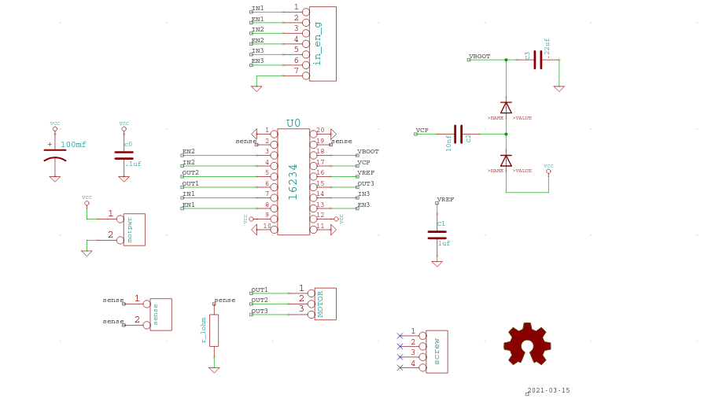
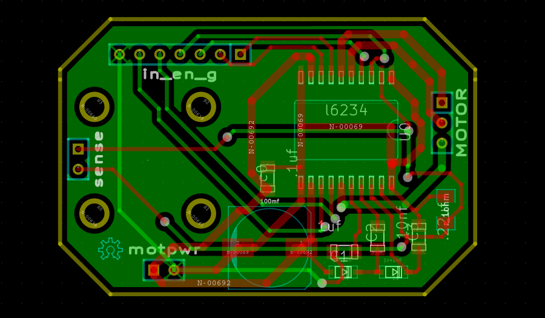

GoPro Driver (L6234)
===

| | |
|---|---|
|  |  | 

BLDC driver based on the L6234 chip.

**Mostly untested**.

Notes
---

* [l6234 datasheet](https://raw.githubusercontent.com/abetusk/manuals/master/datasheets/LD6234.pdf)
* [NearZero](http://skysedge.us/robotics/nearzero/electrical/NearZeroSchematic.pdf)

Tying `SENSE1` and `SENSE2` to ground (or perhaps to a 1 ohm resistor to ground) is necessary,
as I found out.

License
---

CC0

