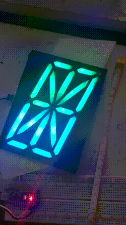
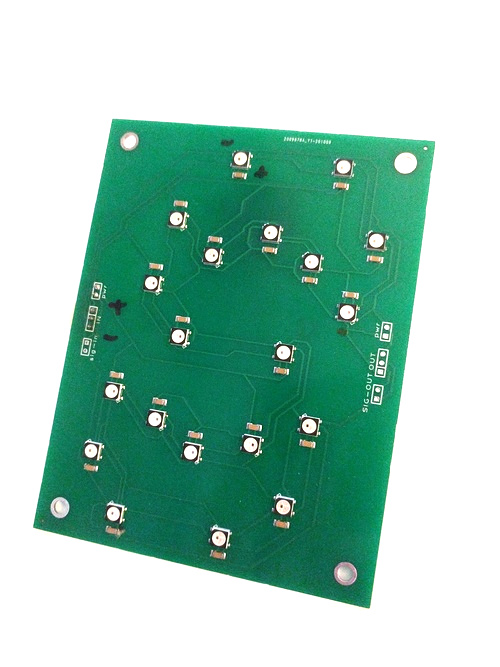
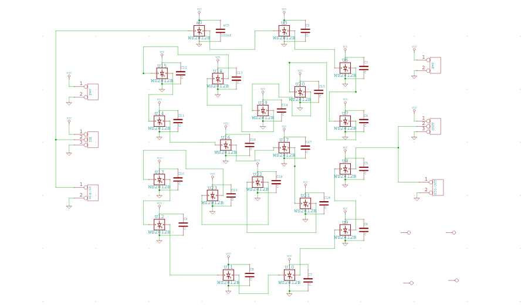
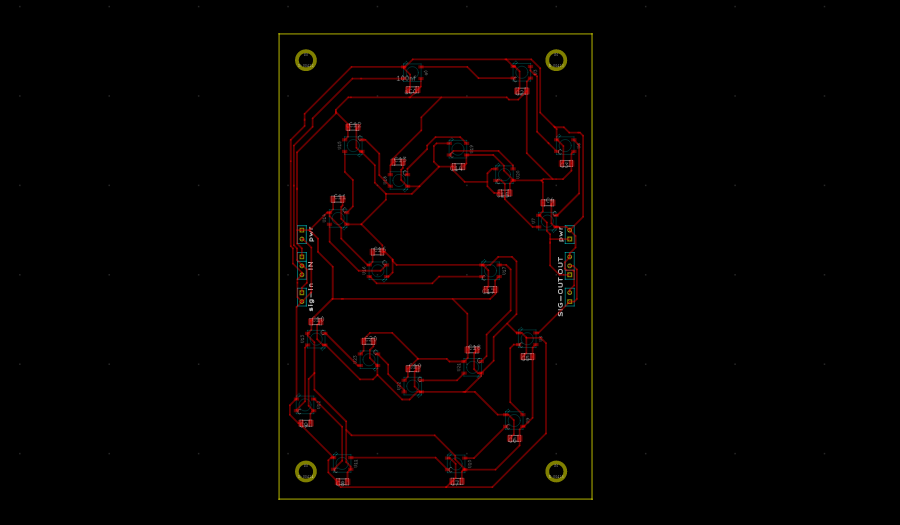
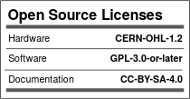

seg16
---

A 16 segment digit (base board) using WS2812B/SK6812 5050 parts.
Size should be about 5.2"x3.9" (132mmx100mm).

Currently this project is **semitested**.

Made with [MeowCAD](https://meowcad.com/project?projectId=4983569d-bf97-47ea-8737-0bbebbcf3797).

| | |
|---|---|
|  |  |

---

###### 2020-10-25

I ordered a set of 10 boards for about $50 from [JLCPCB](https://jlcpcb.com/),
or about $5 per assembled board, with shipping etc.
I used the Gerbers in `export/gerber` along with `BOM` and `CPL` files in the
`wd/jlcpcb` directory.

I haven't actually ordered 30 (which seems to be the max for JLCPCB?) but it comes
to about $112, or about $3.75 per assembled board, with shipping etc. ($86.28 + $25.41 shipping).

###### 2020-11-19

I haven't measured current consumption but [reports rate it](https://www.pjrc.com/how-much-current-do-ws2812-neopixel-leds-really-use/)
at anywhere from 30mA to 50mA (at 5V, so around .15W to .25W).
Each digit is 20 WS2812b, so at full bore that's anywhere from .60A to 1A (or .6W to 5W) per
digit.

If we call it 1A per digit, that means we need about a 20A (100W) power supply for a row of
20 digits.

From some simple experiments, it takes about 2-3 digits before there's a noticeable color degradation
in color.
So, for a single power supply in a row, it's probably wise to distribute power spaced every 2-3 digits.

###### 2020-11-19

The order of the LEDs is given by the following diagram:

License
---

Everything in this directory, unless explicitly denoted otherwise, is
under a CC0 license.

CC0

