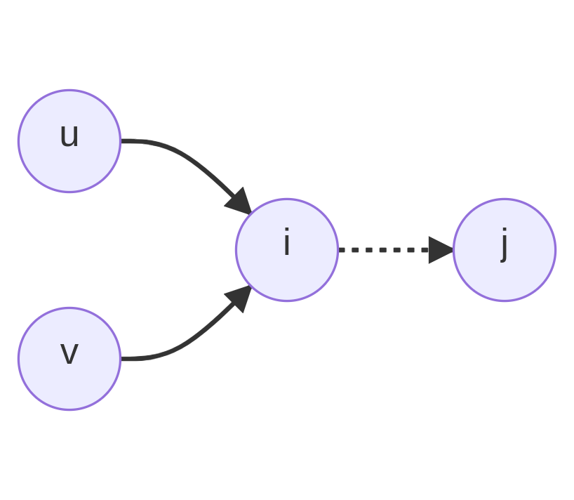

Thanks. Belief Propagation
===

Introduction
---

For a set of random variables, ${ \\bf x } = ( x_0, x_1, x_2, \cdots, x_{ n-1 } )$,
and a given probability distribution over those random variables, $p( { \bf x } )$,
we might like to know what the most likely configuration is.
Another name for the most likely configuration is the maximum a posteriori (MAP)
assignment of the variables over their domain.

Sometimes there is additional structure on the random variables so that the probability function
can be decomposed into a product of distributions over the subsets of variables.
If the additional structure is encapsulated in a graphical model, connecting variables
with an edge and corresponding distribution function, this this can be represented as
a Markov Random Field (MRF),
with a set of cliques, represented in a graph structure, whose probability distribution
function can be written as:

$$
\begin{align}
p( { \bf x } ) & = \frac{1}{Z} \prod_{c \in \text{clique(} G \text{)} } \phi_c ( { \bf x }_c )
\end{align}
$$

A marginal distribution is the probability of fixing a subset of the random variables over
all possible values of the remaining variables.
That is:

$$
p( { \bf x } _ s  = { \bf d } _ s ) = \sum_{ { \bf x } /  x_s } \text{    } \prod_{ c \in \text{ clique( } G \text{ ) } } \phi_c ( { \bf x } _ c )
$$

Where the term on the right fixes the values of ${ \bf x }_s$ where appropriate.

This problem is NP-Complete in general.
If the form of the graphical model is a tree, then the marginals can be computed efficiently with a dynamic programming
like algorithm.

A dynamic programming like algorithm can be adapted to be used on non-tree like graphs and can be expected to
work for graphs that have certain restrictions on their topology or structure.
Since the graph now has loops, the independence property that was needed to make the algorithm efficient is violated.

The dynamic programming like algorithm is called Belief Propagation (BP), sometimes called Loopy Belief Propagation (LBP)
for non-tree like graphs.
For non-tree graphs, the term "probability" is substituted with "messages", as calculations are no longer probability distributions
any more, with the underlying algorithm for BP described as a "message passing" algorithm.

The type of structure on the graphs that lead to proper marginal discovery is not well understood in general
and certainly not understood by me.
Some clue as to what the structure is comes from the degree of independence of the variables and a somewhat hand-waivy
heuristic is that if graphs look locally "tree-like" then BP (or LBP) has some expectation of converging to a correct solution.

---

There are three main graph models that belief propagation looks to be run on:

* Bayesian Network
* Factor Graph
* Markov Random Fields (MRF)

### Markov Random Field

Finite Markov Random Fields (MRF) will be considered.

$$ G(V,E), \ \ \  |V| = n, \ \ \ x_i \in D = \{ d_0, d_1, \cdots, d_{m-1} \}  $$

$$
i \in V \to g_i(\cdot) \in \mathbb{R}
$$

$$
(i,j) \in E \to f_{i,j}( \cdot, \cdot ) \in \mathbb{R}
$$

* $x_i$ represents the value of vertex $i$.
* $g_i(x_i)$ is the mapping of vertex $i$ with value $x_i$
* $f_{i,j}(x_i,x_j)$ is the mapping of the connected vertex $i$ and $j$
  with values $x_i$ and $x_j$, respectively

For example, $f_{i,j}(x_i,x_j)$ could be an indicator function that
vertex $i$ and $j$ could have values $x_i$ and $x_j$.

### Belief Propagation on a (discrete) Markov Random Field

```
::mermaid
graph LR
  u((u)) & v((v)) --> i((i)) -.-> j((j)))
```

---

<p align="center">
  
</p>

$$
\mu_{i,j}(d) = \sum_{a \in D} f_{u,i}(a) \cdot f_{v,i}(a) \dots
$$

---

Each vertex, $i$, can be associated with a random variable, $X_i$, taking
on (discrete) values chosen from some domain $D = \{ d_0, d_1, \cdots, d_{m-1} \}$ with
a probability distribution function $g_i(\cdot)$.

$$
\mu_{i,j}^{t+1}(d) = \sum_{a \in D} f_{i,j}(a,d) \cdot g_i(a) \cdot \prod_{k \in N(i) \text{ \\\\ } j} \mu_{k,i}^{t}(a)
$$

$$
P(X_i = a) \approx b^t_i(a) \propto g_i(a) \cdot \prod_{k \in N(i)} \mu^t_{k,i}(a)
$$

$$
\sum_{b \in D} \mu_{i,j}^{t}(d) = 1,  \ \ \ \ \sum_{a \in D} b^t_i(a) = 1
$$

The product can be more compactly represented by a function $h^t_{i,j}(\cdot)$:

$$
h^t_{i,j}(a) = g_i(a) \cdot \prod_{k \in N(i) \text{\\\\} j } \mu^t_{k,i}(a)
$$

$$
\mu_{i,j}^{t+1}(d) = \sum_{a \in D} f_{i,j}(a,d) \cdot h^t_{i,j}(a)
$$

One can recast this as a matrix multiplication:

$$ \begin{bmatrix} f_{i,j}(d_0,d_0) & f_{i,j}(d_1,d_0) &  \cdots & f_{i,j}(d_{m-1},d_0) \\\\ f_{i,j}(d_0,d_1) & f_{i,j}(d_1,d_1) &  \cdots & f_{i,j}(d_{m-1},d_1) \\\\ \vdots  & \vdots & \ddots & \vdots & \\\\ f_{i,j}(d_0,d_{m-1}) & f_{i,j}(d_1,d_{m-1}) &  \cdots & f_{i,j}(d_{m-1},d_{m-1}) \end{bmatrix} \begin{bmatrix} h_{i,j}^{t}(d_0) \\\\ h_{i,j}^{t}(d_1) \\\\ \vdots \\\\ h_{i,j}^{t}(d_{m-1}) \end{bmatrix} = \begin{bmatrix} \mu_{i,j}^{t+1}(d_0) \\\\ \mu_{i,j}^{t+1}(d_1) \\\\ \vdots \\\\ \mu_{i,j}^{t+1}(d_{m-1}) \end{bmatrix}
$$

$$
\to F_{i,j} \cdot \vec{h}^t_{i,j} = \vec{\mu}^{t+1}_{i,j}
$$


Since $h^t_{i,j}(\cdot)$ has no dependence on $b$, this speeds up a naive calculation by re-using the product results instead of re-calculating them.

If the $F_{i,j}$ matrix has low rank, $r < m$, it can be factored into a singular value decomposition (SVD) for performance:

$$U \cdot S \cdot V = \begin{bmatrix} \vec u_0 & \vec u_1 & \cdots & \vec u_{r-1} \end{bmatrix} \begin{bmatrix} s_0 & 0 &  \cdots & 0 \\\\ 0 & s_1 & \cdots & 0 \\\\ \vdots & \vdots  & \ddots & \vdots \\\\ 0 & 0 &  \cdots & s_{r-1} \end{bmatrix} \begin{bmatrix} \vec{v}^\dagger_0 \\\\ \vec{v}^\dagger_1 \\\\ \vdots \\\\ \vec{v}_{r-1}^\dagger  \end{bmatrix}
$$

Where $F_{i,j} = U \cdot S \cdot V$.

The matrix multiplication that was $O(m^2)$ now becomes two matrix multiplications of order $O(r \cdot m)$ for a potential speedup of $\sim \frac{m}{r}$.

Note that if the $F$ matrix has any symmetry, there are potential efficiency gains by exploiting that symmetry.
In the above, when $F$ is of low rank, the SVD is exploiting the "symmetry' of having many zero eigenvalues.
There is a well known optimization if the implied function has certain translational symmetry properties, allowing
the multiplication to be done via a fast Fourier transform, producing an $O(m \lg m)$ calculation over the $O(m^2)$.

---

#### Bethe Free Energy

(wip)

Belief Propagation (BP) can be thought of as an algorithm that finds a fixed
point of the Bethe Free Energy, $F_\beta$:

$$
\begin{array}{ll}
\phi _ {i,j} (d _ 0, d _ 1 ) = & f ( d _ 0, d _ 1 ) g ( d _ 0 ) g ( d _ 1 ) \\
b _ {i,j} (d _ 0,d _ 1)  = & \alpha \phi _ {i,j} ( d _ 0, d _ 1 )  \prod _ { k \in N(i) / j } \mu _ {k,i} ( d_0) \prod _ { l \in N(j) / i } \mu _ {l,j} (d _ 1) \\
F _ {\beta} (f, g)  = & \sum _ {i,j} \sum _ {d _ 0, d _ 1} b _ {i,j} ( d _ 0, d _ 1 ) [ \ln(b _ {i,j} (d _ 0, d _ 1 )) - \ln( \phi _ {i,j} ( d _ 0 ) ) ] \\
 & - \sum _ {i} (q _ i - 1) \sum _ d b _ i (d)  [ \ln ( b _ i ( d ) ) - \ln( g ( d ) ) ] 
\end{array}
$$

Where $\alpha$ is a normalization constant, $q_i$ is the degree of the MRF variable at site $i$ and
$f$, $g$, $b$ etc. are as above (pair wise function, singleton function, belief, etc.).

Imposing the constraints:

$$
\begin{array}{l}
\sum _ d b _ i (d) = 1 \\
\sum _ { d _ 0 } b _ {i,j} ( d _ 0, d _ 1 ) = b _ j ( d _ 1 )
\end{array}
$$

Allows us to use Lagrange multipliers $\lambda _ {i,j} ( d )$ for the
$\sum _ { d _ 0 } b _ {i,j} ( d _ 0, d _ 1 ) = b _ j ( d _ 1 )$ constraint,
$\gamma _ i$ for the $\sum _ d b _ i (d) = 1$ constraint and $\gamma _ {i,j}$
for the $\sum _ {d} \mu _ {i,j} (d) = 1$ constraint:

$$
\begin{array}{ll}
L = & F _ {\beta} \\
 & - \lambda _ {i,j} (d_1) \left[ \left( \sum _ { d _ 0 } b _ {i,j} ( d _ 0, d _ 1 ) \right) - b _ j ( d _ 1 ) \right] \\
 & - \gamma _ i \left[ \sum _ d b _ i (d) - 1 \right] \\
 & - \gamma _ {i,j} \left[ \sum _ {d} \mu _ {i,j} (d) - 1 \right] \\
\end{array}
$$


$$
\begin{array}{rl}
\frac{ \partial L }{ \partial b _ {i,j} ( d _ 0, d _ 1 ) }  = & 0 \\
\to & \ln b _ {i,j} (d _ 0, d _ 1) = \ln( \phi _ {i,j} (d _ 0, d _ 1) ) + \lambda _ {i,j}(d _ 1) + \lambda _ {j,i}(d _ 0) + \gamma _ {i,j} - 1 \\
\frac{ \partial L }{ \partial b _ i (d _ 0) }  = & 0 \\
\to & (q _ i - 1)( \ln b _ i ( d _ 0 ) + 1)  = \ln g ( d _ 0) + \sum _ {j \in N(i) } \lambda _ {j,i} (d _ 1) + \gamma _ i \\
\lambda _ {i,j} ( d _ 1 ) = & \ln \prod _ {k \in N(j) / i } \mu _ {k,j} ( d _ 1 )  \\
\to & ???
\end{array}
$$


#### Sum-Product Belief Propagation

$$
G(V,E)
$$

$$
s, t \in V, x_{*} \in S = \{ s_0, s_1, \cdots, s_{n-1} \}
$$

$$
\mu_{s \to t}(x_t) = \sum_{x_s} [ \phi_{s t}(x_s,x_t) \prod_{u \in N(s) / t} \mu_{u \to s} (x_s) ] 
$$
$$
b_t(x_t)  \propto \prod_{s \in N(t)} \mu_{t \to s}(x_s)
$$

* $s,t$ - verticies in the graph ($s,t \in V$)
* $x_s, x_t \in S$ - values at the vertices (one of a discrete set of values from $S = \{ s_0, s_1, \cdots, s_{n-1} \}$)
* $N(s)$ - neighbors of vertex $s$
* $N(s) / t$ - neighbors of vertex $s$ excluding vertex $t$
* $\phi_{s t}(x_s,x_t)$ - probability/weight of finding value $x_s$ at position $s$ next to value $x_t$ at position $t$
* $\mu_{s \to t}(x_t)$ - probability/message from position vertex $s$ that value $x_t$ at vertex $t$ is allowed
* $b_t(x_t)$ - "belief" of value $x_t$ at position $t$ ("belief" that vertex $t$ holds value $x_t$)

```
A - B - C
    |   |
    D - E
```

Literature Notes
---

This is a bit outside the scope of this document but I should take some notes on the various "state of the art" techniques
from about a decade or more ago.

#### Fast Belief Propagation for Early Vision

* [paper](https://www.cs.cornell.edu/~dph/papers/bp-cvpr.pdf)
* [talk](https://www.youtube.com/watch?v=nZ2uo-7TDDc)

The basic idea is that for problems with structure, many speedups can be had exploiting the
symmetry or simplicity of the label-to-label cost function, locality of labels or other factors.

The paper and talk focus on using loopy belief propagation (LBP) for stereo problems.

* Using linear or quadratic (truncated) label cost functions, you can go from $O(B^2)$ to $O(B)$ by
  various tricks
* Using a virtual hierarchy of nodes, you can compute initial messages and beliefs and then propagate
  those out to the nodes underneath (wholesale) to get faster convergence

A point that doesn't really seem to be addressed is that this assumes the labels have locality or "cohesion" in
that if you find one label somewhere, the chance of finding a similar label nearby is higher.
This assumption is obvious if you're doing stereo matching or motion estimation but for general problems
this is not the case and it's not clear that this method will do better (and might even perform worse?).

Some other random notes:

* Can do 'checkerboard' updates to get half the memory and twice the speed with similar or the same
  convergence (guaranteed? empirical?)
* Other methods that try to make 'superblocks' change the graph and potentially reduce the node and edge
  count but at the cost of exploding the label state space, which becomes a Cartesian product. Huttenlocher
  talks about how the superblocks (generalized belief propagation (GBP)?) idea wasn't meant to make it
  more efficient but was done for other, theoretical, reasons

#### Scalable detection of statistically significant communities and hierarchies, using message passing for modularity

* [talk](https://www.youtube.com/watch?v=jzN37cqkB0c&list=LL)
* [paper](https://www.pnas.org/doi/epdf/10.1073/pnas.1409770111)

#### Focused Belief Propagation for Query-Specific Inference

* [paper](http://proceedings.mlr.press/v9/chechetka10a/chechetka10a.pdf)

This builds on an idea of residual belief propagation (RBP) by Elidan et all that updates only one message per
time step based on the difference of the messages, called the "residual".
The idea is that one can weight message updates by a better heuristic than the residual, namely
a "path sensitivity".

The path sensitivity attempts to measure the effect of changing/updating one message on another and then
picking a message to update that has maximal path sensitivity.
Doing this wholesale and in general is as bad or worse then just running LBP but various heuristics
can be used to estimate the path sensitivity which are more efficient than a wholesale recalculation.

Other tricks need to be employed in order to make the algorithm "anytime", where an "anytime" algorithm
can be stopped at anytime and still get a good estimate of the answer (maximum a posteriori (MAP) or distribution
on end state).

#### Parallel Splash Belief Propagation

* [paper](https://www.ml.cmu.edu/research/dap-papers/dap-gonzalez.pdf)
* [talk](youtube.com/watch?v=m8QXn5DWu3M)

The idea is to create a minimum spanning tree (MST) to schedule the BP messages.


#### Speculation

Some thoughts on how to add heuristics or optimizations.
These are completely speculative and untested so should be thought of as
rough notes or thoughts.

Consider a tileset consisting of three groups, which will be called 'red', 'green' and 'blue'.
Each group has the same type of tiles (endpoint, road, bend) but can only attach to other tiles
of its same color.
A constrained grid is created by putting two endpoints of each color on either side of the grid
and removing all endpoints from the rest of the grid, forcing a condition where only a single
road from one endpoint color to its corresponding endpoint colored tile is a feasible solution.

In other words, try to find a solution of three self avoiding walks with giving endpoints.
BP has no concept of "self avoiding walk" (SAW) and the fact that these are SAWs is a layer
of interpretation we impose after the fact.
The SAWs are embedded in the tiles present in the grid and the admissible tile pairs from the
$f(\cdot)$ function.
For convenience, we might talk about the SAW as a convenience with the understanding that the
SAW itself is not present as a concept in BP.

One observation is that if the endpoints are too far apart, the SAW meanders from one of it's initial
position.
There looks to be a weak "pull" in the direction of the endpoint, which gets stronger as the grid
gets filled out with choice, but the meandering can also lead to the SAW backing itself into a dead-end
and failing to find a realization.
In tests, setting the error to be extremely low (thus increasing the simulation steps) the realization
is more consistently found (in the test case of `11x11x3`).
Were the grid larger, no doubt the meandering would not be as bad as, by chance, the SAWs might have
a reasonable chance of connecting or, when they get close to each other, might be close enough to have
BP kick in and nudge them towards each other.

Though I lack the language or understanding to quantify what's going on well, it looks like there's a kind
of "mean field" quality to BP, where it's good at understanding what the constraints should be in a kind
of "average" sense (for some definition of "average) with it potentially understanding and overcoming
some local constraints, but it loosing its context on constraints or correlations that happen over
larger distances.

To overcome this effect, one can try and come up with heuristics that allow for those longer length
constraints to be more apparent, especially when they're so strong as to lead to contradictions
if they're not met.

One idea is to chop up sections grid (in `3x3x3` sections, say) with outside boundary conditions
on all but one edge, join them to another chopped section and see if a solution can
be found (by running BP, sampling with MCMC or some other method).
If a solution is always/almost always found and not found either when attached to other segments
or in isolation, then use that information to try and correlate "key" tiles inside.
This correlation can be used to modify the single tile probability function ( $g (\cdot )$ )
do heuristically prefer these tiles when running BP proper.

As an example, consider this ASCII map:

```
,    ,    ,    ,    ,    .    ,    ,    ,    ,    ,
,    S    ,    ,    ,    .    ,    ,    ,    E    ,
,    ,    ,    ,    ,    .    ,    ,    ,    ,    ,
,    ,    ,    ,    ,    .    ,    ,    ,    ,    ,
,    ,    ,    ,    ,    .    ,    ,    ,    ,    ,
,    ,    ,    ,    ,    .    ,    ,    ,    ,    ,
,    ,    ,    ,    ,    .    ,    ,    ,    ,    ,
,    ,    ,    ,    ,    .    ,    ,    ,    ,    ,
,    ,    ,    ,    ,    .    ,    ,    ,    ,    ,
,    ,    ,    ,    ,    [.-] ,    ,    ,    ,    ,
,    ,    ,    ,    ,    .    ,    ,    ,    ,    ,
```

Where `.` is the empty tile, `,` has choices of the empty, bend or road tiles, `S`, `E` are the start/end tiles (suitably
rotated) and `[.-]` have only two choices, either the road or empty tile.

So the only solution is a SAW from `S` to `E` through `[.-]`, with the choice of `-` needed to not end up in a contradiction.

So as a guess, let's try using a `3x3` grid around the `S` tile and pairing it with some of the other chopped sections:


Configuration `SE`:
```
.    .    .    .    .    .    .    .
.    ,    ,    ,    ,    ,    ,    .
.    ,    S    ,    ,    E    ,    .
.    ,    ,    ,    ,    ,    ,    .
.    .    .    .    .    .    .    .
```

Configuration `SB`:
```
.    .    .    .    .    .    .    .
.    ,    ,    ,    ,    ,    ,    .
.    ,    S    ,    ,    ,    ,    .
.    ,    ,    ,    ,    ,    ,    .
.    .    .    .    .    .    .    .
```

Configuration `SB+`:
```
.    .    .    .    .    .    .    .
.    ,    ,    ,    ,    ,    ,    ,
.    ,    S    ,    ,    ,    ,    ,
.    ,    ,    ,    ,    ,    ,    ,
.    .    .    .    .    .    .    .
```

Configuration `SM`:
```
.    .    .    .    .    .    .    .
.    ,    ,    ,    ,    ,    ,    .
.    ,    S    ,    ,    [.-] ,    .
.    ,    ,    ,    ,    ,    ,    .
.    .    .    .    .    .    .    .
```

Configuration `SM+`:
```
.    .    .    .    .    .    .    .
.    ,    ,    ,    ,    ,    ,    ,
.    ,    S    ,    ,    [.-] ,    ,
.    ,    ,    ,    ,    ,    ,    ,
.    .    .    .    .    .    .    .
```

Configuration `SW+`:
```
.    .    .    .    .    .    .    .
.    ,    ,    ,    ,    .    ,    ,
.    ,    S    ,    ,    .    ,    ,
.    ,    ,    ,    ,    .    ,    ,
.    .    .    .    .    .    .    .
```


So now we observe that `SE` has a valid realization
whereas `SB` doesn't.
`SB+` has a valid realization that falls off the right end.
`SM` fails whereas `SM+` succeeds as in the `SB+` case, with the
path continuing over the right edge.
`SW+` also can't find a realization, even though the right hand
side of the `W` tile is open.

If we're able to do this 'blocking' and do some cataloging of
which blocks can be joined together, with various boundary
conditions set, we might be able to deduce some tiles are
heavily dependent on others.

There are many assumptions underneath this, some apparent and
some potentially less so.
One is that there's a kind symmetry, either translational or
scale, that underlies some of these assumptions.
Another is that some simple path heuristic will help, or
that the 'meandering' nature of the search is something to mitigate against.

One thought is to extend a minimum spanning tree from a particular point
(say `S`) through the whole grid, not allowing it to pass through cells that
are fixed or have tiles that aren't from some set of admissible values (determined
somehow by the correlation 'chopping' above?).
One can then run BP on this implied tree directly and/or somehow use the MST to
modulate the probabilities of the admissible set.

Min-cut of the graph also gives some indication of the importance of
certain cells.

---

Some more off-the-cuff remarks.

We might care about "topological" ordering of critical tiles or regions.
We can potentially get away with looking at "critical" tiles or regions
because of some underlying symmetry that allows us to compress the
spatial region between these areas of interest.

For example, in the above, we might care about an ordering that
puts `S - [.-] - E`, potentially even `S > [.-] > E` or `S < [.-] < E`
if we're clever.
We might notice that the `S`, `[.-]` and `E` tiles/cells are the "critical"
ones (that is, they're highly correlated and/or dependent on one another
for a successful realization) and that the regions between the `S`, `[.-]`
pair and the `[.-]`, `E` pair have a kind of translational symmetry in that
all tiles between them are homogeneous and so can be represented by an
exemplar tile/cell.

With this reduction, we might be able to solve a smaller problem, something
like `S , [.-] , E`, deducing the `[.-]` should be `-` and then backing out
and filling in the larger grid.

Some examples to consider:


```
,    ,    ,    ,    ,    .    ,    ,    ,    ,    ,
,    S0   ,    ,    ,   [.-_] ,    ,    ,    E1   ,
,    ,    ,    ,    ,    .    ,    ,    ,    ,    ,
,    ,    ,    ,    ,    .    ,    ,    ,    ,    ,
,    ,    ,    ,    ,    .    ,    ,    ,    ,    ,
,    ,    ,    ,    ,    .    ,    ,    ,    ,    ,
,    ,    ,    ,    ,    .    ,    ,    ,    ,    ,
,    ,    ,    ,    ,    .    ,    ,    ,    ,    ,
,    ,    ,    ,    ,    .    ,    ,    ,    ,    ,
,    S1   ,    ,    ,   [.-_] ,    ,    ,    E0   ,
,    ,    ,    ,    ,    .    ,    ,    ,    ,    ,
```

Where `-` and `_` are roads for `0` and `1` groups respectively.
This may be too restrictive, even if still possible,
so one could imagine a third dimension to allow the paths
to "jump" over each other in the extra dimension.


```
,    ,    ,    .    ,    .    ,    ,    ,    ,    ,
,    S    ,    .    ,   [.-_] ,    ,    ,    E    ,
,    ,    ,    .    ,    .    ,    ,    ,    ,    ,
,    ,    ,    .    ,    .    ,    ,    ,    ,    ,
,    ,    ,    .    ,    .    .    .    ,    ,    ,
,    ,    ,    .    ,    ,    ,    .    ,    ,    ,
,    ,    ,    .    ,    ,    ,    .    ,    ,    ,
,    ,    ,    .    .    .    ,    .    ,    ,    ,
,    ,    ,    .    .    .    ,    .    ,    ,    ,
,    ,    ,   [.-]  ,    ,    ,    .    ,    ,    ,
,    ,    ,    .    ,    ,    ,    .    ,    ,    ,
```

Where the path has to loop "back" before going through the
other choke point.

Assuming one can identify "constrained" tiles, then
doing all pairs shortest path, by some energy metric
to extend paths, is at least a proof of concept
to allow a topological graph to be superimposed
over the tiles in question.

So, as a rough first pass at a heuristic extension:

* Chop up the grid into larger blocks, `3x3x3` say:
  - shove blocks together with various boundary conditions
    and run a small BP algorithm on them to determine
    which blocks are admissible and get an indication
    of which tiles within the block are dependent/correlated
    with each other
* From the list of flagged tiles (tiles that are either constrained,
  flagged as important or whatever else), run an all pairs
  shortest path, choosing some "background" tile as
  the 0 energy cost path (for example, the `,` tile above)
* From the all pairs shortest path, construct an induced
  graph that gives a topological description of which
  tiles are neighbors
* From the topological induced graph, run BP, under some
  canonical cell construction or description, to determine,
  either directly or by weighting the individual tile
  probability, which tiles should be chosen from the
  constrained set.


---

Appendix
---

#### Mutual information

$$
\begin{align}
I(X;Y) & = D_{KL}(p_{X,Y} || p_X \cdot p_Y ) \\
 & = \sum_{x \in X} \sum_{y \in Y} P_{X,Y}(x,y) \ln( \frac{P_{X,Y}(x,y)}{P_X(x) P_Y(y)} )
\end{align}
$$

For $p_X$ and $p_y$ independent, this reduces to:

$$
\sum_{x \in X} \sum_{y \in Y} P_{X,Y}(x,y) \ln( \frac{P_X(x) P_Y(y)}{P_X(x) P_Y(y)} ) = 0
$$

For $X = Y$, this reduces to:

$$
\begin{align}
&  \sum_{x \in X} \sum_{y \in X} P_{X,X}(x,y) \ln( \frac{P_{X,X}(x,y) }{P_X(x) P_X(y)} ) \\
= & \sum_{x \in X} P_X(x) \ln( \frac{P_X(x) }{P_X(x) P_X(x)} ) \\
= & - \sum_{x \in X} P_X(x) \ln( P_X(x) ) \\
\end{align}
$$

which is just the entropy of $X$.

#### Free Energy

Consider ...

#### Belief Propagation on Trees

Belief propagation is exact on trees.
The algorithm is roughly as follows:

* Assign a privileged non-leaf node as the root
* Starting from the leaf nodes inwards to the root, calculate
  the marginal probability in a breadth first seach way
* Once the maximum a posteriori (MAP) is calculated for the root node,
  work outward from the root back to the leaves to calculate the true
  marginals

The analogy to string matching is that to find a concrete alignment, one
must first find the global score, then work backwards from the score
to find a string alignment.
In this case, BP on a tree must find the MAP and then work backwards,
filling in the individual variable estimates once the MAP has been calculated.


Call the join probability distribution function $f(\cdot,\cdot)$ with
each node taking on one of $D$ possible values.
For concreteness, the joint distribution is the same regardless of the
node pairs in question (sort of a homogeniety condition), with each
node drawn from the same domain of integers from $\[0, D-1\]$.

Starting at the leaves and working inwards, we introduce temporary
functions $u_i(\cdot)$:

$$
\begin{align}
u_0 ( v_6 ) & = \sum _ { v_0 = 0 } ^ { D - 1 } f( v_0, v_6 ) \\
u_1 ( v_6 ) & = \sum _ { v_1 = 0 } ^ { D - 1 } f( v_1, v_6 ) \\
u_2 ( v_5 ) & = \sum _ { v_2 = 0 } ^ { D - 1 } f( v_2, v_5 ) \\
u_3 ( v_5 ) & = \sum _ { v_3 = 0 } ^ { D - 1 } f( v_2, v_5 ) \\
u_4 ( v_5 ) & = \sum _ { v_4 = 0 } ^ { D - 1 } f( v_4, v_5 ) \\
u_6 ( v_7 ) & = \sum _ { v_6 = 0 } ^ { D - 1 } f( v_6, v_7 ) \cdot u_0(v_6) \cdot u_1(v_6) \\
u_5 ( v_7 ) & = \sum _ { v_5 = 0 } ^ { D - 1 } f( v_5, v_7 ) \cdot u_3(v_5) \cdot u_4(v_5) \\
u_7 & = \sum _ { v_7 = 0 } ^ { D - 1 } u_6(v_7) \cdot u_5(v_7)
\end{align}
$$

$u_7$ now holds the calculated MAP for the example graph.
Once we have the MAP for $u_7$, and thus the whole graph, we can then use it to inform the rest of the
nodes by 


References
---

* [Island algorithm](https://en.wikipedia.org/wiki/Island_algorithm)
* [Tree decomposition / junction tree / clique tree / join tree](https://en.wikipedia.org/wiki/Tree_decomposition)
* [Belief Propagation](youtube.com/watch?v=meBWAboEWQk)
* [Splash Belief Propagation](https://www.youtube.com/watch?v=m8QXn5DWu3M)
* [Relax, Compensate, Recover BP](youtube.com/watch?v=dMUFfLKIylQ)

Misc Notes
---

* [Arborescence](https://en.wikipedia.org/wiki/Arborescence_(graph_theory))
* [Chu-Liu/Edmond's Algorithm](https://en.wikipedia.org/wiki/Edmonds%27_algorithm)

###### 2022-08-16

