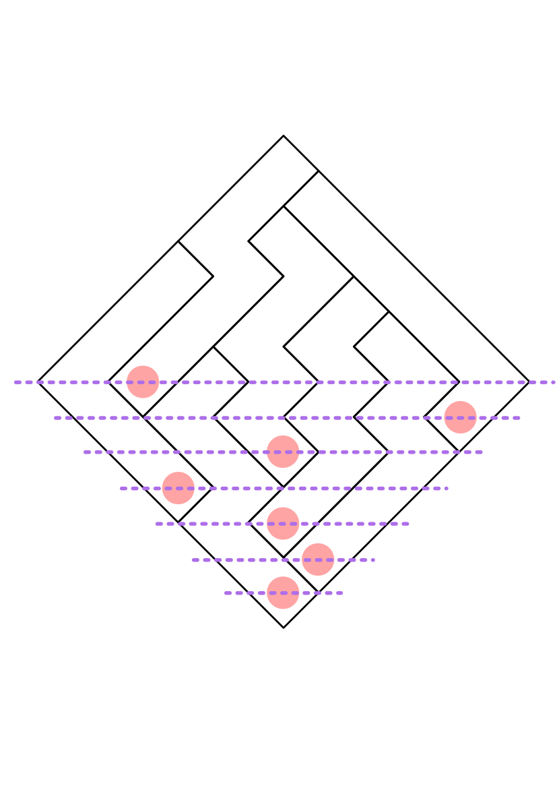
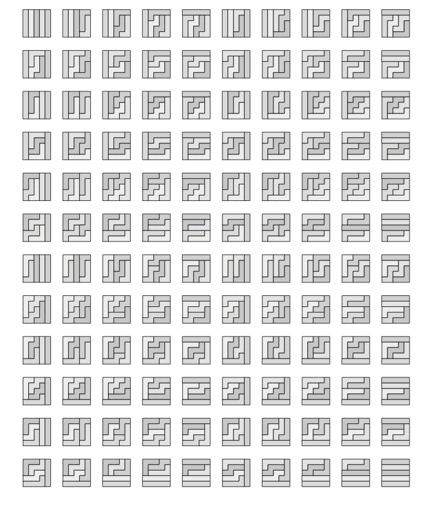

Puzzle: Ribbon Tilings
---

Consider an $n \times n$ grid tiled by ribbon tiles of length $n$, where
a ribbon tile of length $n$ is defined to be a contiguous path with
only 'right' or 'up' moves.

Here is the problem statement:

The puzzle asks for a straight forward proof that there are $n!$ configuration
of these ribbon tiles.

---

Here is one proof:

Rotate the grid 45 degrees so that the first ribbon starts at the bottom
diamond and all ribbons have a "left" and "right" choice if they can be extended.
The first position has only one option for a ribbon start.
The next two positions have a choice of either being extended into by
the first ribbon or starting a new ribbon.

At each subsequent layer below the midpoint of the rotated grid, there will
be one open slot with all other ribbon tiles occupying the other positions.
Past the midpoint, all choices will be forced until the grid is completely filled.

Since at each height, $h$, below the midpoint of the rotated grid there are $h$
choices to start a new ribbon, there are $n!$ different tilings.

---

This puzzle is credited to Chris Moore but
seen in "Handbook of Enumerative Combinatorics" by Miklos Bona.
Personally seen at [tw](https://twitter.com/akivaw/status/1640920344197251072/photo/1)

###### 2023-03-31

